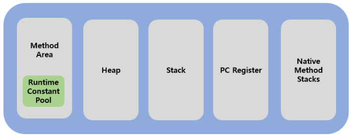

# JAVA의 런타임 메모리 영역

Java의 런타임 메모리 영역은 크게 다음과 같은 부분으로 나뉩니다:

1. **Method Area (메소드 영역)**
2. **Heap (힙)**
3. **Stack (스택)**
4. **PC Register (PC 레지스터)**
5. **Native Method Stack (네이티브 메소드 스택)**

각각의 영역은 커널 메모리의 특정 부분을 사용하여 JVM이 프로그램을 실행할 때 필요한 데이터를 저장하고 관리합니다.

### 1. Method Area (메소드 영역)

- **역할**: 클래스 수준의 데이터 (클래스 변수, 메소드 데이터, 상수 풀 등) 저장.

### 2. Heap (힙)

- **역할**: 모든 객체 인스턴스 및 배열 저장.

### 3. Stack (스택)

- **역할**: 각 스레드마다 존재하며, 메소드 호출 시 프레임 저장 (로컬 변수, 메소드 호출 시의 인자 등).

### 4. PC Register (PC 레지스터)

- **역할**: 각 스레드마다 존재하며, 현재 실행 중인 JVM 명령어의 주소를 저장.

### 5. Native Method Stack (네이티브 메소드 스택)

- **역할**: JVM에서 자바 외의 네이티브 코드(C/C++ 등) 실행 시 사용되는 스택.

### 커널 메모리와의 상호작용

- **메모리 관리**: 커널은 시스템의 메모리 자원을 관리하고, 각 프로세스 및 스레드가 적절한 메모리 공간을 할당받도록 합니다. JVM은 이러한 커널의 메모리 관리 기능을 통해 필요한 메모리 영역을 할당받고, 필요 시 반환합니다.
- **가상 메모리**: 현대 운영체제는 가상 메모리 시스템을 사용하여 물리 메모리와 커널 메모리의 효율적 관리를 지원합니다. JVM의 메모리 영역도 가상 메모리 주소 공간 내에서 관리되며, 커널은 이 가상 주소를 실제 물리 메모리 주소로 매핑합니다.
- **페이지 폴트 및 스와핑**: 힙이나 스택과 같은 동적 메모리 영역은 페이지 폴트가 발생할 수 있으며, 커널은 필요한 경우 메모리 페이지를 디스크로 스와핑하거나 디스크에서 다시 메모리로 불러옵니다.

이러한 메모리 영역은 JVM의 효율적인 실행을 지원하기 위해 커널 메모리 관리 시스템과 긴밀하게 협력합니다.

