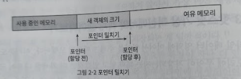
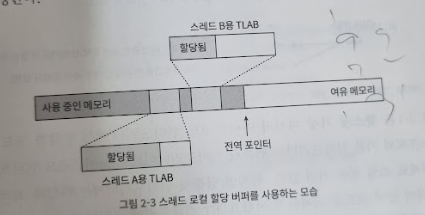
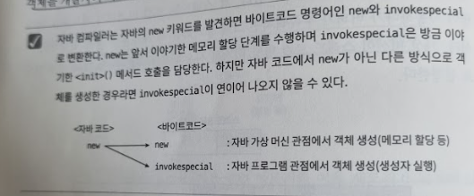
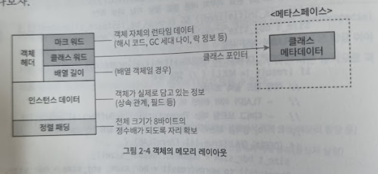
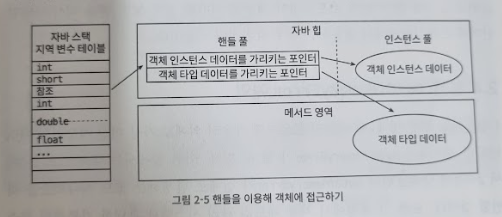

# 2장 자바 메모리 영여과 메모리 오버플로

## 문서 관리자

조승효(문서 생성자)

## 들어가며

- 자바 개발자는 가상 머신이 제공하는 자동 메모리 관리 메커니즘 덕에 메모리 할당과 해제를 짝지어 코딩하지 않아도 메모리 누수나 오버플로 문제를 거의 겪지 않는다.
- 문제가 한번 터지면 가상 머신의 메모리 관리 방식을 이해하지 못하는 한 해결하기가 상당히 어렵다.

## 런타임 데이터 영역

- 어떤 영역은 가상 머신 프로세스의 시작과 동시에 만들어지며, 어떤 영역은 사용자 스레드의 시작/종료에 맞춰 생성/삭제된다.
  

### 프로그램 카운터

- 프로그램 카운터 레지스터는 작은 메모리 영역으로, 현재 실행 중인 스레드의 '바이트코드 줄 번호 표시기' 라고 생각하면 쉽다.
  - 자바 가상 머신의 개념 모형에서, 바이트코드 인터프리터는 이 카운터의 값을 바꿔 다음에 실행할 바이트코드 명령어를 선택하는 식으로 동작한다.
  - 프로그램의 제어 흐름, 분기, 순환, 점프 등을 표현하는 것이다.
  - 예외 처리나 스레드 복원 같은 모든 기본 기능이 바로 이 표시기를 활용해 이루어진다.
- 자바 가상 머신에서의 멀티스레딩은 CPU 코어를 여러 스레드가 교대로 사용하는 방식으로 구현되기 때문에 특정 시각에 각 코어는 한 스레드의 명령어만 실행하게 된다. 따라서 스레드 전환 후 이전에 실행하다 멈춘 지점을 정확하게 복원하려면 스레드 각각에는 고유한 프로그램 카운터가 필요하다. 따라서 각 스레드의 카운터는 서로 영향을 주지 않는 독립된 영역에 저장된다. 이 메모리 영역을 <strong>스레드 프라이빗 메모리</strong>라고 한다.
- 스레드가 자바 메서드를 실행 중일 때는 실행 중인 바이트코드 명령어의 주소가 프로그램 카운터에 기록된다.
- 스레드가 네이티브 메서드를 실행 중일 때 프로그램 카운터 값은 Undefined다. '정의되지 않음' 이란 뜻이다.
- 프로그램 카운터 메모리 영역은 <<자바 가상 머신 명세>>
  에서 OutOfMemoryError 조건이 명시되지 않은 유일한 영역이기도 하다.

### 자바 가상 머신 스택

- 자바 가상 머신 스택도 '스레드 프라이빗'하며, 연결된 스레드와 운명을 같이 한다(생성/삭제 시기가 일치한다).
- 가상 머신 스택은 자바 메서드를 실행하는 스레드의 메모리 모델을 설명해준다.
  - 각 메서드가 호출될 때마다 자바 가상 머신은 스택 프레임을 만들어 지역 변수 테이블, 피연산자 스택, 동적 링크, 메서드 반환값 등의 정보를 저장한다.
  - 스택 프레임을 가상 머신 스택에 푸시(push)하고, 메서드가 끝나면 팝(pop)하는 일을 반복한다.
- '스택'이라고 하면 보통 자바 가상 머신 스택을 가리키는데, 그중 특히 지역 변수 테이블을 가리킬 때가 많다.
  - 지역 변수 테이블에는 자바 가상 머신이 컴파일타임에 알 수 있는 다양한 기본 데이터 타입, 객체 참조, 반환 주소 타입을 저장한다.
  - 지역 변수 테이블에서 이 데이터 타입들을 저장하는 공간을 지역 변수 슬롯이라 한다.
  - 일반적으로 슬롯 하나의 크기는 32비트다. 따라서 double 타입처럼 길이가 64비트인 데이터는 슬롯 두개를 차지하며, 나머지 타입은 모두 슬롯 하나에 저장된다.
  - 지역 변수 테이블을 구성하는 데 필요한 데이터 공간은 컴파일 과정에서 할당된다.
  - 자바 메서드는 스택 프레임에서 지역 변수용으로 할당받아야 할 공간의 크기가 이미 완벽하게 결정되어 있다.
  - 메서드 실행 중에는 절대 변하지 않는다.
  - 크기는 변수 슬롯 개수다.
  - 가상 머신이 변수 슬롯을 구현하는 데 사용하는 메모리의 실제 크기는 가상 머신을 어떻게 구현하느냐에 따라 완전히 달라질 수 있다.(슬롯 하나가 32비트, 64비트 또는 그 이상일 수 있다.)
- <<자바 가상 머신 명세>>는 스택 메모리 영역에서 두 가지 오류가 발생할 수 있도록 정의했다.
  - 첫째, 스레드가 요청한 스택 깊이가 가상 머신이 허용하는 깊이보다 크다면 StackOverflowError를 던진다.
  - 둘째, 스택 용량을 동적으로 확장할 수 있는 자바 가상 머신에서는 스택을 확장하려는 시점에 여유 메모리가 충분하지 않다면 OutOfMemoryError를 던진다.

### 네이티브 메서드 스택

- 네이티브 메서드 스택은 가상 머신 스택과 매우 비슷한 역할을 한다. 차이점이라면 가상 머신 스택은 자바 메서드(바이트코드)를 실행할 때 사용하고, 네이티브 메서드 스택은 네이티브 메서드를 실행할 때 사용한다는 것이다.
- <<자바 가상 머신 명세>>는 네이티브 메서드 스택에서 메서드를 어떤 구조로 어떻게 표현해야 하는지와 관련하여 아무것도 명시하지 않았다.

### 자바 힙

- 자바 힙은 자바 애플리케이션이 사용할 수 있는 가장 큰 메모리다.
- 자바 힙은 모든 스레드가 공유하며 가상 머신이 구동될 때 만들어진다.
- 이 메모리 영역의 유일한 목적은 객체 인스턴스를 저장하는 것이고, 자바 세계의 '거의' 모든 객체 인스턴스가 이 영역에 할당된다. 자바 언어가 계속 발전하면서 앞으로는 값 타입도 지원할 것으로 보인다.
- 자바 힙은 가비지 컬렉터가 관리하는 메모리 영역이기 때문에 어떤 문헌에서는 GC 힙이라고도 한다. 메모리 회수 관점에서 대다수 현대적인 가비지 컬렉터는 세대별 컬렉션 이론(generational collection theory)을 기초로 설계됐다. 그래서 자바 힙을 설명할 때 '신세대(new generation)', '구세대(old generation)', '영구 세대', '에덴 공간(eden space)', '생존자 공간에서부터(from survivor space)', '생존자 공간으로(to survivor space)' 같은 용어가 자주 등장한다. 이 영역 구분은 가비지 컬렉터들의 일반적인 특성 또는 설계 방식일 뿐, 반드시 이 형태로 메모리를 구성해야 한다는 뜻은 아니다. 요새는 많이 바뀌기도 했다.
- 메모리 할당 관점에서 자바 힙은 모든 스레드가 공유한다. 따라서 객체 할당 효율을 높이고자 스레드 로컬 할당 버퍼 여러개로 나뉜다. 하지만 어떤 시각에서 보든 또는 어떻게 나누든 상관없이 데이터가 자바 힙에 저장된다는 사실은 달라지지 않는다. 어떤 세부 영역이든 객체의 인스턴스만 저장할 수 있다. 자바 힙을 다시 작게 구분하는 목적은 오직 메모리 회수와 할당을 더 빠르게 하기 위함이다.
- <<자바 가상 머신 명세>>에 따르면 자바 힙은 물리적으로 떨어진 메모리에 위치해도 상관없으나 논리적으로는 연속되어야 한다. 대다수 가상 머신이 큰 객체(주로 배열 객체)는 물리적으로도 연속된 메모리 공간을 사용하도록 구현한다. 저장 효율을 높이고 구현 로직을 단순하게 유지하기 위해서다.

### 메서드 영역

- 메서드 영역도 자바 힙처럼 모든 스레드가 공유한다.
- 메서드 영역은 가상 머신이 읽어 들인 타입 정보, 상수, 정적 변수 그리고 JIT 컴파일러가 컴파일한 코드 캐시 등을 저장하는 데 이용된다.
- <<자바 가상 머신 명세>>에서는 메서드 영역도 논리적으로는 힙의 한 부분으로 기술하지만, 자바 힙과 구분하기 위해 '논힙(non-heap)'이라 부르기도 한다.
- JDK 7까지 핫스팟은 메서드 영역을 힙의 영구 세대에 구현했다. 그 결과로 핫스팟의 가비지 컬렉터는 메서드 영역도 마치 자바 힙처럼 관리할 수 있었고, 그 덕분에 메서드 영역을 관리하는 코드가 다로 필요 없으니 작업량을 줄일 수 있었다. 다른 JVM은 이렇게 구현하지 않은 것도 있다.
- 메서드 영역을 영구 세대에 구현하면 발생하는 문제점은 다음과 같다.
  - 메모리 오버플로를 겪을 가능성이 많아졌다.
  - 영구 세대 때문에 가상 머신에 따라 성능이 달라지는 메서드가 생겨났다(예:String::intern())
- JDK 6 시절, 핫스팟 개발 팀은 핫스팟의 미래를 위해 영구 세대를 포기하고 점진적으로 메서드 영역을 네이티브 메모리에 구현할 계획을 세운다. 그래서 JDK 7에 이르러 핫스팟은 그 전까지 영구 세대에서 관리하던 문자열 상수와 정적 변수 등의 정보를 자바 힙으로 옮겼다. JDK 8에 와서는 영구 세대라는 개념을 완전히 지우고 네이티브 메모리에 메타스페이스를 구현했다.
- 회수할 일이 거의 없기는 하지만 간혹가다 회수해야 할 일이 생길 수도 있으며 이때 회수하지 않으면 메모리가 누수되는 심각한 버그들이 존재했다.
- <<자바 가상 머신 명세>>에 따르면 메서드 영역이 꽉 차서 필요한 만큼 메모리를 할당할 수 없다면 OutOfMemoryError를 던진다.

### 런타임 상수 풀

- 런타임 상수 풀은 메서드 영역의 일부다.
- 상수 풀 테이블에는 클래스 버전, 필드, 메서드, 인터페이스 등 클래스 파일에 포함된 설명 정보에 더해 컴파일 타임에 생성된 다양한 리터럴과 심벌 참조가 저장된다.
- 가상 머신이 클래스를 로드할 때 이러한 정보를 메서드 영역의 런타임 상수 풀에 저장한다.
- 클래스 파일의 상수 풀과 비교해 런타임 상수 풀의 중요한 특징이 하나 더 있다. 바로 동적이라는 점이다. 자바 언어에서는 상수가 꼭 컴파일타임에 생성되어야 한다는 규칙이 없다.
- 상수 풀의 공간이 부족하면 OutOfMemoryError를 던진다.

### 다이렉트 메모리

- NIO는 힙이 아닌 메모리를 직접 할당할 수 있는 네이티브 함수 라이브러리를 이용하며, 이 메모리에 저장되어 있는 DirectByteBuffer 객체를 통해 작업을 수행할 수 있다. 따라서 자바 힙과 네이티브 힙 사이에서 데이터를 복사해 주고받지 않아도 돼서 일부 시나리오에서 성능을 크게 개선했다.
- 물리 메모리를 직접 할당하기 때문에 자바 힙 크기의 제약과는 무관하지만, 이 역시 메모리라는 사실에는 변함이 없다. 따라서 하부 기기의 총 메모리 용량과 프로세서가 다룰 수 있는 주소 공간을 넘어설 수는 없다.
- 서버 관리자들이 -Xmx 등의 매개 변수를 설정할 때 가상 머신의 메모리 크기만 고려할 뿐, 다이렉트 메모리는 간과하는 경우가 제법 있다.
- 사용되는 모든 메모리 영역의 합이 물리 메모리 한계(물리적 제약과 운영체제 수준의 제약 포함)를 넘어서면 동적 확장을 시도할 때 OutOfMemoryError가 발생한다.

## 핫스팟 가상 머신에서의 객체 들여다보기

### 객체 생성

- 자바 가상 머신이 new 명령에 해당하는 바이트코드를 만나면, 이 명령의 매개 변수가 상수 풀 안의 클래스를 가리키는 심벌 참조인지 확인한다.
- 이 심벌 참조가 뜻하는 클래스가 로딩, 해석(resolve), 초기화(initialize) 되었는지 확인한다.
  - 준비 되지 않은 클래스라면 로딩부터 해야 한다.
- 로딩이 완료된 클래스라면 새 객체를 담을 메모리를 할당한다. 객체에 필요한 메모리 크기는 클래스를 로딩하고 나면 완벽하게 알 수 있다. 객체용 메모리 공간 할당은 자바 힙에서 특정 크기의 메모리 블록을 잘라주는 일이라 할 수 있다.
- 자바 힙이 완벽히 규칙적이라고 가정하면 사용 중인 메모리는 모두 한쪽에 여유 메모리는 반대편에 자리하며, 포인터가 두 영역의 경계인 가운데 지점을 가리키게 될 것이다. 이 상태에서 메모리를 할당하면 포인터를 여유 공간쪽으로 정확히 객체 크기만큼 이동시키게 된다. 이러한 할당 방식을 포인터 밀치기(bump the pointer)라고 한다.

- 자바 힙은 규칙적이지 않다. 사용 중인 메모리와 여유 메모리가 뒤섞여 있어서 포인터를 밀쳐 내기가 그리 간단하지 않다. 그 대신 가상 머신은 가용 메모리 블록들을 목록으로 따로 관리하며, 객체 인스턴스를 담기에 충분한 공간을 찾아 할당한 후 목록을 갱신한다. 이 할당 방식을 여유 목록(free list)이라 한다.
- 시리얼과 파뉴(ParNew)처럼 모으기가 가능한 컬렉터를 사용하는 시스템이라면 단순하고 효율적인 포인터 밀치기 방식의 할당 알고리즘을 채택하고, 이론상의 CMS처럼 스윕(sweep: 쓸기) 알고리즘을 적용한 컬렉터를 쓰는 시스템은 더 복잡한 여유 목록 방식을 채택할 것이다.
- 가상 머신에서 객체 생성은 매우 빈번히 일어난다. 더욱이 멀티스레딩 환경에서는 여유 메모리의 시작 포인터 위치를 수정하는 단순한 일도 스레드 안전하지 않기 때문에 여러 스레드가 동시에 객체를 생성하려고 할 때 문제가 생길 수 있다. 예컨대 한 스레드가 요청한 객체 A를 위해 메모리를 할당하는 과정에서, 포인터의 값을 아직 수정하기 전에 다른 스레드가 객체 B용 메모리를 요청할 수 있다.
  - 해법 첫번째, 메모리 할당을 동기화 하는 방법이다. 실제로 비교 및 교환과 실패 시 재시도 방식의 가상 머신은 갱신을 원자적으로 수행한다.
  - 해법 두번째, 스레드마다 다른 메모리 공간을 할당하는 방법이다. 스레드 각각이 자바 힙 내에 작은 크기의 전용 메모리를 미리 할당받아 놓는 것이다. 이런 메모리를 스레드 로컬 할당 버퍼(TLAB)라고 한다. 각 스레드는 로컬 버퍼에서 메모리를 할당 받아 사용하다가 버퍼가 부족해지면 그때 동기화를 해 새로운 버퍼를 할당받는식이다. 가상 머신이 스레드 로컬 할당 버퍼를 사용할지는 -XX:+/-UseTLAB 매개 변수로 설정한다.
    
- 메모리 할당이 끝났으면 가상 머신은 할당받은 공간을 0으로 초기화한다(객체 헤더는 제외). 스레드 로컬 할당 버퍼를 사용한다면 초기화는 TLAB 할당 시 미리 수행한다. 자바 코드에서 객체의 인스턴스 필드를 초기화하지 않고도 사용할 수 있는 이유가 바로 이 단계 덕이다. 모든 필드가 자연스럽게 각 데이터 타입에 해당하는 0 값을 담고 있게 되는 것이다.
- 자바 가상 머신은 '각 객체에 필요한 설정'을 해준다. 예를 들어 어느 클래스의 인스턴스인지, 클래스의 메타 정보는 어떻게 찾는지, 이 객체의 해시 코드는 무엇인지(사실 해시코드는 Object::hashCode() 메서드가 처음 호출될 때 계산함), GC 세대 나이(age)는 얼마인지 등의 정보가 여기 속한다. 이런 정보가 각 객체의 객체 헤더에 저장된다. 객체 헤더를 설정하는 방법은 가상 머신의 현재 구동모드에 따라 달라질 수 있다.
- 이상의 과정이 끝났다면 가상 머신 관점에서는 새로운 객체가 다 만들어진 셈이다. 하지만 자바 프로그램 관점에서는 이제부터가 시작이다. 생성자(클래스의 <init>() 메서드)가 아직 실행되지 않았고, 모든 필드는 기본값이 0인 상태다. 그외 객체로서 구실하기 위한 여러 자원과 상태 정보 역시 아직 개발자의 의도대로 구성되지 못했다. 일반적으로 new 명령어에 이어서 <init>() 메서드까지 실행되어 객체를 개발자의 의도대로 초기화해야 비로소 사용 가능한 진짜 객체가 완성된다.

### 객체의 메모리 레이아웃

#### 객체 헤더

- 마크 워드: 객체 자체의 런타임 데이터. 해시 코드, GC 세대 나이, 락 상태 플래그, 스레드가 점유하고 있는 락들, 편향된 스레드의 아이디, 편향된 시각의 타임스탬프 등이다. 차지하는 크기는 32비트 가상 머신에서는 32비트이고, 64비트 가상 머신에서는 64비트이다. 한정된 메모리를 최대한 효율적으로 써야 한다. 그래서 마크 워드의 데이터 구조는 동적으로 의미가 달라진다.
- 클래스 워드(klass word): 클래스 워드에는 객체의 클래스 관련 메타데이터를 가리키는 클래스 포인터가 저장된다. 자바 가상 머신은 이 포인터를 통해 특정 객체가 어느 클래스의 인스턴스인지 런타임에 알 수 있다.
- 자바 배열의 경우 배열 길이도 객체 헤더에 저장한다. 위치는 클래스 워드 다음이다.

#### 인스턴스 데이터

- 객체가 실제로 담고 있는 정보다. 예컨대 프로그램 코드에서 정의한 다양한 타입의 필드 관련 내용, 부모 클래스 유무, 부모 클래스에서 정의한 모든 필드
- 정보의 저장 순서는 가상 머신의 할당 전략 매개 변수(-XX:FieldsAllocationStyle)와 자바 소스 코드에서 필드를 정의한 순서에 따라 달라진다. 핫스팟 가상 머신은 기본적으로 long double, int, short char, byte boolean, 일반 객체 포인터 순으로 할당한다. 기본 할당 전략에서는 길이가 같은 필드들은 항상 같이 할당되고 저장된다. 필드 길이가 같다면 부모 클래스에서 정의된 필드가 자식 클래스의 필드보다 앞에 배치된다.
- +XX:CompactFields 매개 변수를 true로 설정하면 하위 클래스의 필드 중 길이가 짧은 것들은 상위 클래스의 변수 사이사이에 끼워 넣어져서 공간이 조금이나마 절약된다.

#### 정렬 패딩

- 이 부분은 존재하지 않을 수도 있으며, 특별한 의미 없이 자리를 확보하는 역할만 한다. 핫스팟 가상 머신의 자동 메모리 관리 시스템에서 객체의 시작 주소는 반드시 8바이트의 정수배여야 한다. 달리 말하면 모든 객체의 크기가 8바이트의 정수배여야 한다는 뜻이다. 객체 헤더는 정확히 8바이트의 정수배가 되도록 잘 설계되어 있다. 따라서 인스턴스 데이터가 조건을 충족하지 못하는 경우에만 패딩으로 채운다.

### 객체에 접근하기

- 대다수 객체는 다른 객체 여러 개를 조합해 만들어진다. 그리고 자바 프로그램은 스택에 있는 참조 데이터를 통해 힙에 들어 있는 객체들에 접근해 이를 조작한다. <<자바 가상 머신 명세>>는 참조 타입을 단지 '객체를 가리키는 참조'라고만 정했을 뿐, 힙에서 객체의 정확한 위치를 알아내어 접근하는 구체적인 방법은 규정하지 않았다. 따라서 객체에 접근하는 방식 역시 가상 머신에서 구현하기 나름이며, 주로 핸들이나 다이렉트 포인터를 사용해 구현한다.

#### 핸들 방식

- 자바 힙에 핸들 저장용 풀이 별도로 존재할 것이다. 자바 스택 지역 변수 테이블 에 있는 참조 변수에는 객체의 핸들 주소가 저장되고 핸들에는 다시 해당 객체의 인스턴스 데이터, 타입 데이터, 구조 등의 정확한 주소 정보가 담길 것이다.
- 가장 큰 장점은 참조에 '안정적인' 핸들의 주소가 저장된다는 것이다. 가비지 컬렉션 과정에서 객체가 이동하는 일은 아주 흔하다. 핸들을 이용하면 이렇게 객체의 위치가 바뀌는 상황에서도 참조 자체는 손댈 필요가 없다. 그 대신 핸들 내의 인스턴스 데이터 포인터만 변경하면 된다.

#### 다이렉트 포인터 방식

- 자바 힙에 위치한 객체에서 인스턴스 데이터뿐 아니라 타입 데이터에 접근하는 길도 제공해야 한다. 스택의 참조에는 객체의 실제 주소가 바로 저장되어 있다.
- 다이렉트 포인터 방식의 가장 큰 장점은 속도다. 핸들을 경유하는 오버헤드가 없기 때문이다. 자바에서는 다른 객체에 접근할 일이 아주 많기 때문에 이 오버헤드도 실행시간에 영향을 크게 줄 수 있다.
