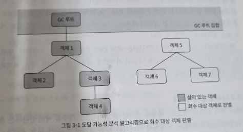

# 3장 가비지 컬렉터와 메모리 할당 전략

## 문서 관리자

조승효(문서 생성자)

## 들어가며

- 가비지 컬렉터가 해결해야 할 문제는

  - 어떤 메모리를 회수해야 하나?
  - 언제 회수해야 할까?
  - 어떻게 회수해야 할까?

- 우리가 가비지 컬렉션과 메모리 할당의 내부를 이해해야 하는 이유는? 다양한 메모리 오버플로와 누수 문제를 해결해야 하는 상황이나 더 높은 동시성을 달성하는 데 가비지 컬렉션이 방해가 되는 상황이 오면, 이 '자동화된' 기술을 적절히 모니터링하고 조율할 수 있어야 하기 때문이다.

## 대상이 죽었는가?

### 참조 카운팅 알고리즘

- 많은 교재에서 객체가 살아 있는지 판단하는 알고리즘을 다음과 같이 설명한다.

  - 객체를 가리키는 참조 카운터(reference counter)를 추가한다. 참조하는 곳이 하나 늘어날 때마다 카운터 값을 1씩 증가시킨다.
  - 참조하는 곳이 하나 사라질 때마다 카운터 값을 1씩 감소시킨다.
  - 카운터 값이 0이 된 객체는 더는 사용될 수 없다.

- 자바 가상 머신에서는 참조 카운팅을 쓰지 않는다. 이 간결한 알고리즘에도 고려해야 할 특이 상황이 적지 않고, 모든 상황에서 문제없이 동작하게 하려면 계산할 게 상당히 늘어나기 때문이다.
- 예를 들어 간단한 참조 카운팅만으로는 순환 참조(circular reference) 문제를 풀기 어렵다.

### 도달 가능성 분석 알고리즘

- 자바, C# 등 오늘날의 주류 프로그래밍 언어들은 모두 객체 생사 판단에 도달 가능성 분석(reachability analysis) 알고리즘을 이용한다. 이 알고리즘의 기본 아이디어는 GC 루트라고 하는 루트 객체들을 시작 노드 집합으로 쓰는 것이다. 시작 노드들에서 출발하여 참조하는 다른 객체들로 탐색해 들어간다. 탐색 과정에서 만들어지는 경로를 참조 체인(reference chain)이라 한다. 그리고 어떤 객체와 GC 루트 사이를 이어 주는 참조 체인이 없다면, 즉 GC 루트로부터 도달 불가능한 객체는 더 이상 사용할 수 없는 게 확실해 진다.

- 자바에서 GC 루트로 이용할 수 있는 객체는 정해져 있다. 다음은 대표적인 예다.
  - 가상 머신 스택(스택 프레임의 지역 변수 테이블)에서 참조하는 객체: 현재 실행중인 메서드에서 쓰는 매개 변수, 지역 변수, 임시 변수 등
  - 메서드 영역에서 클래스가 정적 필드로 참조하는 객체: 자바 클래스의 참조 타입 정적 변수
  - 메서드 영억에서 상수로 참조되는 객체: 문자열 테이블 안의 참조
  - 네이티브 메서드 스택에서 JNI(이른바 네이티브 메서드)가 참조하는 객체
  - 자바 가상 머신 내부에서 쓰이는 참조: 기본 데이터 타입에 해당하는 Class 객체, (NullPointerException, OutOfMemoryErro 등의) 일부 상주 예외 객체, 시스템 클래스 로더
  - 동기화 락(synchronized 키워드)으로 잠겨 있는 모든 객체
  - 자바 가상 머신 내부 상황을 반영하는 JMXBean: JVMTI에 등록된 콜백, 로컬 로드 캐시 등
- 이상의 정해진 GC 루트들 외에도 가비지 컬렉터 종류나 현재 회수 중인 메모리 영역에 따라 다른 객체들도 '임시로' 추가될 수 있다.

### 다시 참조 이야기로
