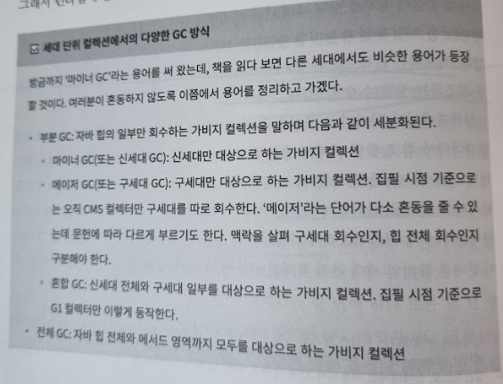
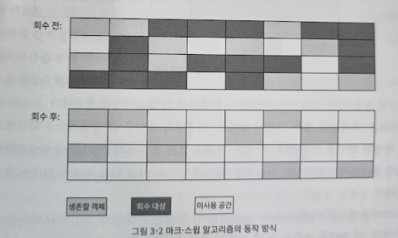
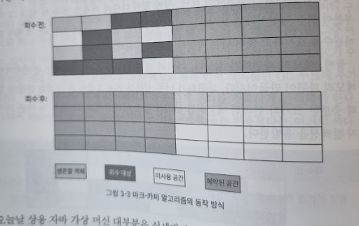
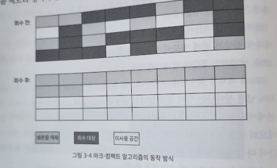
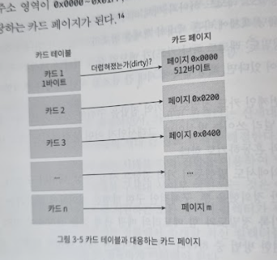
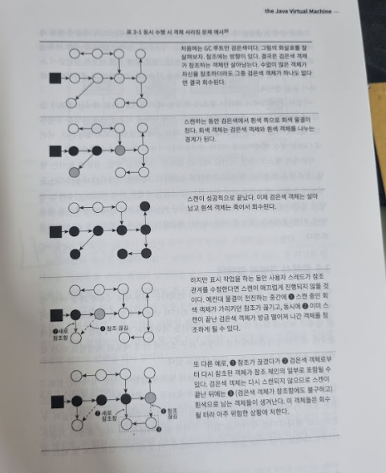

# 3장 가비지 컬렉터와 메모리 할당 전략

## 문서 관리자

조승효(문서 생성자)

## 들어가며

- 가비지 컬렉터가 해결해야 할 문제는

  - 어떤 메모리를 회수해야 하나?
  - 언제 회수해야 할까?
  - 어떻게 회수해야 할까?

- 우리가 가비지 컬렉션과 메모리 할당의 내부를 이해해야 하는 이유는? 다양한 메모리 오버플로와 누수 문제를 해결해야 하는 상황이나 더 높은 동시성을 달성하는 데 가비지 컬렉션이 방해가 되는 상황이 오면, 이 '자동화된' 기술을 적절히 모니터링하고 조율할 수 있어야 하기 때문이다.

## 대상이 죽었는가?

### 참조 카운팅 알고리즘

- 많은 교재에서 객체가 살아 있는지 판단하는 알고리즘을 다음과 같이 설명한다.

  - 객체를 가리키는 참조 카운터(reference counter)를 추가한다. 참조하는 곳이 하나 늘어날 때마다 카운터 값을 1씩 증가시킨다.
  - 참조하는 곳이 하나 사라질 때마다 카운터 값을 1씩 감소시킨다.
  - 카운터 값이 0이 된 객체는 더는 사용될 수 없다.

- 자바 가상 머신에서는 참조 카운팅을 쓰지 않는다. 이 간결한 알고리즘에도 고려해야 할 특이 상황이 적지 않고, 모든 상황에서 문제없이 동작하게 하려면 계산할 게 상당히 늘어나기 때문이다.
- 예를 들어 간단한 참조 카운팅만으로는 순환 참조(circular reference) 문제를 풀기 어렵다.

### 도달 가능성 분석 알고리즘

- 자바, C# 등 오늘날의 주류 프로그래밍 언어들은 모두 객체 생사 판단에 도달 가능성 분석(reachability analysis) 알고리즘을 이용한다. 이 알고리즘의 기본 아이디어는 GC 루트라고 하는 루트 객체들을 시작 노드 집합으로 쓰는 것이다. 시작 노드들에서 출발하여 참조하는 다른 객체들로 탐색해 들어간다. 탐색 과정에서 만들어지는 경로를 참조 체인(reference chain)이라 한다. 그리고 어떤 객체와 GC 루트 사이를 이어 주는 참조 체인이 없다면, 즉 GC 루트로부터 도달 불가능한 객체는 더 이상 사용할 수 없는 게 확실해 진다.

- 자바에서 GC 루트로 이용할 수 있는 객체는 정해져 있다. 다음은 대표적인 예다.
  - 가상 머신 스택(스택 프레임의 지역 변수 테이블)에서 참조하는 객체: 현재 실행중인 메서드에서 쓰는 매개 변수, 지역 변수, 임시 변수 등
  - 메서드 영역에서 클래스가 정적 필드로 참조하는 객체: 자바 클래스의 참조 타입 정적 변수
  - 메서드 영억에서 상수로 참조되는 객체: 문자열 테이블 안의 참조
  - 네이티브 메서드 스택에서 JNI(이른바 네이티브 메서드)가 참조하는 객체
  - 자바 가상 머신 내부에서 쓰이는 참조: 기본 데이터 타입에 해당하는 Class 객체, (NullPointerException, OutOfMemoryErro 등의) 일부 상주 예외 객체, 시스템 클래스 로더
  - 동기화 락(synchronized 키워드)으로 잠겨 있는 모든 객체
  - 자바 가상 머신 내부 상황을 반영하는 JMXBean: JVMTI에 등록된 콜백, 로컬 로드 캐시 등
- 이상의 정해진 GC 루트들 외에도 가비지 컬렉터 종류나 현재 회수 중인 메모리 영역에 따라 다른 객체들도 '임시로' 추가될 수 있다.

### 다시 참조 이야기로

- 참조 타입 데이터에 저장된 값이 다른 메모리 조각의 시작 주소를 뜻한다면, 이 참조 데이터를 해당 메모리 조각이나 객체를 참조한다고 말한다. 문제 될게 없는 정의지만 현시점에서는 범위가 살짝 좁다. 이 정의에 따르면 객체의 상태는 '참조됐다'와 '참조되지 않았다', 이렇게 딱 두가지 뿐이다. '버리기는 아까운' 객체를 표현할 방법이 없는 것이다. 예를 들어 '메모리가 여유롭다면 그냥 두고, 가비지 컬렉션을 하고 나서도 메모리가 매우 부족하다면 그때 회수하는 객체' 를 표현하고 싶다면 어떨까?
- JDK 1.2부터 참조 개념이 확장되어 참조를 네 가지로 구분하기 시작했다. 강한 참조, 부드러운 참조, 약한 참조, 유령 참조인데 나열한 순서대로 강도가 약해진다.
  - 강한 참조(strong reference): 가장 전통적인 정의의 참조를 뜻한다. Object obj = new Object() 처럼 프로그램 코드에서 참조를 할당하는 걸 말한다. 강한 참조 관계가 남아 있는 객체는 가비지 컬렉터가 절대 회수하지 않는다.
  - 부드러운 참조(soft reference): 유용하지만 필수는 아닌 객체를 표현한다. 부드러운 참조만 남은 객체라면 메모리 오버플로가 나기 직전에 두번째 회수를 위한 회수 목록에 추가된다. 두 번째 회수 후에도 메모리가 부족하면 그때 메모리 오버플로 예외를 던진다. 부드러운 참조는 JDK 1.2 때 SoftReference 클래스 형태로 추가되었다.
  - 약한 참조(weak reference): 부드러운 참조와 비슷하지만 연결 강도가 더 약하다. 약한 참조뿐인 객체는 다음번 가비지 컬렉션까지만 살아 있다. 가비지 컬렉터가 동작하기 시작하면 메모리가 넉넉하더라도 약하게 참조된 객체는 모두 회수된다. JDK 1.2 때 추가된 WeakReference 클래스가 구현한다.
  - 유령 참조(phantom reference): 참조 중에 가장 약하다. 유령 참조는 객체 수명에 아무런 영향을 주지 않으며, 유령 참조를 통해 객체 인스턴스를 가져오는 것마저 불가능하다. 유령 참조를 거는 유일한 목적은 대상 객체가 회수될 때 알림을 받기 위해서다. 유령 참조 역시 JDK 1.2 때 추가되었으며 PhantomReference 클래스로 구현되어 있다.
  - 파이널 참조(final Reference): JDK 내부적으로 쓰인다. 참조 강도는 약한 참조와 유령 참조 사이이다. finalize() 메서드를 구현한 객체는 모두 파이널 참조의 대상이 되어 별도의 대기열(queue)에 등록된다. 그런 다음 해당 객체에 도달할 수 있는 강한 참조, 부드러운 참조, 약한 참조가 모두 없어지면 finalize() 메서드를 호출한다.

### 살았나 죽었나?

- 도달 가능성 분석 알고리즘이 '도달 불가능'으로 판단한 객체라고 해서 반드시 죽어야 하는 건 아니다. 아직 '유예' 단계가 남았다. 확실히 사망 선고를 내리려면 두 번의 표시(marking)과정을 거쳐야 한다.
- 도달 가능성 분석으로 GC 루트와 연결된 참조 체인을 찾지 못한 객체에는 첫 번째 표시가 이루어지며 이어서 필터링이 진행된다. 필터링 조건은 종료자(finalizer), 즉 finalize() 메서드를 실행해야 하는 객체인가 이다. finalize() 가 필요 없는 객체이거나 가상 머신이 finalize()를 이미 호출한 경우 모두 '실행할 필요 없음' 으로 처리한다.
- finalize() 를 실행해야 하는 객체로 판명되면 F-큐(F-Queue)라는 대기열에 추가된다. 그러면 가상 머신이 나중에 우선순위가 낮은 종료자 스레드를 생성해 F-큐에 들어 있는 객체들의 finalize() 메서드를 실행한다.
- finalize() 메서드는 죽음에 직면한 객체가 부활할 수 있는 마지막 기회다. finalize()를 이용해 부활을 꾀하는 객체라면 참조 체인상의 아무 객체와 다시 연결하면 된다. 하지만 이것은 별로 좋지 못한 방법이다.

### 메서드 영역 회수하기

- 메서드 영역 가비지 컬렉션은 대체로 '비용 효율'이 좋지 않다. 일반적인 애플리케이션에서 자바 힙은, 그중에서도 특히 신세대는 가비지 컬렉션 한번으로 메모리 공간의 70~99%를 회수해 낸다. 반면 메서드 영역은 회수 조건이 까다로워서 효율이 훨씬 떨어진다.
- 메서드 영역의 가비지 컬렉션은 크게 두 가지를 회수한다. 더 이상 사용되지 않는 '상수'와 '클래스'다.
- 다 쓴 상수를 회수하는 방법도 자바 힙에서 객체를 회수하는 방법과 매우 비슷하다. 상수를 참조하는 것이 없다면 치워 버려야 한다고 판단한다. 상수 풀에 있는 다른 클래스(인터페이스 포함), 메서드, 필드의 심벌 참조도 비슷한 방법으로 회수한다.
- 더 이상 쓰이지 않는 '클래스'인지 판단하는 조건은 더 까다롭다
  - 이 클래스의 인스턴스가 모두 회수되었다.
  - 이 클래스를 읽어 들인 클래스 로더가 회수되었다.
  - 이 클래스에 해당하는 java.lang.Class 객체를 아무 곳에서도 참조하지 않고, 리플렉션 기능으로 이 클래스의 메서드를 이용하는 곳도 전혀 없다.

## 가비지 컬렉션 알고리즘

- 객체의 생사를 판별하는 기준으로 가비지 컬렉션 알고리즘을 '참조 카운팅 GC'와 '추적 GC'로 나눌 수 있다. 이 둘을 '직접 가비지 컬렉션'과 '간접 가비지 컬렉션'이라 부르기도 한다. 참조 카운팅 GC 알고리즘은 주류 자바 가상 머신들에서 사용되지 않는다.

### 세대 단위 컬렉션 이론

- 현재 상용 가상 머신들이 채택한 가비지 컬렉터는 대부분 세대 단위 컬렉션 이론에 기초해 설계되었다.
- 약한 세대 가설(weak generational hypothesis): 대다수 객체는 일찍 죽는다.
- 강한 세대 가설(strong generational hypothesis): 가비지 컬렉션 과정에서 살아남은 횟수가 늘어날수록 더 오래 살 가능성이 커진다.
- 이 두 가정이 합쳐져 널리 알려진 가비지 컬렉터들에 일관된 설계 원칙을 제공한다. 자바 힙을 몇개의 영역으로 나누고 객체들을 나이에 따라 각기 다른 영역에 할당하는 것이다. 여기서 나이란 가비지 컬렉션에서 살아남은 횟수를 말한다.
- 영역 안에 객체 대부분이 곧바로 죽을 운명이라면, 그 객체들을 한데 몰아넣고(곧 회수될 다수의 객체에 표시하는 대신) 살아남는 소수의 객체를 유지하는 방법에 집중하는 편이 유리하다. 확실히 적은 비용으로 대량의 메모리를 확보할 수 있다. 한번 살아남은 객체는 통계적으로 잘 죽지 않으니 다른 영역에 따로 모아 두고, 가상 머신이 그 영역을 회수하는 빈도를 줄이는 것이다. 이렇게 하면 가비지 컬렉션에 드는 전체 시간도 줄고 메모리 공간도 효율적으로 이용할 수 있다.
- 자바 힙을 여러 영역으로 나누면 가비지 컬렉터는 한 번에 하나 또는 몇개의 영역만 선택해 회수할 수 있는데 이를 기준으로 마이너 GC, 메이저 GC, 전체 GC 식으로 부르곤 한다. 한편 각 영역에 담긴 객체들의 생존 특성에 따라 마크-스윕(makr-sweep: 표시 후 쓸기), 마크-카피(mark-copy: 표시 후 복사), 마크-컴팩트(mark-compact: 표시 후 모으기)등의 가비지 컬렉션 알고리즘을 구분해 적용한다.
- 세대 단위 컬렉션 이론을 가상 머신에 적용한 설계자들은 자바 힙을 최소 두 개 영역으로 나눈다. 바로 신세대와 구세대다.
- 객체들은 단독으로 존재하는 게 아니기 때문에 다른 세대에 존재하는 객체들을 참조하는 상황이 자연스럽게 나타난다.
- 이런 문제를 해결하기 위해 세대 간 참조 가설(intergenerational reference hypothesis): 세대 간 참조의 개수는 같은 세대 안에서의 참조보다 훨씬 적다. 를 도입해야 한다.
- 신세대가 구세대를 참조하면 어차피 살아남아서 구세대가 될 것이다.

### 마크-스윕 알고리즘

- 이 알고리즘은 작업을 표시(mark)와 쓸기(sweep)라는 두 단계로 나눠 진행한다. 먼저 회수할 객체들에 모두 표시한 다음, 표시된 객체들을 쓸어 담는 식이다. 또는 반대로 살릴 객체에 표시하고 표시되지 않는 객체를 회수하기도 한다.
- 실행 효율이 일정하지 않다.
- 메모리 파편화가 심하다.

### 마크-카피 알고리즘

- 이 알고리즘은 가용 메모리를 똑같은 크기의 두 블록으로 나눠 한 번에 한 블록만 사용한다. 한쪽 블록이 꽉 차면 살아남은 객체들만 다른 블록에 복사하고 기존 블록을 한 번에 청소한다.
- 대다수 객체가 살아남는다면 메모리 복사에 상당한 시간을 허비하는 반면, 대다수가 회수된다면 생존한 소수의 객체만 복사하면 된다. 더욱이 복사 과정에서 객체들이 매모리의 한쪽 끝에서부터 차곡차곡 쌓이기 때문에 골치 아픈 메모리 파편화 문제로부터 해방된다.
- 구현하기 쉽고 실행효율 좋다.
- 가용 메모리를 절반으로 줄여 낭비가 제법 심하다.
- 신세대에 이 알고리즘을 활용한다.
- IBM에 따르면 신세대 객체 98% 는 대부분 죽으므로 메모리 영역을 1:1 로 나눌 필요가 없다는 결론이 나온다.
- 아펠 스타일 컬렉션 방식을 구체적으로 보자. 먼저 신세대를 하나의 큰 에덴 공간과 두 개의 작은 생존자 공간으로 나눈다. 그리고 메모리를 할당할 때는 생존자 공간 중 하나와 에덴만 사용한다. 가비지 컬렉션이 시작되면 에덴과 생존자 공간에서 살아남은 객체들을 나머지 생존자 공간으로 하나씩 복사한 후 에덴과 이전 생존자 공간을 곧바로 비운다.
- 핫스팟 가상 머신에서 에덴과 생존자 공간의 비율은 기본적으로 8:1이다. 즉, 신세대에 할당된 전체 메모리 중 90%를 활용한다.(에덴 80% + 생존자 공간 중 하나 10%)
- 10% 넘게 살아남는 특이 케이스에 대처하기 위한 설계가 하나 추가되어 있다. 메모리 할당 보증이라는 메커니즘으로, 마이너 GC에서 살아남은 객체를 생존자 공간이 다 수용하지 못할 경우 다른 메모리 영역(대부분의 경우 구세대)을 활용해 메모리 할당을 보증하는 것이다(핸들 승격)

### 마크-컴팩트 알고리즘

- 마크-카피 알고리즘은 객체 생존율이 높을수록 복사할 게 많아져서 효율이 나빠진다. 더구나 공간을 50%나 낭비하기 싫다면 할당 보증용 공간을 따로 마련하여 대다수 객체가 살아남는 극단적 상황에 대처해야 한다. 그래서 구세대에는 적합하지 않다.
- 표시 단계는 마크 스윕과 같다. 하지만 다음 컴펙트 단계에서 회수 대상 객체들을 곧바로 쓸어 담는 대신 생존한 모든 객체를 메모리 영역의 한쪽 끝으로 모은 다음, 나머지 공간을 한꺼번에 비운다.
- 메모리 이동이 일어난다는 점이다. 구세대에서는 회수 때마다 살아남는 객체가 상당히 많을 것이다. 따라서 생존한 객체를 이동시킨 후, 이동된 객체들을 가리키던 기존 참조들을 모두 갱신하기는 매우 부담될 것이다. 더욱이 이런 식의 객체 이동은 사용자 애플리케이션을 모두 멈춘 상태에서 진행해야 하므로 아주 신중하게 고려해야 할 단점이다. 이와 같은 일시 정지 현상을 초기 가상 머신 설계자는 "스톱 더 월드(stop the world)"라는 말로 아주 생생하게 표현해냈다.
- 파편화 메모리 할당 문제는 '파편화 없는 할당 연결 리스트"로 해결할 수 있다.
- 일시정지시간을 기준으로 판단하면 객체를 이동시키지 않는 편이 유리하다. 처리량이 기준이라면 객체를 이동시키는 편이 효율적이다.
- 대부분의 경우에는 메모리 파편화를 감내하면서 마크-스윕을 사용하다가, 객체 할당에 영향을 줄 만큼 파편화가 심해지면 마크-컴팩트를 돌려 연속된 공간을 확보하는 것이다.

## 핫스팟 알고리즘 상세 구현

### 루트 노드 열거

- 루트 노드 열거란 도달 가능성 분석 알고리즘에서 GC 루트 집합으로부터 참조 체인을 찾는 작업을 말한다.
- 스캔을 효율적으로 구현하는 것은 만만한 것이 아니다.
- 루트 노드 열거 단계에서 사용자 스레드를 일시 정지해야 한다.
- 현재 도달 가능성 분석 알고리즘의 참조 체인 찾기 과정에서 가장 오래 걸리는 작업은 다행이도 사용자 스레드와 동시에 실행할 수 있다. 하지만 루트 노드 열거만큼은 반드시 일관성이 보장되는 스냅숏 상태에서 수행해야 한다. 여기서 '일관성'이란 열거 작업이 진행되는 동안 실행 서브시스템이 '특정 시점으로 고정'된 것처럼 보인다는 뜻이다. 더 구체적으로 표현하면 루트 노드들의 참조 관계가 변하지 않아야 한다는 말이다.
- 현재 주류 자바 가상 머신들은 '정확한 가비지 컬렉션'을 사용한다. 따라서 사용자 스레드가 정지한 후 실행 콘텍스트와 전역 참조의 위치를 빠짐없이 확인할 필요가 없다. 그 대신 가상 머신이 객체 참조가 저장된 위치를 직접 알아낼 방법이 있어야 한다. 이 방법을 핫스팟은 OopMap이라는 데이터 구조를 이용해 해결한다. 먼저 클래스 로딩이 완료되면 객체에 포함된 각 데이터의 타입을 확인한다. 그리고 JIT 컴파일 과정에서 스택의 어느 위치와 어느 레지스터의 데이터가 참조인지 기록한다. 이런 식으로 컬렉터는 메서드 영역과 다른 GC 루트들로부터 시작하여 추적해 보지 않고도 스캔 과정에서 이 정보를 직접 얻어낸다.

### 안전 지점

- 핫스팟은 OopMap을 활용하여 GC 루트들을 빠르고 정확하게 열거할 수 있다. 하지만 진짜 큰 문제가 뒤따른다. 참조 관계나 OopMap의 내용을 변경할 수 있는 명령어가 많으며, 이런 명령어 모두에 OopMap을 만들어 넣으면 메모리를 더 많이 사용해야 한다. 실제로 가비지 컬렉션에 드는 공간 비용을 감당하기 어려울 만큼 커진다.
- 핫스팟은 모든 명령어 각가에 OopMap을 생성하지는 않는다. 그 대신 안전 지점(safe point) 이라고 하는 특정한 위치에만 기록한다. 가비지 컬렉터는 사용자가 안전 지점에 도달할 때까지는 절대 멈춰 세우지 않는다. 따라서 안전 지점을 너무 적게 설정해서 컬렉터가 너무 오래 기다리게 하거나, 반대로 너무 많이 설정해서 런타임 메모리 부하가 지나치게 커지지 않도록 주의해야 한다.
- 안전 지점의 위치를 선택하는 기준은 기본적으로 '프로그램이 장시간 실행될 가능성이 있는가' 이다. 명령어 하나의 실행 시간은 매우 짧기 때문에 단순히 명령어 스트림이 길어서 실행 시간이 길어질 가능성은 적다. '장시간 실행'될 가능성을 보여주는 가장 분명한 상황은 명령어 흐름이 다중화(multiflexing) 될때다. 메서드 호출, 순환문, 예외 처리 등이 명령어 흐름을 다중화하는 대표적인 예이며 이런 기능을 하는 명령어만이 안전 지점을 생성한다.
- 가비지 컬렉션이 시작되면 JNI 호출을 실행중인 스레드를 제외한 모든 스레드가 가장 가까운 안전 지점까지 실행하고 멈추게 할 방법이 필요하다.
- 선제적 멈춤 방식에서는 스레드의 코드가 가비지 컬렉터를 특별히 신경 쓸 필요가 없다. 인터럽트
- 자발적 멈춤 방식에는 가비지 컬렉터가 스레드 수행에 직접 관여하지 않는다. 스스로 멈추는 방식

### 안전 지역

- 안전 지점 메커니즘은 실행 중인 프로그램이 그리 길지 않은 시간에 안전 지점에 도달하여 가비지 컬렉션 프로세스가 제대로 임무를 다할 수 있게끔 보장한다. 하지만 실행 중이 '아닌' 프로그램이라면 어떨까?' 이를 위해서 안전 '지역'이라는 개념이 필요하다.
- 안전 지역(safe region)은 일정 코드 영역에서는 참조 관계가 변하지 않음을 보장한다. 안전 지역 안이라면 어디서든 가비지 컬렉션을 시작해도 무방하다는 뜻이다. 안전 지점을 확장한 개념이라고 생각해도 좋다.
- 사용자 스레드는 안전 지역의 코드를 실행하기 앞서 안전 지역에 진입했음을 표시한다. 그러면 가비지 컬렉터는 안전 지역에 있다고 선언한 스레드들을 신경 쓸 필요가 없다. 안전 지역에서 벗어나려는 스레드는 가상 머신이 루트 노드 열거를 완료했는지 또는 사용자 스레드를 일시 정지시켜야 하는 다른 가비지 컬렉션 단계를 완료했는지 확인한다. 완료했다면 계속 실행해도 아무 일도 일어나지 않는다. 반대로 아직 완료되지 않았다면 안전 지역을 벗어나도 좋다는 신호를 받을 때까지 기다려야 한다.

### 기억 집합과 카드 테이블

- 세대간 참조를 해결하기 위해서 기억 집합을 알아야 한다.
- 기억 집합은 비회수 영역에서 회수 영역을 가리키는 포인터들을 기록하는 추상 데이터 구조다.
- Object 포인터를 사용해 기억집합을 구현할수 있다. 그러나 이렇게 하면 차지하는 공간과 관리 비용이 모두 상당히 높을 것이다. 가비지 컬렉션 시 컬렉터는 기억 집합을 이용해 특정 비회수 영역에서 회수 영역을 가리키는 포인터가 존재하는지만 확인하면 된다. 세대 간 포인터들은 각각에 대해 더 이상 자세한 내용을 알 필요는 없다. 따라서 기억 집합 설계자는 정밀도를 낮춰서, 즉 기록 단위를 더 크게 잡아서 공간과 관리 비용을 절약할 수 있을 것이다.
  - 워드 정밀도: 레코드 하나가 메모리의 워드 하나에 매핑된다.
  - 객체 정밀도: 레코드 하나가 객체 하나에 매핑된다.
  - 카드 정밀도: 레코드 하나가 메모리 블록 하나에 매핑된다.
- 카드 테이블을 구현하는 가장 간단한 형태는 바이트 배열이며 실제로 핫스팟 가상 머신도 정확히 이렇게 구현했다. 다음 코드는 핫스팟의 기본 카드 테이블 표시 로직이다.
  CARD_TABLE[this address >> 9] = 1;
  바이트 배열인 CARD_TABLE의 원소 각각이 메모리 영역에서 특정 크기의 메모리 블록 하나에 대응한다. 이 메모리 블록을 카드 페이지라고 한다. 일반적으로 카드 페이지의 크기는 2의 N제곱 바이트로 정한다. 앞의 코드에서 핫스팟은 카드 페이지의 크기를 2의 9제곱, 즉 512 바이트로 정한 걸 알 수 있다. 카드 테이블로 관리하는 메모리 영역의 시작 주소가 0x0000이라 가정하면, 배열 CARD_TABLE의 원소 0, 1, 2가 주소 영역이 0x0000~0x01FF, 0x0200~0x03FF, 0x0400~0x05FF인 메모리 블록에 해당하는 카드 페이지가 된다.

- 카드 페이지 하나의 메모리에는 보통 하나 이상의 객체가 들어 있다. 이 객체들 중 하나에라도 세대 간 포인터를 갖는 필드가 있다면, 카드 테이블에서의 해당 원소(카드)를 1로 표시하고, 그 원소는 '더럽혀졌다(dirty)'고 말한다. 세대 간 포인터를 갖는 객체가 하나도 없다면 0으로 표시한다.
- 객체를 회수할 때는 카드 테이블에서 더렵혀진 원소만 확인하면 어떤 카드 페이지의 메모리 블록이 세대 간 포인터를 포함하는지 쉽게 파악할 수 있다.

### 쓰기 장벽

- 카드 테이블 원소를 관리하는 문제, 예를 들어 언제 더럽혀지고 더럽히는 주체는 무엇인지 같은 문제가 남아 있다.
- 문제는 더럽혀졌다는 표시를 어떻게 하느냐, 즉 객체가 대입되는 순간 해당 카드 테이블을 어떻게 갱신하느냐다.
- 컴파일해 실행하는 경우 JIT 컴파일 후의 코드는 순수한 기계어 명령어들이다. 따라서 대입 연산 시 카드 테이블을 갱신하려면 기계어 수준의 방법이 동원되어야 한다.
- 핫스팟 가상 머신은 쓰기 장벽 기술을 이용해 카드 테이블을 관리한다.
- 읽기 장벽은 동시 비순차 실행(concurrent out-of-order execution) 문제를 해결하기 위한 메모리 장벽 기술이다.
- 쓰기 장벽은 가상 머신 수준에서 '참조 타입 필드 대입' 시 끼어드는 AOP 애스팩트(aspect)에 비유할 수 있다. 참조 타입에 객체가 대입되면 어라운드 어드바이스(around advice)가 생성되어, 대입 전후로 추가 동작을 수행할 수 있게 하는 것이다.
- 쓰기 장벽을 적용하면 가상 머신은 추가로 실행할 명령어를 생성해 대입 연산 모두에 추가한다. 그래서 컬렉터가 쓰기 장벽으로 카드 테이블 갱신 연산을 추가한다면 참조가 갱신될 때마다 오버헤드가 더해진다. 구세대 객체가 신세대를 참조하는 대입이 아니라도 마찬가지다. 그래도 마이너 GC 때 구세대 전체를 스캔하는 비용보다는 훨씬 저렴하다.
- 쓰기 장벽에 의한 오버헤드 말고도 카드 테이블은 멀티 스레드 시나리오에서 거짓 공유(false sharing) 문제를 일으킬 수 있다. 그래서 성능에 영향을 줄 수 있다.

### 동시 접근 가능성 분석

- 이론적으로 도달 가능성 분석 알고리즘은 일관성이 보장되는 스냅숏 상태에서 전체 과정을 진행해야 한다. 다시 말해 사용자 스레드는 분석 과정 내내 멈춰 있어야 한다.
- 루트 노드 열거 단계에서 GC 루트는 전체 자바 힙에 존재하는 모든 객체와 비교해 그 수가 아주 적다. 또한 OopMap 같은 다양한 최적화 기법 덕에 스레드가 멈춰 있는 시간은 매우 짧으며 상대적으로 일정하다.
- 루트 노드 열거가 끝나면 가비지 컬렉터는 GC 루트로부터 객체 그래프를 탐색할 수 있다. 이 단계의 일시 정지 시간은 자바 힙 크기에 비례한다. 힙이 클수록 더 많은 객체를 담게 되고 객체 그래프 구조도 복잡해진다. 더 많은 객체를 확인해 표시하려면 일시 정지 시간은 당연히 길어진다.
- 참조 관계를 추적하는 가비지 컬렉션 알고리즘들에는 공통적으로 '표시' 단계가 등장한다. 표시 단계의 일시 정지 시간이 힙 크기에 비례해 증가한다면 거의 모든 가비지 컬렉터에 악영향을 준다는 뜻이다. 같은 이유로, 이 단계의 일시 정지 시간을 줄일 수 있다면 거의 모든 컬렉터에 득이 된다.
- 삼색 표시(tri-color marking) 기법
  - 흰색: 가비지 컬렉터가 방문한 적 없는 객체.
  - 검은색: 가비지 컬렉터가 방문한 적이 있으며, 이 객체를 가리키는 모든 참조를 스캔했다.
  - 회색: 가비지 컬렉터가 방문한 적 있으나 이 객체를 가리키는 참조 중 스캔을 완료하지 않은 참조가 존재한다.
- 사용자 스레드와 컬렉터가 동시에 실행된다면?
  - 첫째, 죽은 객체를 살았다고 잘못 표시할 수 있다.
  - 둘째, 살아 있는 객체를 죽었다고 표시할 수 있다.

- 객체 사라짐 문제는 두가지 조건을 만족해야 한다.
  - 사용자 스레드가 흰색 객체로의 새로운 참조를 검은색 객체에 추가
  - 사용자 스레드가 회색 객체에서 흰색 객체로의 직간접적인 참조를 삭제
- 해결법은 증분 업데이트, 시작단계스냅숏
  - 증분 업데이트는 첫번째 조건을 깨는 것으로 검은색 객체에 흰색 객체로의 참조가 추가되면 새로 추가된 참조를 따로 기록해둔다. 그리고 동시 스캔이 끝난 후 기록해둔 검은색 객체들을 루트로 하여 다시 스캔한다.
  - 시작 단계 스냅숏은 두 번째 조건을 깨뜨려 준다. 이번에는 회색 객체가 흰색 객체로의 참조 관계를 끊으려 하면 그 사실을 기록한다. 동시 스캔이 끝난 후 기록해둔 회색 객체들을 루트로 하여 다시 스캔한다.
