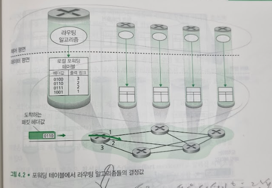
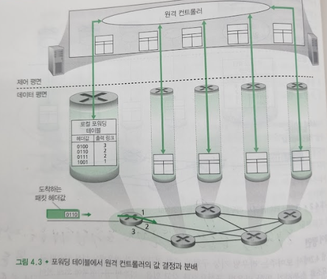

# 네트워크 계층 개요
## 문서 관리자
조승효(문서 생성자)
## 포워딩과 라우팅: 데이터 평면과 제어 평면
   - 네트워크 계층의 근본적 역할은 매우 단순하다. 즉, 송신 호스트에서 수신 호스트로 패킷을 전달하는 것이다.
   - 포워딩(전달): 패킷이 라우터의 입력 링크에 도달했을 때 라우터는 그 패킷을 적절한 출력 링크로 이동시켜야 한다.
   - 라우팅: 송신자가 수신자에게 패킷을 전송할 때 네트워크 계층은 패킷 경로를 결정해야 한다. 이러한 경로를 계산하는 알고리즘을 라우팅 알고리즘(routing algorithm)이라 한다.
   - 포워딩은 매우 짧은 시간(보통 몇 나노초) 단위를 갖기에 대표적으로 하드웨어에서 실행된다. 반면에 라우팅은 네트워크 전반에 걸쳐 출발지에서 목적지까지 데이터그램의 종단간 경로를 결정하는 것이다. 라우팅은 더 긴 시간(보통 초) 단위를 갖기에 소프트웨어에서 보통실행된다.

   - 라우터는 도착하는 패킷 헤더의 필드 값을 조사하여 패킷을 포워딩한다. 이 값을 라우터의 포워딩 테이블의 내부 색인으로 사용한다. 포워딩 테이블 엔트리에 저장되어 있는 헤더의 값은 해당 패킷이 전달되어야 할 라우터의 외부 링크 인터페이스를 나타낸다.
   - 라우팅 프로토콜에 따라 라우팅 정보에 포함된 라우팅 메시지를 교환하며 이루어진다!
   - 포워딩과 라우팅 기능의 뚜렷한 다른 목적은 네트워크의 가상적인(비현실적이지만, 기술적으로 가능한) 예를 이용하여 잘 설명할 수 있다. 이 가상의 네트워크는 라우터 내부에 존재하는 네트워크 운영자가 직접 설정을 한다고 가정한다. 이 경우에 라우팅 프로토콜이 필요하지 않다.

   - 그림 4.3은 제어 평면 라우팅 기능이 물리적 라우터와는 다르다. 라우팅 기기는 포워딩만을 수행한다. 어떻게 원격 컨트롤러는 소통하는 것일까? 포워딩 테이블과 다른 라우팅 정보들을 포함한 메시지를 교환함으로써 소통할 수 있다. 그림 4.3에서 보여지는 제어 평면적 접근은 SDN (software defined networking) 의 중심이다.
## 네트워크 서비스 모델
   - 네트워크 계층에서 제공할 수 있는 서비스
      - 보장된 전달: 이 서비스는 패킷이 소스 호스트에서부터 목적지 호스트까지 도착하는 것을 보장한다.
      - 지연 제한 이내의 보장된 전달: 이 서비스는 패킷의 전달 보장뿐만 아니라 호스트간의 특정 지연 제한 안에 전달한다.
      - 순서화(in-order) 패킷 전달: 이 서비스는 패킷이 목적지에 송신된 순서로 도착하는 것을 보장한다.
      - 최소 대역폭 보장: 이 네트워크 계층 서비스는 송신과 수신 호스트 사이에 특정한 비트 속도(예: 1 Mbps)의 전송 링크를 에뮬레이트한다. 송신 호스트가 비트들을 특정한 비트 속도 이하로 전송하는 한, 모든 패킷이 목적지 호스트까지 전달된다.
      - 보안(security) 서비스: 네트워크 계층은 모든 데이터그램들을 소스 호스트에서는 암호화, 목적지 호스트에서는 해독을 할 수 있게 하여 전송 계층(transport layer)의 모든 세그먼트(segments)들에 대해 기밀성을 제공해야 한다.
    - 인터넷 네트워크 계층은 최선형 서비스(best-effort service)라고 알려진 서비스를 제공한다. 최선형 서비스는 패킷을 보내는 순서대로 수신됨을 보장할 수 없을 뿐만 아니라, 목적지까지의 전송 자체도 보장될 수 없다. 종단 시스템 간 지연 또한 보장되지 않으며, 보장된 최소 대역폭 또한 없다.