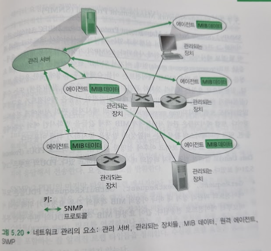
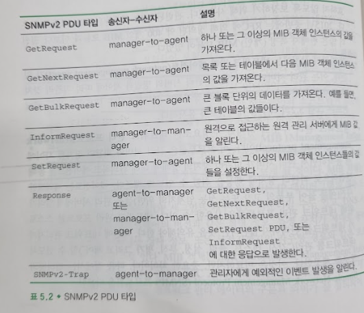

# 네트워크 관리와 SNMP
## 문서 관리자
조승효(문서 생성자)
## 시작
   - 네트워크 관리는 상당히 어렵다.
   - 네트워크 관리는 적정한 비용으로 실시간, 운용성능, 서비스 품질 등의 요구사항을 만족시키기 위하여 네트워크와 구성요소 자원들을 감시, 테스트, 폴링, 설정, 분석, 평가, 제어하는 하드웨어, 소프트웨어, 인간요소 등을 배치하고, 통합, 조정하는 것이다.
## 네트워크 관리 프레임워크

   - 관리 서버(managing server)는 네트워크 운영 센터(NOC)의 중앙 집중화된 네트워크 관리 스테이션에서 동작하는, 일반적으로 사람과 상호 작용하는 응용이다.
   - 피관리 장치(managed device)는 관리 대상 네트워크에 존재하는 네트워크 장비(소프트웨어 포함)들이다. 피관리 장치 내부에는 소위 피관리 객체(managed object)라고 불리는 것이 있다.
   - 피관리 장치 내의 피관리 객체들에 관련된 정보들은 MIB(Management Information Base)에 저장된다. MIB 객체는 SMI(Structure of Management Information)라고 하는 데이터 기술 언어로 명세된다.
   - 각 피관리 장치에는 네트워크 관리 에이전트(network management agent)가 있는데, 이는 관리 서버와 통신하면서 관리 서버의 명령과 제어에 따라 피관리 장치에 국지적인 행동을 취하는, 피관리 장치상의 프로세스이다.
   - 네트워크 관리 프로토콜(network management protocol)은 관리 서버와 피관리 장치들 사이에서 동작하면서 관리 서버가 피관리 장치의 상태에 질의하고 에이전트를 통해 간접적으로 피관리 장치에 행동을 취할 수 있도록 해준다.
## Simple Network Management Protocol (SNMP)
   - SNMPv2 (Simple Network Management Protocol version2) 는 관리 서버와 그 관리 서버를 대표하여 실행되고 있는 에이전트 사이에서 네트워크 관리 제어 및 정보 메시지를 전달하기 위해 사용된다.
