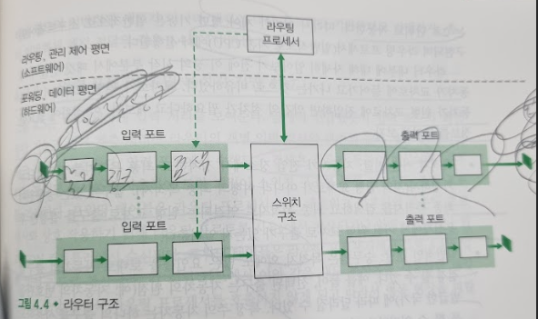

# 라우터 내부에는 무엇이 있을까?
## 문서 관리자
조승효(문서 생성자)
## 시작

   - 입력포트
      - 그림 4.4에서 입력 포트의 맨 왼쪽 상자와 출력 포트의 맨 오른쪽 상자로서 라우터로 들어오는 입력 링크의 물리계층 기능을 수행한다.
      - 양방향 트래픽을 전달 할 수 있다면 출력 포트가 동일한 링크의 입력포트 역할을 하기도 함.
      - 입력포트는 입력 링크의 반대편에 있는 링크 계층과 상호 운용하기 위해 필요한 링크 계층 기능을 수행한다. 중간 상자로 표시된다.
      - 입력포트에서 검색 기능을 수행한다. 입력포트의 가장 오른쪽(또는 출력포트의 가장 왼쪽) 상자로 표시된다. 여기서 포워딩 테이블을 참조하여 도착된 패킷이 스위칭 구조를 통해 전달되는 라우터 출력 포트를 결정한다. 제어패킷(예: 라우팅 프로토콜 정보를 전달하는 패킷)은 입력 포트에서 라우팅 프로세서로 전달된다.
   - 스위칭 구조: 스위칭 구조는 라우터의 입력 포트와 출력 포트를 연결한다. 스위칭 구조는 라우터 내부에 포함되어 있다.
   - 출력 포트: 출력 포느는 스위칭 구조에서 수신한 패킷을 저장하고 필요한 링크 계층 및 물리적 계층 기능을 수행하여 출력 링크로 패킷을 전송한다. 링크가 양방향일 때(즉, 양방향으로 트래픽을 전달)인 경우, 출력포트는 일반적으로 동일한 링크의 입력포트와 한 쌍을 이룬다.
   - 라우팅 프로세서: 라우팅 프로세서는 제어 평면 기능을 수행한다. 기존의 라우터에서는 라우팅 프로토콜을 실행하고 라우팅 테이블과 연결된 링크 상태 정보를 유지 관리하며 라우터의 포워딩 테이블을 계산한다. SDN 라우터에서 라우팅 프로세서는 원격 컨트롤러와 통신하여 원격 컨트롤러에서 계산된 포워딩 테이블 항목을 수신하고 라우터의 입력 포트에 이러한 항목을 설치한다.
   - 입력 포트, 출력 포트, 스위칭 구조는 거의 항상 하드웨어로 구현된다.
   - 제어 평면 기능은 일반적으로 소프트웨어로 구현된다.
## 입력 포트 처리 및 목적지 기반 전달
   - 입력 포트의 회선 종단 기능과 링크 계층 처리는 라우터의 개별 입력 링크와 관련된 물리 계층 및 데이터 링크 계층을 구현한다. 입력 포트에서 수행되는 검색은 라우터 동작의 핵심이다.
   - 라우터는 포워딩 테이블을 사용하여 도착 패킷이 스위칭 구조를 통해 전달되는 출력 포트를 검색한다.
   - 40억개의 주소를 모두 매핑할 수는 없으므로 프리픽스 테이블을 이용해서 IP 주소를 매핑한다.
   - 만약 엔트리들과 일치하지 않는다면 최장 프리픽스 매칭 규칙(longest prefix matching rule)을 적용한다. 즉, 테이블에서 가장 긴 대응 엔트리를 찾고, 여기에 연관된 링크 인터페이스로 패킷을 보낸다.
   - 이것은 나노초 단위로 수행되어야 한다.
   - 목적지 IP 주소를 찾은 다음에("match") 패킷을 스위칭 구조를 통해서 지정된 출력 포트로 보내는 것은("action") 라우터 뿐만 아니라 많은 네트워크 장치에서 수행되는 일이다. 링크 계층 스위치에서도 사용되고, 방화벽 등으로 사용될 수 있다.
## 변환기
   - 스위칭 구조를 통해 패킷이 입력 포트에서 출력 포트로 실제로 스위칭(즉, 전달)되므로 스위칭 구조는 라우터의 핵심이다.

   - 메모리를 통한 교환: 가장 단순하고, 초기의 라우터는 CPU(라우팅 프로세서)를 직접 제어해서 입력 포트와 출력 포트 사이에서 패킷을 스위칭하는 전통적인 컴퓨터이다.
   - 버스를 통한 교환: 이 접근 방식에서, 입력 포트는 라우팅 프로세서의 개입 없이 공유 버스를 통해 직접 출력 포트로 패킷을 전송한다.
   - 인터커넥션 네트워크를 통한 교환: 공유 버스의 대역폭 제한을 극복하는 한 가지 방법은 이전의 다중 프로세서 컴퓨터 구조에서 프로세서를 인터커넥션하는데 사용된 것과 같은 보다 복잡한 인터커넥션 네트워크를 사용하는 것이다. 여러 패킷을 병렬로 전달할 수 있다.
## 출력 포트 프로세싱
   - 출력 포트 프로세싱은 출력 포트의 메모리에 저장된 패킷을 가져와서 출력 링크를 통해 전송한다. 여기에는 전송을 위한 패킷 선택 및 대기열 제거, 필요한 링크 계층 및 물리계층 전송 기능을 수행하는 것이 포함된다.
## 어디에서 큐잉이 일어날까?
   - 패킷 큐는 입력 포트와 출력 포트 모두에서 형성될 수 있다.
   - 도착하는 패킷을 저장할 수 있는 메모리가 없을 때 패킷 손실이 발생한다.
### 입력 큐잉

   - 스위치 구조가(입력 회선 속도에 비해) 충분히 빠르지 않으면 어떻게 되는가? 이 경우 패킷이 스위칭 구조를 통해 출력 포트로 전송되기 위해서 차례를 기다려야 한다. 이 큐잉의 중요한 결과를 살펴보기 위해서 크로스바 스위칭 구조를 가정해보자. (1) 모든 링크의 속도는 같다. (2) 입력 링크가 패킷을 받는 것과 같은 속도로 하나의 패킷을 입력 포트에서 주어진 출력 포트로 전달한다. (3) FCFS 방식으로 패킷은 입력 큐에서 출력 큐로 이동된다. 출력 포트가 다르다면 여러 패킷이 병렬로 전달될 수 있지만, 두 패킷이 같은 출력 큐로 향한다면 이 중 한 패킷은 차단되고 입력 큐에서 기다려야 한다. 즉 스위칭 구조는 한번에 하나의 패킷만 지정된 출력 포트로 전송이 가능하다.
   - 입력 대기 중인 스위치에서의 HOL (head-of-the-line) 차단이라고 한다.
### 출력 큐잉

   - 출력 포트는 시간단위(패킷 전송 시간)에 단일 패킷 만을 전송할 수 있기 때문에 N개의 도착 패킷은 출력 링크를 통한 전송 큐에 대기해야 한다.
   - 스위칭 구조가 포트 회선 속도의 N배 빠른 경우에도 패킷 큐잉이 출력 포트에서 발생될 수 있다.
   - 들어오는 패킷을 저장할 메모리가 충분하지 않을 때 도착한 패킷을 폐기[드롭-테일(drop-tail)] 정책으로 알려짐시키거나 이미 대기 중인 하나 이상의 패킷을 폐기하여 새로 도착한 패킷을 저장하기 위한 공간을 확보해야 한다. 어떤 경우에는, 버퍼가 가득 차기 전에 패킷을 폐기(또는 헤더를 마킹)시켜 송신자에게 혼잡 신호를 제공하는 것이 바람직할 수 있다. AQM(active queue management) 알고리즘으로 알려진 많은 "패킷 폐기" 와 "패킷 마킹" 정책들이 제안되거나 분석되고 있다. 가장 폭 넓게 연구되고 구현된 AQM 알고리즘 중 하나는 RED(Random Early Detection) 이다.
   - 버퍼 사이즈를 정하는 알고리즘이 있다.
## 패킷 스케줄
   - First-In-First-Out (FIFO): 출력 링크 큐에 도착한 순서와 동일한 순서로 출력 링크에서 전송할 패킷을 선택한다.
   - 우선순위 큐잉: 우선순위에 따라 진행한다. 비선점 우선순위 큐잉에서는 패킷의 전송이 시작되면 우선순위가 높은게 들어와도 중단되지 않는다.
   - 라운드 로빈(Round robin)과 WFQ(Weighted Fair Queuing): 라운드 로빈 스케줄링에서는 클래스 1 패킷이 전송된 다음 클래스 2 패킷이 전송되고, 다시 클래스 1 패킷 다음에 클래스 2 패킷이 전송된다. 작업 보존(work-conserving) 큐잉 규칙에서는 전송을 위해 큐에서 기다리는 패킷이 있다면 링크는 유휴 상태가 되는 것을 허용하지 않는다. 작업 보존 라운드 로빈 규칙에서는 클래스에서 패킷을 찾지만 아무것도 찾지 못하면 시퀀스의 다음 클래스를 즉시 검사한다.
   - 라우터에서 널리 구현된 라운드 로빈 큐잉의 일반적인 형태는 소위 WFQ규칙이다. 여기서 도착하는 패킷은 적절한 클래스별 대기 영역에서 분류되며 대기한다. 라운드 로빈 스케줄링에서처럼 WFQ 스케줄러는 순환 방식으로 동작한다. 클래스가 세 개 있다고 가정했을 때, 먼저 클래스 1이 동작하고 클래스 2 이후 클래스 3이 동작하는 패턴을 반복한다. 또한 WFQ는 작업 보존 큐잉 규칙이며, 따라서 빈 클래스 큐를 찾으면 서비스 순서에서 다음 클래스로 즉시 이동한다. WFQ는 각 클래스마다 다른 양의 서비스 시간을 부여 받는다는 점에서 라운드 로빈과 차이가 있다. 특히 각 클래스 i는 가중치(weight) wi를 할당받는다. WFQ에서는 전송할 클래스 i 패킷이 있는 동안에 클래스 i는 wi / (시그마 wj)의 서비스 시간을 보장받으며, 이 식에서 분모 부분은 전송을 위해 큐에 패킷이 있는 모든 클래스의 합이다. 전송률 R인 링크에 대해 클래스 i는 항상 최소한 R * wi/(시그마 wj) 의 처리율을 가진다.

