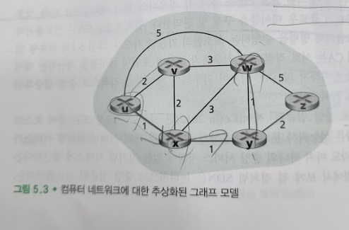
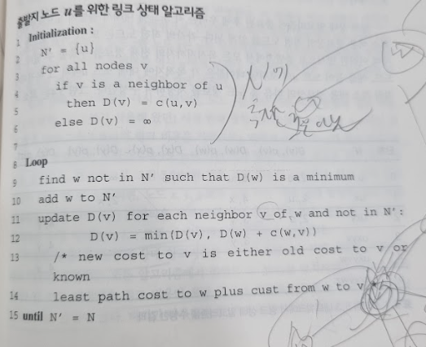
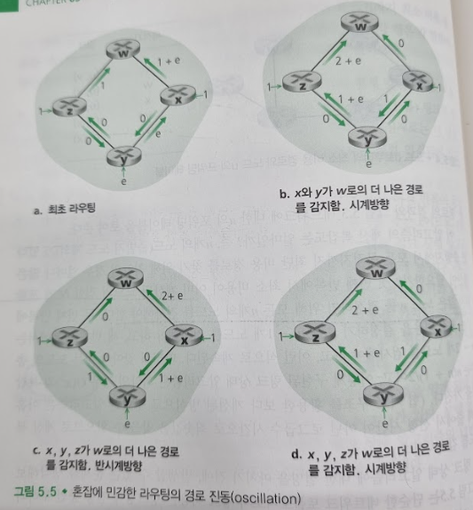
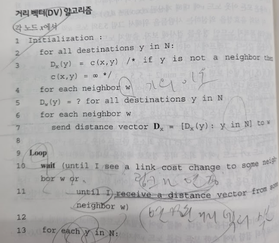
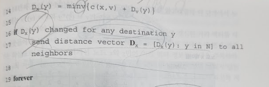

# 라우팅 알고리즘
## 문서 관리자
조승효(문서 생성자)
## 시작
   - 라우팅 알고리즘의 목표는 송신자부터 수신자까지 라우터의 네트워크를 통과하는 좋은 경로(루트라고도 함)을 결정하는 것이다. 일반적으로 좋은 경로란 최소 비용 경로를 나타낸다.
   - 정책상 통과하지 못하는 경로가 있을 수도 있다.

   - 라우팅 문제를 나타내는 데에는 그래프가 사용된다.
   - 그래프는 G = (N, E)로 나타내는데 N과 E는 각각 노드(node)와 에지(edge)의 집합이고, 하나의 에지는 집합 N에 속하는 한 쌍의 노드로 표시된다.
   - 네트워크 계층 라우팅 상황에서, 그래프 상의 노드는 패킷 포워딩 결정이 이루어지는 지점인 라우터를 나타내며 이 노드들을 연결하는 에지는 라우터들 간의 물리 링크를 나타낸다.
   - 에지는 그 비용을 나타내는 값을 가진다. 이 비용은 일반적으로 해당 링크의 물리적인 거리, 링크 속도, 링크과 관련된 금전 비용 등을 반영한다.
   - 집합 E에 포함된 어떤 에지 (x,y)에 대해서, c(x,y)는 노드 x와 y간의 비용을 의미한다. 만약 노드 쌍 (x,y)가 E에 포함되어 있지 않으면 $c(x,y) = \infin$로 둔다. 또한 모든 에지가 방향성을 가지지 않는, 무방향성 그래프만을 고려한다. 그러나 우리가 공부할 알고리즘들은 양방향으로 서로 다른 비용을 가지는 방향성 링크의 경우로 쉽게 확장할 수 있다. 에지 (x,y) 가 집합 E에 속하면, 노드 y는 노드 x의 이웃(neighbor) 이라고 한다.
   - 라우팅 알고리즘은 자연적으로 출발지와 목적지 간 최소 비용 경로를 찾는 것을 목표로 하게 된다. 그래프 G(N, E)에서의 경로는 노드의 연속 $(x_1, x_2, ... , x_p) $ 이고, 노드 쌍 $(x_1, x_2), (x_2, x_3), ... , (x_{p-1}, x_p)$은 집합 E에 속한 에지들임을 기억하자. 경로 $(x_1, x_2, ... , x_p) $의 비용은 경로상 모든 에지 비용의 단순합, 즉 $c(x_1, x_2) + c(x_2, x_3) + ... + c(x_{p-1}, x_p)$이다. 어떤 두 노드 x,y가 주어지면 일반적으로 두 노드 간에 많은 경로 들이 존재하고 각 경로는 비용을 갖는다. 이 중 최소 비용 경로는 하나일 수도 있고 여러 개 일 수도 있다. 최소 비용 문제는 명확하다. 출발지와 목적지 간 최소 비용을 갖는 경로를 찾으면 된다. 최소 비용 경로가 바로 최단 경로(shortest path)가 된다.
   - 중앙 집중형 라우팅 알고리즘은 네트워크 전체에 대한 완전한 정보를 가지고 출발지와 목적지 사이의 최소 비용 경로를 계산한다. 링크 상태(link-state, LS) 알고리즘 이라고 한다.
   - 분산 라우팅 알고리즘에서는 최소 비용 경로의 계산이 라우터들에 의해 반복적이고 분산된 방식으로 수행된다. 어떤 노드도 모든 링크의 비용에 대한 완전한 정보를 갖고 있지 않다. 대신 각 노드는 자신에 직접 연결된 링크에 대한 비용 정보만을 가지고 시작한다. 이후 반복된 계산과 이웃 노드와의 정보 교환을 통해 노드는 점차적으로 목적지 또는 목적지 집합까지의 최소 비용 경로를 계산한다.
   - 정적 라우팅 알고리즘(static routing algorithms)에서 경로는 아주 느리게 변하는데, 종종 사람이 개입한 결과로 그렇게 된다.
   - 동적 라우팅 알고리즘(dynamic routing algorithms)은 네트워크 트래픽 부하(load)나 토폴로지 변화에 따라 라우팅 경로를 바꾼다.
   - 부하에 민감한 알고리즘(load-sensitive algorithms)에서 링크 비용은 해당 링크의 현재 혼잡 수준을 나타내기 위해 동적으로 변한다.
   - 오늘날 인터넷 라우팅 알고리즘(RIP, OSPF, BGP 등)은 링크 비용이 현재(또는 가장 최근)의 혼잡을 반영하지 않기 때문에 부하에 민감하지 않다(load-insensitive)
## 링크 상태(LS) 라우팅 알고리즘
   - 링크 상태 알고리즘에서는 네트워크 토폴로지와 모든 링크 비용이 알려져 있어서 링크 상태 알고리즘의 입력값으로 사용될 수 있다는 점을 기억하자. 이것은 각 노드가 자신과 연결된 링크의 식별자와 비용을 포함하는 링크 상태 패킷을 네트워크상의 모든 다른 노드로 브로드캐스팅 하게 함으로써 가능하다.
   - 링크 상태 알고리즘은 발명자의 이름을 따서 다익스트라 알고리즘(Dijkstra's algorithm)이라고 부른다. 긴밀히 관련된 알고리즘으로는 프림 알고리즘(Prim's algorithm)이 있다. 
   
   - 다익스트라 알고리즘은 하나의 노드(출발지, u라고 지칭)에서 네트워크 내 모든 다른 노드로의 최소 비용 경로를 계산한다. 다익스트라 알고리즘은 반복적이고, 알고리즘의 k 번째 반복 이후에는 k개의 목적지 노드에 대해 최소 비용 경로가 알려지며 이 k개의 경로는 모든 목적지 노드로의 최소 비용 경로 중에서 가장 적은 비용을 갖는 k개의 경로이다.
   - D(v): 알고리즘의 현재 반복 시점에서 출발지 노드부터 목적지 v까지의 최소 비용 경로의 비용
   - p(v): 출발지에서 v까지의 현재 최소 비용 경로에서 v의 직전 노드(v의 이웃)
   - N': 노드의 집합. 출발지에서 v까지의 최소 비용 경로가 명확히 알려져 있다면, v는 N'에 포함된다.
   - 이 알고리즘의 계산 복잡도는 최악의 경우 $O(n^2)$이다. 그러나 힙 자료구조를 이용하면 좀 더 개선할 수 있다.
   
   - 링크 비용은 대칭적이지 않다. 
   - 그래서 라우팅의 경로가 진동하게 된다.
   - 한가지 해결책은 링크 비용이 해당 링크가 전달하는 트래픽의 양에 의존하지 않도록 하는 방법이 있다. 하지만 라우팅의 한 가지 목적이 매우 혼잡한(즉, 높은 지연을 발생시키는) 링크를 회피하는 것이므로 받아들이기 어려운 해결책이다.
   - 모든 라우터가 동시에 링크 상태 알고리즘을 실행하지 못하도록 하면 된다. 라우터들이 스스로 동기를 맞추는 경향이 있기에 랜덤한 시각에 알고리즘을 실행하게 한다.
## 거리 벡터(Distance-Vector, DV) 라우팅 알고리즘
   - 거리 벡터(distance-vector, DV) 알고리즘은 반복적이고 비동기적이며 분산적이다. 각 노드는 하나나 그 이상의 직접 연결된 이웃으로부터 정보를 받고, 계산을 수행하며, 계산된 결과를 다시 그 이웃들에게 배포한다는 점에서 분산적(distributed)이다. 이웃끼리 더 이상 정보를 교환하지 않을 때까지 프로세스가 지속된다는 점에서는 반복적(iterative)이다.(이 알고리즘은 자기 종료를 한다. 즉, 계싼을 멈추라는 신호가 없어도 알아서 멈춘다.) 톱니바퀴 돌듯이 모든 노드가 서로 정확히 맞물려 동작할 필요가 없다는 점에서 비동기적(asynchronous)이라고 할 수 있다.
   - 노드 x에서 y까지 최소 비용 경로의 비용을 $d_x(y)$ 라고 하자. 그러면 최소 비용은 벨만-포드(Bellman-Ford)식에 의해서 다음처럼 나타낼 수 있다. $d_x(y) - min_v\{c(x,v) + d_v(y)\}$
   이 식에서 $min_v$는 x의 모든 이웃에 대해서 적용된다.
   - 벨만-포드 식의 해답은 각 노드 포워딩 테이블의 엔트리를 제공한다. DV 알고리즘에서 일어나는 이웃 간 통신의 형식을 제안한다.
   - 출발지 노드를 x라고 가정하면, 노드 x는 자신으로부터 집합 N에 속한 모든 다른 노드 y까지의 최소 비용 경로의 비용 $D_x(y)$을 추정한다. $D_x = [D_x(y): y \quad in \quad N]$을 노드 x에서부터 N에 속한 모든 다른 노드 y까지의 비용 추정값의 벡터라고 하자. DV 알고리즘으로 각 노드 x는 다음과 같은 라우팅 정보를 유지한다.
      - 각 이웃 노드 v 중에서 x에 직접 접속된 이웃 노드까지의 비용 c(x, v)
      - 노드 x의 거리 벡터, 즉 x로부터 N에 있는 모든 목적지 y로의 비용 예측값을 포함하는 벡터 $D_x = [D_x(y): y \quad in \quad N]$
      - 이웃 노드들의 거리 벡터들, 즉 v가 x의 이웃이라고 하면 $D_v = [D_v(y): y \quad in \quad N]$ 

   - DV 알고리즘에서는 어떤 노드 x가 자신에게 직접 연결된 링크 중 하나의 비용이 변경된 사실을 알게 되거나 어떤 이웃으로부터 변경된 거리 벡터를 수신했을 때 자신의 거리 벡터 추정값을 업데이트한다. 특정 목적지 y에 대한 자신의 포워딩 테이블을 갱신하기 위해서 노드 x가 정말 알아야 하는 것은 y까지의 최단 경로 거리가 아니라 y로의 최단 경로상의 다음 홉 라우터인 이웃 노드 $v^*(y)$이다. 다음 홉 라우터 $v^*(y)$는 DV 알고리즘의 14번째 줄에서 최솟값을 갖게 하는 이웃 v이다.
   - DV의 유사 알고리즘은 실제로 인터넷의 RIP, BGP, ISO IDRP, Novell IPX, 최초의 ARPAnet 등을 포함하여 많은 라우팅 알고리즘에서 사용된다.
   - 갱신 메시지가 더 이상 없으면 라우팅 테이블 계산도 더 이상 없고 알고리즘은 정지 상태가 된다.
   - 링크 비용이 변할 때 링크 비용이 감소하는 것은 큰 문제가 되지 않으나 링크 비용이 커질 때에는 라우팅 루프가 발생하게 된다. 링크 비용 증가라는 소식은 정말 천천이 알려진다. 반복이 계속해서 벌어진다. 이런 문제를 무한 계수 문제(count-to-infinity problem)라고 한다.
   -포이즌 리버스(poisoned reverse) 즉 $D_z(x) = \infin$ 이라고 알리는 방법을 통해서 무한 계수 문제를 회피할 수 있지만 이게 모든 문제를 회피하는 것은 아니다. (단순히 직접 이웃한 두개의 노드가 아닌) 세 개 이상의 노드를 포함한 루프는 포이즌 리버스로는 감지할 수 없다.