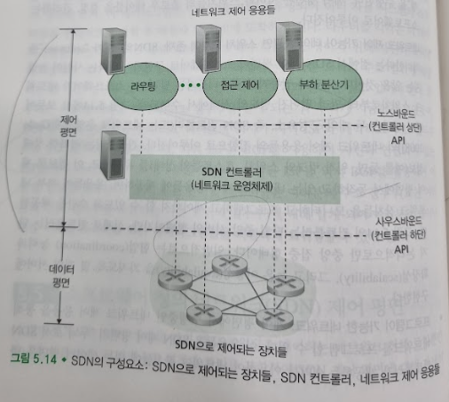
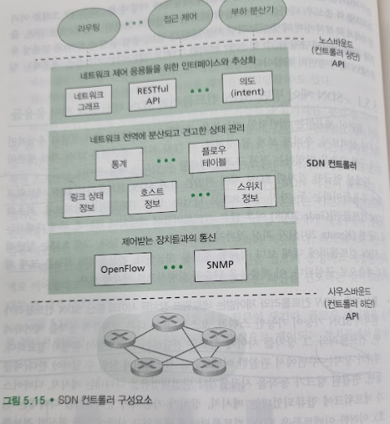

# 소프트웨어 정의 네트워크(SDN) 제어 평면
## 문서 관리자
조승효(문서 생성자)
## 시작
   - 플로우 기반 포워딩: SDN으로 제어되는 스위치들에서의 패킷 포워딩은 전송 계층, 네트워크 계층, 또는 링크 계층 헤더의 어떤 값들을 기반으로도 이루어질 수 있다.
   - 데이터 평면과 제어 평면의 분리
   - 네트워크 제어 기능이 데이터 평면 스위치 외부에 존재: 소프트웨어가 네트워크 스위치로부터 멀리 떨어진 별도의 서버에서 수행됨
   - 프로그램이 가능한 네트워크
   
## SDN 제어 평면: SDN 컨트롤러와 SDN 네트워크 제어 응용들

   - 통신 계층: SDN 컨트롤러와 제어받는 네트워크 장치들 사이의 통신. 컨트롤러와 그 장치들 사이에 정보를 전달하는 프로토콜이 분명히 필요하다. 게다가 장치는 주변에서 관찰한 이벤트들을 컨트롤러에 알릴 수 있어야 한다. 컨트롤러 구조의 가장 하위 계층을 구성한다. 컨트롤러와 제어받는 장치들 간의 통신은 "사우스바운드(southbound)라고 알려진 컨트롤러 인터페이스를 넘나든다.
   - 네트워크 전역 상태 관리 계층: SDN 제어 평면의 궁극적인 제어 결정을 위해서는 컨트롤러가 네트워크 호스트와 링크, 스위치, 그리고 SDN으로 제어되는 다른 장치들에 대한 최신 정보를 알아야 한다.
   - 네트워크 제어 응용 계층과의 인터페이스: 컨트롤러는 노스바운드(nothbound)인 인터페이스를 통해서 네트워크 제어 응용들과 상호작용한다. 이 API는 네트워크 제어 응용들이 상태 관리 계층 내의 네트워크 상태 정보와 플로우 테이블을 읽고 쓸 수 있도록 해준다.
## 오픈플로우(OpenFlow) 프로토콜
   - 오픈플로우 프로토콜은 TCP 상에서 디폴트 포트 번호로 6653을 가지고 동작한다.
   - 컨트롤러에서 제어되는 스위치로 전달되는 중요한 메시지들은 다음과 같다.
      - 설정: 이 메시지는 컨트롤러가 스위치의 설정 파라미터들을 문의하거나 설정할 수 있도록 한다.
      - 상태 수정: 이 메시지는 컨트롤러가 스위치 플로우 테이블의 엔트리를 추가/제거 또는 수정하거나 스위치 포트의 특성을 설정하기 위해 사용된다.
      - 상태 읽기: 이 메시지는 컨트롤러가 스위치 플로우 테이블과 포트로부터 통계 정보와 카운터 값을 얻기 위해 사용한다.
      - 패킷 전송: 이 메시지는 컨트롤러가 제어하는 스위치의 지정된 포트에서 특정 패킷을 내보내기 위해 사용된다. 이 메시지 자체는 페이로드 부분에 보낼 패킷을 포함한다
   - SDN으로 제어되는 스위치에서 컨트롤러로 전달되는 중요한 메시지들은 다음과 같다
      - 플로우 제거: 이 메시지는 컨트롤러에게 어떤 플로우 테이블 엔트리가 시간이 만료되었거나 상태 수정 메시지를 수신한 결과로 삭제되었음을 알린다.
      - 포트 상태: 이 메시지는 스위치가 컨트롤러에게 포트의 상태 변화를 알리기 위해 사용된다.
      - 패킷 전달: 스위치 포트에 도착한 패킷 중에서 플로우 테이블의 어떤 엔트리와도 일치하지 않는 패킷은 처리를 위해 컨트롤러에게 전달된다고 했다. 어떤 엔트리와 일치한 패킷 중에서도 일부는 그에 대한 작업을 수행하기 위해 컨트롤러에게 보내지기도 한다.