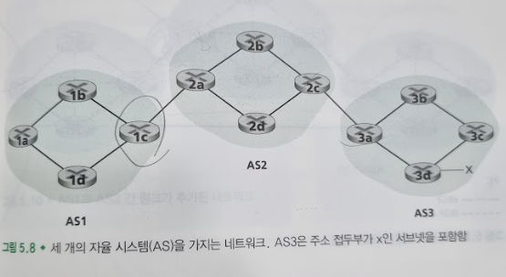
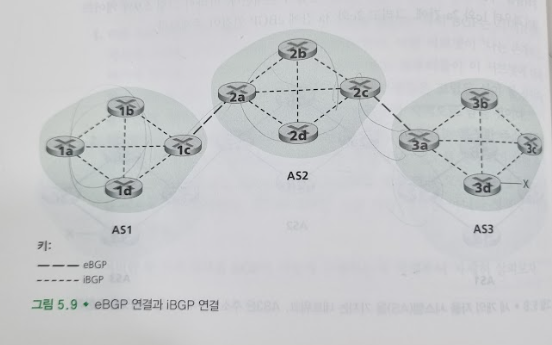
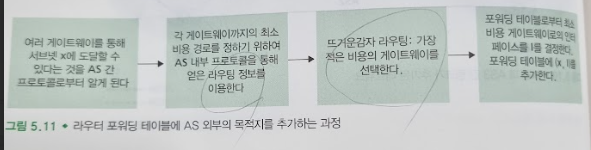
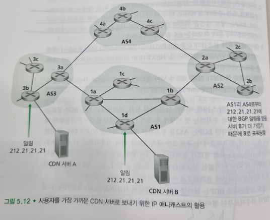

# 인터넷 서비스 제공업자(ISP) 간의 라우팅: BGP
## 문서 관리자
조승효(문서 생성자)
## 시작
   - 패킷이 여러 AS를 통과하도록 라우팅 할 때 우리는 자율 시스템 간 라우팅 프로토콜(inter-autonomous system routing protocol)이 필요하다. 
   - AS간 라우팅 프로토콜은 여러 AS간의 협력이 수반되므로 통신하는 AS들은 같은 AS 간 라우팅 프로토콜을 수행해야만 한다. 사실 인터넷의 모든 AS들은 경계 게이트웨이 프로토콜(Border Gateway Protocol)이라고 불리는 동일한 AS 간 라우팅 프로토콜을 사용한다. 일반적으로 BGP라고 더 잘 알려져 있다.
## BGP의 역할
   - 목적지가 AS 외부에 있는 경우는 어떻게 되는가? 정확히 이 지점에서 BGP가 필요하다.
   - BGP에서는 패킷이 특정한 목적지 주소를 향해서가 아니라 CIDR(Classless Inter-Domain Routing) 형식으로 표현된 주소의 앞쪽 접두부(prefix)를 향해 포워딩된다.
   - 이웃 AS로부터 도달 가능한 서브넷 접두부 정보를 얻는다. 특히 BGP는 각 서브넷이 자신의 존재를 인터넷 전체에 알릴 수 있도록 한다. 어떤 서브넷이 "나는 존재하고 여기에 있어요."라고 외치면 BGP는 인터넷의 모든 라우터들이 이 서브넷에 대해 알 수 있도록 만든다. 만일 BGP가 없다면 각 서브넷들은 고립된 섬이 될 것이다. 혼자인 채, 알려지지 않고, 인터넷에서 접근 불가능한 지역으로 남을 것이다.
   - 서브넷 주소 접두부로의 "가장 좋은" 경로를 결정한다. 라우터는 특정한 주소 접두부를 향한 두 개 이상의 경로를 알 수도 있다. 가장 좋은 경로를 결정하기 위해 라우터는 BGP의 경로 결정 프로시저를 수행한다. 최고의 경로는 도달 가능 정보뿐 아니라 정책에 기반해서 결정된다.
## BGP 경로 정보 알리기
   - 각 AS에서 각각의 라우터들은 게이트웨이 라우터 또는 내부 라우터이다.
   - 내부 라우터는 자신의 AS 내에 있는 호스트 및 라우터와만 연결되어 있다.
   
   - 접두부 x에 대한 도달 가능성 정보를 모든 라우터에게 알리는 작업을 생각해보자. 추상적인 수준에서 얘기하면 매우 간단하다. 먼저 AS3가 AS2에게 BGP 메시지를 보내 x가 존재하고 AS3내에 있음을 알린다. 이 메시지를 "AS3 x" 라고 표기하자. 그러면 AS2는 AS1에게 BGP 메시지를 보내서 x가 존재하고 x에 도달하기 위해서는 먼저 AS2를 통과하고 그 후 AS3 로 갈 수 있다고 알린다. 이 메시지를 "AS2 AS3 x" 라고 표기하자. 이런 방식으로 자율 시스템 각각은 x의 존재뿐 아니라 x에 이르기 위한 자율 시스템의 경로를 알게 된다.
   
   - BGP에서 라우터들의 쌍들은 포트 번호가 179이고 반영구적인 TCP 연결을 통해 라우팅 정보를 교환한다. 이 TCP 연결을 통해 모든 BGP 메시지가 전송되는데 이 연결을 BGP 연결(BGP connection)이라고 부른다. 나아가 두 개의 AS 에 걸친 BGP 연결은 외부 BGP(external BGP, eBGP) 연결이라고 하고, 같은 AS 내의 라우터 간 BGP 연결은 내부 BGP(internal BGP, iBGP) 연결이라고 한다. 1c와 2a 간에, 그리고 2c와 3a 간에 eBGP 연결이 존재한다.
   - 도달 가능성 정보를 전파하기 위해서는 iBGP와 eBGP 연결이 모두 사용된다. 접두부 x에 대한 도달 가능 정보를 AS1과 AS2의 모든 라우터들에게 알리는 경우를 생각해보자. 이 과정에서 게이트웨이 라우터 3a는  먼저 게이트웨이 라우터 2c에게 "AS3 x"라는 eBGP 메시지를 보낸다. 그러면 게이트웨이 라우터 2c는 iBGP 메시지 "AS3 x"를 게이트웨어 라우터 2a를 포함한 AS2 내부의 모든 라우터에게 전송한다. 게이트웨이 라우터 2a는 eBGP 메시지 "AS2 AS3 x"를 게이트웨이 라우터 1c에게 보낸다. 마지막으로 게이트웨이 라우터 1c는 iBGP를 사용하여 AS1 내의 모든 라우터에게 메시지 "AS2 AS3 x" 를 전달한다.
## 최고의 경로 결정
   - 라우터가 BGP 연결을 통해 주소 접두부를 알릴 때 몇몇 BGP 속성(attributes)을 함께 포함한다. BGP 용어로서의 경로(route)는 주소 접두부와 그 속성을 함께 말한다. AS-PATH 속성에는 알림 메시지가 통과하는 AS들의 리스트를 담는다. AS-PATH 값을 생성하기 위해서 접두부가 어떤 AS에 전달되었을 때 그 AS는 자신의 ASN을 AS-PATH 내 현재 리스트에 추가한다. NEXT-HOP은 AS-PATH를 시작하는 라우터 인터페이스의 IP 주소이다.
### 뜨거운감자 라우팅(Hot Potato Routing)
   - 뜨거운감자 라우팅에서는 (가능한 모든 경로 중에서) 경로 각각의 시작점인 NEXT-HOP 라우터까지의 경로 비용이 최소가 되는 경로를 선택한다.
   
   - 포워딩 테이블에 AS 외부의 목적지를 추가할 때 AS간 라우팅 프로토콜(BGP)과 AS 내부 라이틍 프로토콜(OSPF)가 둘다 사용됨을 반드시 알아야 한다.
   - 뜨거운감자 라우팅은 전체 경로 중에서 자기 AS 외부에서 얼마의 비용이 들지는 신경쓰지 않고 오로지 자신의 AS 내부 비용만 줄이려는 이기적인 알고리즘이다.
### 경로 선택 알고리즘
   - 실제로 BGP는 뜨거운감자 라우팅보다는 더 복잡한 알고리즘을 사용하지만, 여전히 뜨거운 감자 라우팅을 포함하고 있다.
   - 하나의 목적지에 대해 두 개 이상의 경로가 존재한다면 BGP는 하나의 경로가 남을 때까지 다음의 제거 규칙을 계속 수행한다.
      - 속성 중의 하나로서 (AS-PATH나 NEXT-HOP 외에) 지역 선호도(local preference)가 경로에 할당된다. 가장 높은 지역 선호값을 가진 경로가 선택된다.
      - 가장 높은 지역 선호값을 가진 경로가 여러 개 있다면 이들 중에서 최단 AS-PATH를 가진 경로가 선택된다. AS 홉수를 기준으로 한다.
      - (같은 최고 지역 선호값과 같은 AS-PATH 길이를 가진 모든) 남은 경로들에 대해 뜨거운감자 라우팅을 수행한다.
      - 하나보다 많은 경로가 남아있다면 라우터는 BGP 식별자를 사용한다.
    - 이기적인 알고리즘이 아니게 되며 BGP는 인터넷 AS간 라우팅의 사실상(de facto) 표준이다.
## IP 애니캐스트(anycast)
   - BGP는 인터넷의 AS 간 라우팅 외에도 종종 DNS에서 흔히 사용되는 IP 애니캐스트 서비스를 구현하는 데도 활용된다. IP 애니캐스트의 사용을 유도하기 위해 많은 으용에서 우리가 (1) 같은 컨텐츠를 지리적으로 분산된 많은 다른 서버에 복제하고, (2) 각 사용자를 가장 가까운 서버의 컨텐츠로 접근하게 하려고 하는 경우를 생각해보자. 예를 들어 CDN은 비디오나 다른 자료들을 서로 다른 나라의 서버들에 복제해 둔다. 유사하게, DNS 시스템도 DNS 레코드들을 전세계 DNS 서버들에 복제할 수 있다. 이런 경우 어떤 사용자가 이 복제된 컨텐츠에 접근을 원할 때 사용자에게 복제된 컨텐츠를 가진 "가장 가까운" 서버를 알려주는 것이 바람직하다. BGP의 경로 선택 알고리즘은 그렇게 하기 위한 매우 쉽고 자연스러운 방법을 제공한다.
   
   - CDN이 IP애니캐스트를 어떻게 활용하는지 알아보자. IP 애니캐스트 설정 단계에서 CDN 사업자가 자신의 서버 각각에 동일한 IP 주소를 할당하고 표준 BGP를 활용하여 이 주소를 서버 각각으로부터 알린다. BGP라우터가 이 IP 주소에 대한 복수 개의 경로 알림 메시지를 받으면 이를 동일한 물리적 위치로의 서로 다른 경로에 대한 정보를 제공받고 있는 것처럼 생각한다(사실은 서로 다른 물리적 위치로의 서로 다른 경로이다). 각 라우터는 라우팅 테이블을 설정하면서 BGP 경로 선택 알고리즘을 수행하여 해당 IP 주소로의 최고의 경로를 골라낸다. 사용자가 비디오를 요청하면 CDN은 사용자가 어디에 위치해있든 상관없이 지리적으로 분산되어 있는 서버들이 공통적으로 사용하는 IP 주소를 사용자에게 돌려준다.
   - CDN은 일반적으로 IP 애니캐스트를 사용하지 않는다. BGP 라우팅이 변경되면 하나의 TCP 연결에 속한 패킷들이 웹서버의 서로 다른 복제본으로 도착될 수 있기 때문이다. 그러나 DNS 시스템에서는 DNS 질의를 가장 가까운 루트 DNS 서버로 전달하기 위해 IP 애니캐스트가 광범위하게 사용된다.
## 라우팅 정책
   - 라우터가 목적지까지의 경로를 선택하려 할 때 AS 라우팅 정책은 최단 AS-PATH나 뜨거운감자 라우팅 같은 다른 모든 고려사항보다 우선시된다. 무임승차등을 방지하기 위함이다.