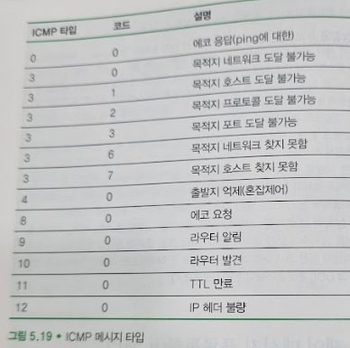

# 인터넷 제어 메시지 프로토콜(ICMP)
## 문서 관리자
조승효(문서 생성자)
## 시작
   - 인터넷 제어 메시지 프로토콜(Internet Control Message Protocol, ICMP)은 호스트와 라우터가 서로 간에 네트워크 계층 정보를 주고받기 위해 사용된다. 가장 전형적인 사용 형태는 오류 보고이다.
   - ICMP는 종종 IP의 한 부분으로 간주되지만, ICMP 메시지가 IP 데이터그램에 담겨 전송되므로 구조적으로는 IP 바로 위에 있다. 즉, TCP나 UDP 세그먼트가 IP 페이로드로 전송되는 것처럼 ICMP 메시지도 IP 페이로드로 전송된다.
