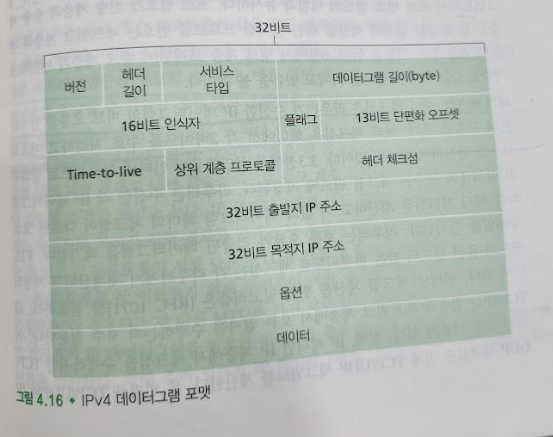

# 인터넷 프로토콜(IP): IPv4, 주소 지정, IPv6 등
## 문서 관리자
조승효(문서 생성자)
## IPv4 데이터그램 형식

   - 버전 번호: 4비트로 데이터그램의 IP 프로토콜 버전을 명시한다.
   - 헤더 길이: IPv4 데이터그램은 헤더에 가변 길이의 옵션을 포함하므로 이 네 비트로 IP 데이터그램에서 실제 페이로드(예를 들어 데이터그램에 캡슐화 된 전송 계층 세그먼트)가 시작하는 곳을 결정한다.
   - 서비스 타입: IPv4 헤더에 포함된 서비스타입(TOS) 비트는 서로 다른 유형의 IP 데이터그램을 구별한다.
   - 데이터그램 길이: 바이트로 계산한 IP 데이터그램(헤더와 데이터)의 전체 길이이다.
   - 식별자, 플래그, 단편화 오프셋: 세 필드는 IP 단편화와 관계가 있다.
   - TTL(Time-to-live): 이 필드는 네트워크에서 데이터그램이 무한히 순환하지 않도록 한다(라우팅 루프). 이 필드 값은 라우터가 데이터그램을 처리할 때마다 감소한다. TTL 필드가 0이 되면 라우터가 데이터그램을 폐기한다.
   - 프로토콜: 이 필드는 일반적으로 IP 데이터그램의 최종 목적지에 도착했을 때만 사용된다.
   - 헤더 체크섬: 헤더 체크섬은 라우터가 수신한 IP 데이터그램의 비트 오류를 탐지하는데 도움을 준다.
   - 출발지와 목적지 IP 주소: 출발지가 데이터그램을 생성할 때, 자신의 IP 주소를 출발지 IP 주소 필드에 삽입하고 목적지 IP 주소를 목적지 IP 주소 필드에 삽입한다.
   - 옵션: 옵션 필드는 IP 헤더를 확장한다.
   - 데이터(페이로드): IP 데이터그램의 데이터 필드는 목적지에 전달하기 위해 전송 계층 세그먼트를 포함하지만 ICMP와 같은 다른 유형의 데이터를 담기도 한다.
## IPv4 데이터그램 단편화
   - 링크 계층 프레임이 전달할 수 있는 최대 데이터 양을 MTU (maximum transmission unit)라 부른다.
   - 링크 계층 프레임 내에 캡슐화되므로 링크 계층 프로토콜의 MTU는 IP 데이터그램 길이에 엄격한 제약을 둔다.
   - 출력 링크가 IP 데이터그램의 길이보다 작은 MTU를 가지는 경우 IP 데이터그램의 페이로드를 두개 이상의 더 작은 IP 데이터그램으로 분할하고 각각의 더 작아진 IP 데이터그램을 별도의 링크 계층 프레임으로 캡슐화하여 출력 링크로 보내는 것이다. 이러한 작은 데이터그램 각각을 조각(fragment, 단편)이라고 한다.

   - 조각들은 목적지 전송 계층에 도달하기 전에 재결합되어야 한다. 실제로 TCP와 UDP 모두 네트워크 계층에서 단편화가 되지 않은 완벽한 세그먼트를 수신하는 것을 기대한다. IPv4 설계자는 네트워크 라우터가 아닌 종단 시스템에서 데이터그램 재결합을 하도록 결정했다.
## IPv4 주소체계
   - 호스트와 물리적 링크 사이의 경계를 인터페이스라고 부른다.
   - 라우터는 2개 이상의 연결된 링크가 필요하다. 라우터와 이런 링크 사이의 경계 또한 인터페이스라 하는데 각 링크마다 하나의 인터페이스를 가지고 하나의 라우터는 여러 개의 인터페이스를 가진다. 모든 호스트와 라우터는 IP 데이터그램을 송수신할 수 있으므로 IP는 각 호스트와 라우터 인터페이스가 IP 주소를 갖도록 요구한다. 따라서 기술 면에서 IP 주소는 인터페이스를 포함하는 호스트 라우터보다는 인터페이스와 관련이 있다.
   - 각 IP 주소는 32비트 길이(4바이트)이다. 따라서 2^32개(대략 40억 개) 주소가 사용 가능하다. 이 주소는 일반적으로 주소의 각 바이트를 십진수로 표현하고 주소의 다른 바이트와 점(.)으로 구분하는 십진 표기법(dotted-decimal notation)을 사용한다.
   - IP 용어로 세 호스트들의 인터페이스들과 하나의 라우터 인터페이스로 연결된 네트워크는 서브넷(subnet)을 구성한다고 말한다. IP 주소 체계는 이 서브넷에 223.1.1.0/24라는 주소를 할당하는데, 여기서 /24("슬래시-24")는 서브넷 마스크(subnet mask)라 부르는데, 32비트 주소의 왼쪽 24비트가 서브넷 주소라는 것을 가리킨다.
   - 서브넷을 결정하려면 먼저 호스트나 라우터에서 각 인터페이스를 분리하고 고립된 네트워크를 만든다. 이 고립된 네트워크의 종단점은 인터페이스의 끝이 된다. 이렇게 고립된 네트워크 각각을 서브넷이라고 부른다.
   - 인터넷 주소 할당 방식에 CIDR(Classless Interdomain Routing)라는 것이 있다. CIDR은 서브넷 주소체계 표기를 일반화하고 있다. 서브넷 주소체계로서, 32비트 IP 주소는 두 부분으로 나누고, 이것은 다시 점으로 된 십진수 형태의 a.b.c.d/x를 가지며, 여기서 x는 주소 첫 부분의 비트 수이다.
   - a.b.c.d/x 형식 주소에서 최상위 비트(most significant bit, MSB)를 의미하는 x는 IP 주소의 네트워크 부분을 구성한다. 이를 해당 주소의 프리픽스(prefix) 또는 네트워크 프리픽스라고 부른다.
   - 주소의 나머지 32-x 비트들은 기관 내부에 같은 네트워크 프리픽스를 갖는 모든 장비들을 구별한다고 보면 된다.
   - IP 주소의 또 다른 형태인 브로드캐스트 주소 255.255.255.255가 있다. 호스트가 목적지 주소가 255.255.255.255인 데이터그램을 보내면, 이 메시지는 같은 서브넷에 있는 모든 호스트에게 전달된다.
   - 주소 블록을 획득하기 위해서는 ISP 에게 요청을 해야 한다. ISP 는 ICANN(Internet Corporation for Assigned Names and Numbers)에게 요청한다.
   - 호스트에 IP 주소를 할당하는 것은 수동으로 구성이 가능하지만 일반적으로 동적 호스트 구성 프로토콜(Dynamic Host Configuration Protocol, DHCP)을 더 많이 사용한다.
      - 네트워크 관리자는 해당 호스트가 네트워크에 접속하고자 할 때마다 동일한 IP 주소를 받도록 하거나, 다른 임시 IP 주소를 할당하도록 DHCP를 설정한다.
      - 네트워크에서 자동으로 호스트와 연결해 주는 DHCP의 능력 때문에 플러그 앤 플레이 프로토콜(plug-and-play protocol) 또는 제로 구성 프로토콜(zero-configuration protocol)이라고도 한다.
      - DHCP는 클라이언트 서버 프로토콜이다.

      - DHCP 서버 발견(DHCP server discovery): 먼저 새롭게 도착한 호스트는 상호 동작될 DHCP를 발견한다. 이것은 DHCP 발견 메시지(DHCP discover message)를 사용하여 수행되며, 클라이언트는 포트 67번으로 UDP 패킷을 보낸다. UDP 패킷은 IP 데이터그램으로 캡슐화된다. 이 메시지 내의 목적지 IP 주소를 브로드캐스팅 IP 주소 255.255.255.255로 설정하고 출발지 IP 주소는 0.0.0.0으로 설정한다.
      - DHCP 서버 제공(DHCP server offer(s)): DHCP 발견 메시지를 받은 DHCP 서버는 DHCP 제공 메시지를 클라이언트로 응답한다. 이때에도 다시 IP 브로드캐스트 주소 255.255.255.255를 사용하요 서브넷의 모든 너드로 이 메시지를 브로드캐스트한다. 서브넷에는 여러 DHCP 서버가 존재하기 때문에, 클라이언트는 여러 DHCP 제공 메시지로부터 가장 최적의 위치에 DHCP 서버를 선택한다. 각각의 서버 제공 메시지는 수신된 발견 메시지의 트랜잭션 ID, 클라이언트에 제공된 IP 주소, 네트워크 마스크 그리고 IP 주소 임대 기간을 포함한다.
      - DHCP 요청(DHCP request): 새롭게 도착한 클라이언트는 하나 또는 그 이상의 서버 제공자 중에서 선택할 것이고 선택된 제공자에게 파라미터 설정으로 되돌아오는 DHCP 요청 메시지로 응답할 것이다.
      - DHCP ACK: 서버는 DHCP 요청 메시지에 대해 요청된 파라미터를 확인하는 DHCP ACK 메시지로 응답한다.
## 네트워크 주소 변환(NAT)
   - SOHO (small office, home office) 네트워크의 확산으로 인해서, SOHO가 장치를 연결하기 위해 LAN을 설치할 때마다 ISP는 모든 SOHO의 IP 장치(전화, 태블릿, 게임 장치, IP TV, 프린터 등)를 수용할 수 있는 주소 범위를 할당해야 한다. 하지만 ISP가 이미 SOHO 네트워크의 해당 주소의 범위에 인접한 부분을 할당해버렸다면? 또 특정 홈 네트워크 소유자가 IP 주소가 어떻게 관리되는지 알고자 한다면? 다행히 이런 상황에서는 네트워크 주소 변환(NAT)으로 주소를 할당할 수 있다.

   - 홈 네트워크 4개 인터페이스 모두 같은 네트워크 주소 10.0.0.0/24를 갖는다. 주소 공간 10.0.0.0/8은 사설망 또는 홈 네트워크와 같은 사설 개인 주소를 갖는 권역(realm)을 위해 예약된 IP 주소 공간 세 부분 중의 하나다. 사설 주소를 갖는 권역이란 네트워크 주소들이 그 네트워크의 내부에 있는 장비에게만 의미가 있는 그런 네트워크를 의미한다.
   - 주어진 홈 네트워크 내부의 장비는 서로 10.0.0.0/24 주소체계를 이용하여 서로 패킷을 송신할 수 있다. 그러나 그 홈 네트워크 벗어나 글로벌 인터넷으로 가는 패킷 전달은 이 주소들을 사용할 수 없다. 즉 10.0.0.0/24 주소들은 주어진 홈 네트워크 내부에서만 의미가 있다.
   - "NAT 가능"한 라우터는 외부 세계로는 라우터처럼 보이지 않는다. 대신 NAT 라우터는 외부세계로는 하나의 IP 주소를 갖는 하나의 장비로 도착한다. 홈 라우터를 떠나 인터넷으로 가는 트래픽은 목적지 주소 138.76.29.7을 가져야 한다. 본질적으로 NAT 가능 라우터는 외부에서 들어오는 홈 네트워크의 상세한 사항을 숨긴다.(홈 네트워크 컴퓨터가 어디에서 주소를 얻고, 라우터가 한 IP 주소를 어디에서 얻는 것인지 대해 의문을 가져야 한다. 많은 경우에 그 대답은 같다. 바로 DHCP이다! 라우터는 ISP의 DHCP 서버로부터 주소를 얻고, NAT-DHCP-라우터로 제어되는 홈네트워크의 주소공간에서 DHCP 서버를 실행하여 컴퓨터에게 주소를 제공한다.)
   - WAN에서 같음 목적지 IP 주소를 갖는 NAT 라우터에 모든 데이터그램이 도착하면, 라우터가 주어진 데이터그램을 전달하는 내부 호스트를 알 수 있는 방법은 무엇인가? 비결은 NAT 라우터에서 NAT 변환 테이블(NAT translation table)을 사용하고, 그 테이블에 IP 주소와 포트 번호를 포함하는 것이다.
## IPv6
   - IPv4 주소가 고갈됨에 따라 등장하게 되었다.

   - IP 주소 크기를 32비트에서 128비트로 확장했다.
   - 애니캐스트 주소(anycast address)가 도입되었다. 애니캐스트 주소로 명시된 데이터그램은 호스트 그룹의 어떤 이에게도 전달될 수 있다.
   - 버전: 이 4비트 필드는 IP 버전번호를 인식한다. IPv6의 이 필드 값은 "6"이다. 단순히 이 필드를 "4"로 설정한다고 IPv4 데이터그램을 만들수 있는 것은 아니다.
   - 트래픽 클래스: IPv4의 TOS 필드와 비슷한 의미로 만든 8비트 필드는 흐름 내의 SMTP 이메일 같은 애플리케이션의 데이터그램보다 voice-over-IP 같은 특정 응답용 데이터그램에 우선 순위를 부여하는 데 사용된다.
   - 흐름 라벨: IPv6는 정의하기 어려운 흐름(flow)을 가지고 있다. RFC 2460은 "비 디폴트 품질 서비스나 실시간 서비스와 같은 특별한 처리를 요청하는 송신자에 대해 특정 흐름에 속하는 패킷 레이블링"을 가능하게 한다고 설명한다. 예를 들어, 오디오/비디오 전송은 흐름으로 처리된다. 반면에, 파일 전송이나 전자 메일과 같은 예전의 애플리케이션은 흐름으로 처리되지 않는다. 높은 사용자 우선 순위를 가지고 전달된 트래픽 또한 흐름처럼 처리될 수 있다. 흐름의 정확한 의미는 아직 정의되지 않았지만, IPv6 설계자가 언젠가 필요한 흐름 차별화를 예견했다는 사실은 분명하다.
   - 페이로드 길이: 이 16비트 값은 IPv6 데이터그램에서 고정 길이 40바이트 패킷 헤더 뒤에 나오는 바이트 길이이며 부호 없는 정수(unsigned integer)다.
   - 다음 헤더: 이 필드는 데이터그램의 내용(데이터 필드)이 전달될 프로토콜(예: TCP나 UDP)을 구분한다. 이 필드는 IPv4의 헤더에 있는 프로토콜 필드와 같다.
   - 홉 제한: 이 필드의 내용은 라우터가 데이터그램을 전달할 때마다 1씩 감소한다. 홉 제한 수가 0보다 작아지면 데이터그램을 버린다.
   - 출발지와 목적지 주소: IPv6 128비트 주소의 다양한 형태는 RFC 4291에 있다.
   - 데이터: IPv6 데이터그램의 페이로드 부분이다. 데이터그램이 목적지에 도착하면 IP 데이터그램에서 페이로드를 제거한 후, 다음 헤더 필드에 명시한 프로토콜에 전달한다.
   - 단편화/재결합 필드가 존재하지 않는다.
   - 헤더 체크섬이 존재하지 않는다.
   - 옵션 필드가 존재하지 않는다.
### IPv4에서 IPv6로의 전환
   - 플래그 데이를 선언하는 방법이 있다. 즉, 모든 인터넷 장비를 끄고 IPv4에서 IPv6로 업그레이드하는 시간과 날짜를 정하는 것이다. 현실적으로 불가능하다.
   - IPv4에서 IPv6로 전환하는 방법은 터널링을 포함한다.
