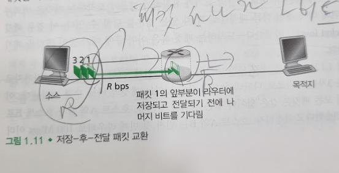
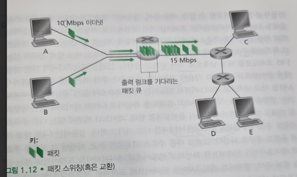
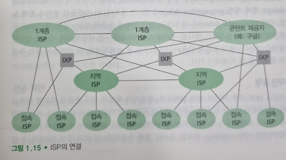

# 네트워크 코어
## 문서 관리자
조승효(문서 생성자)
## 패킷 교환
   - 송신 종단 시스템에서 목적지 종단 시스템으로 메시지를 보내기 위해, 송신 시스템은 긴 메시지를 패킷(packet)이라고 하는 작은 데이터 덩어리로 분할한다. 송신 측과 수신 측 사이에서 각 패킷은 통신 링크와 패킷 스위치를 거치게 된다.
   - 송신 종단 시스템 혹인 패킷 스위치가 R bits/sec 의 속도로 링크상에서 L bits 의 패킷을 송신한다면 그 패킷을 전송하는데 거리는 시간은 L/R초이다.
   - 저장-후-전달

      - 스위치가 출력 링크로 패킷의 첫 비트를 전송하기 전에 전체 패킷을 받아야 함을 의미함
      - 그림에서 패킷 각각의 크기가 L bits 라고 할 때 패킷 1의 일부가 라우터에 도착해도 라우터는 수신한 비트를 전송할 수 없다. 대신에 그 패킷의 비트를 먼저 저장한 후, 라우터가 패킷의 모든 비트를 수신한 후에만 출력 링크로 그 패킷을 전송
      - 패킷1은 목적지에 2L/R 초에 도달함. 만약에 저장 후 전달 방식을 사용하지 않았다면 L/R초 만에 도착했을 것
      - 패킷2가 목적지에 도달하는 시간은 3L/R, 패킷3이 목적지에 도달하는 시간은 4L/R
      - 소스로부터 목적지 노드까지 N개의 링크로 구성되고, 각각은 R 전송속도를 갖는 경로를 통해 하나의 패킷을 전송하면 지연 시간은 N * (L/R)
   - 큐잉 지연과 패킷 손실
      - 각 링크에 대해 패킷 스위치는 출력 버퍼(출력 큐라고도 함)를 갖고 있으며, 그 링크로 송신하려고 하는 패킷을 저장하고 있다.
      - 패킷은 출력 버퍼에서 큐잉 지연(queuing delay)을 겪게 된다.
      - 패킷 손실을 당하게 된다.

      - 라우터에 도착하는 패킷의 전송속도가 15Mbps를 초과하면 라우터에서 혼잡이 발생한다.
   - 전달 테이블과 라우팅 프로토콜
      - 라우터는 어떻게 그 패킷을 어느 링크로 전달해야 하는지를 결정하는가?
      - 인터넷에서 모든 종단 시스템은 IP 주소라고 하는 주소를 갖는다.
      - 주소는 계층적 구조를 갖는다.
      - 패킷이 네트워크의 한 라우터에 도착하면, 라우터는 패킷의 목적지 주소의 일부를 조사하고 그 패킷을 이웃 라우터로 전달한다. 보다 구체적으로 각 라우터는 목적지 주소(혹은 목적지 주소의 일부)를 라우터의 출력 링크로 매핑하는 전달 테이블(forwarding table)을 갖고 있다.
      - 전달 테이블은 라우팅 프로토콜에 의해 설정된다.
## 회선 교환
   - 회선 교환 네트워크에서 종단 시스템 간에 통신을 제공하기 위해 경로상에 필요한 자원(버퍼, 링크 전송률)은 통신 세션(session) 동안에 확보 또는 예약(reserve)된다.
   - 회선 교환 네트워크의 예로 전통적인 전화망이 있다. 회선(circuit)을 통해 일정한 전송률을 예약한다.
   - 회신 교환 네트워크에서의 다중화
      - 주파수-분할 다중화(frequency-division multiplexing, FDM): 주파수 스펙트럼 공유, 대역의 폭을 대역폭(bandwidth)라고 함
      - 시-분할 다중화(time-division multiplexing, TDM): 일정 주기의 프레임으로 구분하고 각 프레임은 고정된 수의 시간 슬롯으로 나뉜다.
   - 회선이 비활용 기간(silent period) 에는 놀게되므로 낭비라고 주장함
   - 회선 교환보다 패킷 교환이 최대 사용자수가 더 많을 수 있다.
   - 회선 교환보다 패킷 교환이 유휴가 더 적을 수 있다.
   - 그래서 패킷 교환이 대세가 되고 있다.
## 네트워크의 네트워크
   - 오늘날의 인터넷은 복잡하며, 12개 정도의 1 계층 ISP 들과 수십만 개의 하위 계층 ISP들로 구성되어 있다.
   - 하나의 글로벌 통과 ISP 가 있는 네트워크 구조 1
   - 다중의 글로벌 ISP 가 있는 네트워크 구조 2
   - 지역 ISP 가 존재하는 네트워크 구조 3
   - PoP, 멀티-홈, 피어링, IXP 가 존재하는 네트워크 구조 4
      - PoP는 단지 제공자의 네트워크 내에 있는(같은 위치에 존재하는) 하나 혹은 그 이상의 라우터 그룹, 여기에서 고객 ISP가 제공자 ISP에 연결될 수 있다.
      - (1계층 ISP를 제외한) 모든 ISP는 멀티 홈, 즉 둘 혹은 그 이상의 제공자 ISP에 연결하도록 선택할 수 있다.
      - 서로 요금을 부여하지 않는 피어링 그리고 이러한 피어링을 중개하는 IXP(Internet Exchange Point)
   - 콘텐트-제공자 네트워크(content-provider network) 가 있는 네트워크 구조 5
