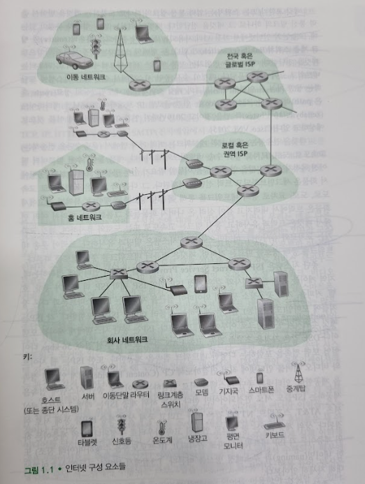

# 인터넷이란 무엇인가?
## 문서 관리자
조승효(문서 생성자)
## 구성요소로 본 인터넷

   - 인터넷은 전 세계적으로 수십억 개의 컴퓨팅 장치를 연결하는 컴퓨터 네트워크
   - 개인 PC, 태블릿, 휴대폰, 인터넷 사물들을 호스트 혹은 종단 시스템(end system) 이라고 부름
   - 종단 시스템은 통신 링크(communication link)와 패킷 스위치(packet switch)의 네트워크로 연결된다.
      - 링크는 동축 케이블, 구리선, 광케이블, 라디오 스펙트럼을 포함한 다양한 물리 매체(physical media) 로 구성된다. 이 때 각각의 링크들은 다양한 전송률(transmission rate, 링크 대역폭)을 이용하여 데이터를 전송하며, 전송률은 초당 비트 수를 의미하는 bps (bit per second) 단위를 사용한다.
   - 송신 종단 시스템은 그 데이터를 세그먼트(segment)로 나누고 각 세그먼트에 헤더(header)를 붙인다. 이렇게 만들어진 정보 패키지는 컴퓨터 네트워크에서 패킷(packet)이라고 부른다.
   - 패킷 교환기는 입력 통신 링크의 하나로 도착하는 패킷을 받아서 출력 통신 링크의 하나로 그 패킷을 전달한다. 두 가지 종류가 있는데 router(네트워크 코어에서 사용) 와 link-layer switch(액세스 네트워크에서 사용) 가 있다.
   - 종단 시스템은 ISP (Internet Service Provider)를 통해서 인터넷에 접속하며, 여러 프로토콜 특히 TCP(Transmission Control Protocol) 와 IP(Internet Protocol) 을 사용한다.
   - 인터넷 표준(Internet standard)는 IETF(Internet Engineering Task Force) 에서 개발하며 IETF 표준 문서를 RFCs(requests for comments) 라고 한다.
## 서비스 측면에서 본 인터넷
   - 애플리케이션에 서비스를 제공하는 인프라구조로서 인터넷을 기술할 수 있다.
   - 웹서핑과 같은 애플리케이션은 서로 데이터를 교환하는 많은 종단 시스템을 포함하고 있기 때문에 분산 애플리케이션(distributed application)이라고 부른다.
   - 인터넷 애플리케이션은 종단 시스템에서 수행된다.
   - 인터넷에 접속된 종단 시스템들은 한 종단 시스템에서 수행되는 프로그램이 어떻게 인터넷 인프라 구조에게 다른 종단 시스템에서 수행되는 특정 목적지 프로그램에게 데이터를 전달하도록 요구하는지를 명시하는 소켓 인터페이스(socket interface)를 제공한다.
## 프로토콜이란 무엇인가?

   - 어떤 일을 수행하려면 둘 이상의 통신 개체(entity)가 함께 인식하는 프로토콜이 필요하다.
   - 인터넷에서의 모든 활동은 프로토콜이 제어한다.
   - 프로토콜은 둘 이상의 통신 개체 간에 교환되는 메시지 포맷과 순서뿐 아니라, 메시지의 송수신과 다른 이벤트에 따른 행동들을 정의한다.