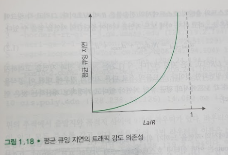

# 패킷 교환 네트워크에서의 지연, 손실과 처리율
## 문서 관리자
조승효(문서 생성자)
## 패킷 교환 네트워크에서의 지연 개요
   - 처리 지연: 패킷을 어디로 보낼지 결정하는 시간
   - 큐잉 지연: 패킷은 큐에서 링크로 전송되기를 기다릴 때 걸리는 시간
   - 전송 지연: 모든 비트를 링크로 밀어내는 데 필요한 시간 패킷의 크기가 L, 전송률이 R 이면 전송 지연 시간은 L/R
   - 전파 지연: 링크의 처음부터 라우터 B까지의 전파에 필요한 시간 빛의 속도보다 약간 작다.
   - 전송 지연과 전파 지연 비교
      - 전송 지연은 라우터가 패킷을 내보내는데 필요한 시간(패킷 길이와 링크 전송률의 함수이며, 두 라우터 사이의 거리와는 관계없다.)
      - 전파 지연은 비트가 한 라우터에서 다음 라우터로 전파되는 데 걸리는 시간이다(두 라우터 사이의 거리에 대한 함수며, 패킷 길이나 전숭률과는 관계 없다.)
      - [애니메이션 링크](https://www.tkn.tu-berlin.de/teaching/rn/animations/propagation/)
   - 전체 지연 = 처리 지연 + 큐잉 지연 + 전송 지연 + 전파 지연
## 큐잉 지연과 패킷 손실
   - 트래픽 강도는 La / R 로 표현할 수 있다. 여기에서 L 은 패킷의 비트수 R 은 전송률, a는 패킷이 큐에 도착하는 평균율이다.
   - 주기적으로 도착한다면 큐잉 지연은 없지만 몰려서 도착한다면 상당한 큐잉 지연이 생김

   - 트래픽 강도가 1에 접근할수록 평균 큐잉 지연이 급속히 증가한다.
   - 현실적으로 큐는 유한하므로 큐가 꽉찰 때 패킷을 버린다(drop) 즉, 그 패킷을 잃어버리게 된다(lost)
## 종단간 지연
   - 종단 간 지연은 링크가 N 개 라우터가 N - 1 개 있다고 가정하면 dend-end = N(처리 지연 + 전송 지연 + 전파 지연) 여기에서 큐잉 지연은 무시한다.
## 컴퓨터 네트워크에서의 처리율
   - 주요한 성능 수단은 종단간 처리율
   - 호스트 A에서 호스트 B로 커다란 파일을 전송한다고 할 때 순간적인 처리율(instantaneous throughput)은 호스트 B 가 파일을 수신하는 비율이다. 호스트 B가 모든 F 비트를 수신하는 데 T 초가 걸린다고 한다면, 이때 파일 전송의 평균 처리율(average throuput)은 F/T 비트/초이다.
   - 병목 링크의 전송률이 처리율이 되기도 한다.