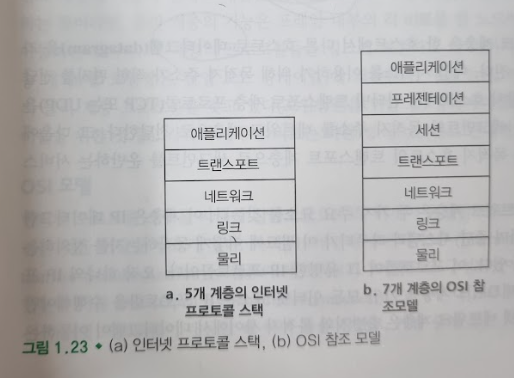
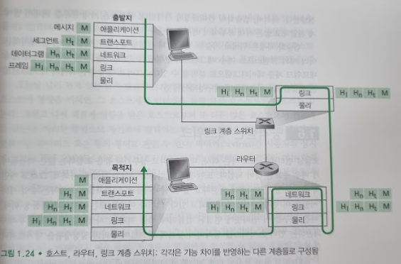

# 프로토콜 계층과 서비스 모델
## 문서 관리자
조승효(문서 생성자)
## 계층구조
   - 계층구조는 크고 복잡한 시스템의 잘 정의된 특정 부분을 논의할 수있게 해 준다.
### 프로토콜 계층화
   - 프로토콜(프로토콜을 구현하는 네트워크 하드웨어와 소프트웨어)을 계층(layer)으로 조직한다.
   - 한 계층이 상위 계층에 제공하는 서비스에 관심을 갖고, 이것을 계층의 서비스 모델(service model) 이라고 한다.
   -n 계층 프로토콜이 네트워크를 구성하는 종단 시스템, 패킷 스위치, 그 외의 다른 요소 사이에 분산된 것을 주목하자.
   - 모듈화는 시스템 구성요소의 갱신을 더 쉽게 해준다.
   - 중복이 되는 문제도 있다.
   - 다양한 계층의 프로토콜을 모두 합하여 프로토콜 스택(protocol stack)이라고 한다.

### 애플리케이션 계층
   - 애플리케이션 계층은 네트워크 애플리케이션과 애플리케이션 계층 프로토콜이 있는 곳
   - 인터넷 애플리케이션 계층은 HTTP(웹 문서 요청과 전송을 위해 제공), SMTP(전자메일 전송을 제공) 및 FTP(두 종단 시스템 간의 파일 전송 제공) 같은 많은 프로토콜을 포함한다.
   - 도메인 네임 서버(domain name server, DNS)가 돕는다.
   - 애플리케이션 계층에서의 이 정보 패킷을 메시지(message)라고 부른다.
### 프레젠테이션 계층
   - 프레젠테이션 계층은 데이터를 표현할 수 있는 방식을 결정한다.
   - 프레젠테이션 계층은 데이터 암호화 및 문자 변환과 같은 정보를 표현하는 기능을 제공한다.
   - 프레젠테이션 계층의 역할은 통신하는 애플리케이션들이 교환되는 데이터의 의미를 해석하도록 서비스를 제공하는 것이다. 이들 서비스는 데이터 기술 뿐만 아니라 데이터 압축과 데이터 암호화를 포함한다. 데이터 기술은 애플리케이션이 데이터가 표현/저장되는 내부 포맷을 걱정하지 않아도 되게 해준다.
### 세션 계층
   - 통신 연결을 하기 위한 다양한 옵션 결정과 OS 간에 논리적인 연결을 담당한다. 이때, 통신 연결 옵션에는 서비스 요청과 응답으로 구성되며, 이는 다른 네트워크 장비에 위치한 응용프로그램들 사이에서 동작한다.
   - 세션 계층은 데이터 교환의 경계와 동기화를 제공하는데, 이에는 체킹포인트와 회복 방법을세우는 수단을 포함한다.
### 트랜스포트 계층
   - 인터넷의 트랜스포트 계층은 클라이언트와 서버 간에 애플리케이션 계층 메시지를 전송하는 서비스를 제공한다.
   - 인터넷에는 두 가지, 즉 TCP와 UDP라는 트랜스포트 프로토콜이 있으며, 이들은 애플리케이션 계층 메시지를 전달한다. 
   - TCP는 애플리케이션에게 연결지향형 서비스를 제공한다. 이 서비스는 목적지로의 애플리케이션 계층 메시지 전달 보장과 흐름제어(송신자/수신자의 속도 일치)를 포함한다. 또한 TCP는 긴 메시지를 짧은 메시지로 나누고 혼잡제어 기능을 제공하여, 네트워크가 혼잡할 때 출발지의 전송속도를 줄이도록 한다.
   - UDP 프로토콜은 애플리케이션에 비연결형 서비스를 제공한다. 이 서비스는 신뢰성, 흐름제어, 혼잡제어를 제공하지 않는 아주 간단한 서비스다.
   - 트랜스포트 계층 패킷을 세그먼트(segment)라고 한다.
### 네트워크 계층
   - 인터넷의 네트워크 계층은 한 호스트에서 다른 호스트로 데이터그램(datagram)을 라우팅하는 책임을 진다.
   - IP 데이터그램의 필드를 정의하며 종단 시스템과 라우터가 이 필드에 어떻게 동작하는지를 정의하는 프로토콜을 갖고 있다. 이 프로토콜이 그 유명한 IP 프로토콜이다.
   - 인터넷 네트워크 계층은 출발지와 목적지 사이에서 데이터그램이 이동하는 경로를 결정하는 라우팅 프로토콜을 포함한다.
### 링크 계층
   - 경로상의 한 노드(호스트 혹은 패킷 스위치)에서 다른 노드로 패킷을 이동하기 위해, 네트워크 계층은 링크 계층 서비스에 의존해야 한다. 특히 각 노드에서 네트워크 계층은 데이터그램을 아래 링크 계층으로 보내고, 링크 계층은 그 데이터그램을 경로상의 다음 노트에 전달한다. 다음 노드에서 링크 계층은 그 데이터그램을 상위 네트워크 계층으로 보낸다.
   - 신뢰적 전송을 제공하기도 한다.
   - 링크 계층 프로토콜의 예로는 이더넷, 와이파이, 그리고 케이블 접속 네트워크의 DOCSIS 프로토콜을 들 수 있다.
   - 링크 계층 패킷을 프레임(frame)이라고 한다.
### 물리 계층
   - 링크 계층의 기능이 전체 프레임을 한 네트워크 요소에서 이웃 네트워크 요소로 이동하는 것이라면, 물리 계층의 기능은 프레임 내부의 각 비트를 한 노드에서 다음 노드로 이동하는 것이다. 이 계층의 프로토콜들은 링크에 의존하고 더 나아가 링크의 실제 전송 매체에 의존한다.
## 캡슐화
   - 라우터와 링크 계층 스위치는 둘 다 패킷 교환기

   - 캡슐화는 메시지에 헤더를 추가하는 것. 예를 들어 그램에서 트랜스포트 계층 세그먼트는 애플리케이션 계층 메시지를 캡슐화한다.
   - 캡슐화는 마치 우편을 처리하는 시스템으로 생각하면 됨.