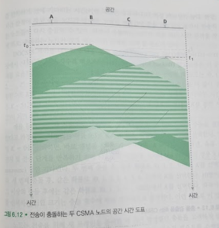
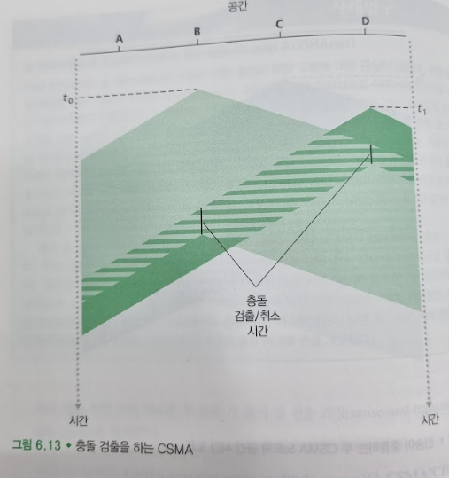

# 다중 접속 링크와 프로토콜
## 문서 관리자
조승효(문서 생성자)
## 시작
   - 점대점 링크(point-to-point link)는 링크의 한쪽 끝에 한 송신자와 링크의 다른 쪽 끝에 한 수신자가 있다. PPP(point-to-point protocol)와 HDLC(high-level data link control)가 이에 속한다.
   - 브로드캐스트 링크(broadcast link)는 동일한 하나의 공유된 브로드캐스트 채널에 다수의 송신 노드 및 수신노드들이 연결된다. 여기서 브로드캐스트라는 용어는 임의의 한 노드가 프레임을 전송하면 채널이 그 프레임을 방송(broadcast)해서 다른 모든 노드들이 그 프레임의 복사본을 수신하기 때문에 사용된 것이다. 이더넷과 무선 랜은 브로드캐스트 링크 기술의 대표적인 예
   - 다중 접속 문제(multiple access problem), 즉 "다수의 송수신 노드들의 공유되는 브로드캐스트 채널로의 접속을 조정하는 문제"
   - 컴퓨터 네트워크에서도 공유되는 브로드캐스트 채널로 보내는 노드들의 전송을 조정하기 위한 다중 접속 프로토콜(multiple access protocol)이라는 프로토콜이 있다.
   - 모든 노드들이 프레임을 전송할 수 있으므로, 2개 이상의 노드가 동시에 프레임을 전송할 수 있다. 이런 일이 발생하면, 모든 노드는 동시에 여러 개의 프레임을 받게 된다. 즉, 전송된 프레임들이 각 수신자에서 충돌(collide)한다.
   - 수십 개의 다양한 다중 접속 프로토콜들이 다양한 링크 계층 기술에서 구현되었다. 다중 접속 프로토콜은 채널 분할 프로토콜(channel partitioning protocol), 랜덤 접속 프로토콜(random access protocol), 순번 프로토콜(takingturns protocol)의 세 가지로 분류할 수 있다.
## 채널 분할 프로토콜
   - 채널이 N개 노드를 지원하고 채널 전송률이 R bps라고 하자. TDM은 시간을 시간 프로엠(time frame)으로 나누고 또한 각 시간 프레임을 N개의 시간 슬롯(time slot)으로 나눈다. 교환되는 데이터의 링크 계층 단위를 패킷이라 한다. 충돌을 제거할 수 있고 아주 공정하므로 바람직하다.(각 노드는 프레임 시간 동안에 R/N bps 의 할당된 전송률을 가진다). 그러나 이 방식은 두 가지 단점이 있다. 첫째, 전송할 패킷이 있는 노드가 단 하나인 경우에도 노드 전송률이 평균 R/N으로 제한된다. 둘째, 노드가 전송 순서상 자신의 차례를 항상 기다려야 한다.
   - FDM은 R bps의 채널을 다른 주파수(각 R/N의 대역폭을 갖는)로 나눠서 각 주파수를 N개 노드 중 하나에게 할당한다. 따라서 FDM은 하나의 큰 R bps 채널로부터 N개의 R/N bps의 작은 채널을 만든다. FDM은 TDM과 같은 장단점이 있다. FDM은 충돌을 피하고 N개 노드에게 대역폭을 균등하게 분할한다. 그러나 FDM은 TDM과 같은 주요 단점이 있다. 즉, 전송할 패킷을 가진 노드가 단 하나일지라도 노드는 R/N의 대역폭으로 한정된다.
   - 코드 분할 다중 접속(code division multiple access, CDMA)는 다른 코드를 각 노드에게 할당한다. 그러면 노드는 전송하는 데이터 비트들을 자신의 유일한 코드로 인코딩한다.
## 랜덤 접속 프로토콜
   - 랜덤 접속 프로토콜에서 전송 노드는 항상 채널의 최대 전송률인 R bps로 전송한다. 충돌이 생기면 충돌과 관련된 각 노드는 프레임(패킷)이 충돌 없이 전송될 때까지 자신의 프레임을 계속해서 재전송한다. 그러나 충돌했을 때 노드는 해당 프레임을 즉시 재전송할 필요가 없다. 대신 그 프레임을 재전송하기 전에 랜덤 지연 시간 동안 기다린다.
### 슬롯 알로하
   - 모든 프레임은 정확히 L 비트로 구성된다.
   - 시간은 L/R초의 슬롯들로 나뉜다.
   - 노드는 슬롯의 시작점에서만 프레임을 전송하기 시작한다.
   - 각 노드는 언제 슬롯이 시작하는지 알 수 있게끔 동기화되어 있다.
   - 한 슬롯에서 2개 이상의 프레임이 충돌하면, 모든 노드는 그 슬롯이 끝나기 전에 충돌 발생을 알게 된다.
   - p를 확률(0과 1 사이의 숫자)이라 하자. 각 노드에서의 슬롯 알로하의 동작은 다음처럼 단순하다.
   - 노드는 전송할 새 프레임이 있으면 다음 슬롯이 시작할 때까지 기다렸다가 그 슬롯에 전체 프레임을 전송한다.
   - 만약 충돌하지 않으면, 노드는 성공적으로 자신의 프레임을 전송한 것이다. 따라서 그 프레임을 재전송할 필요가 없다(전송할 것이 또 있으면 노드는 새 프레임을 준비한다)
   - 만약 충돌하면, 노드는 그 슬롯이 끝나기 전에 충돌을 검출한다. 노드는 그 프레임이 충돌 없이 전송될 때까지 확률 p로 해당 프레임을 다음 슬롯들에서 재전송한다.
   - 슬롯 알로하는 하나의 활성 노드로 하여금 채널의 전속력 R로 계속해서 프레임을 전송할 수 있도록 허용한다. 또한 슬롯 알로하는 각 노드가 충돌을 감지하고 언제 재전송할지 각자 결정하므로 상당히 분산되어 있다.
   - 활성 노드가 많이 있으면 일부 슬롯이 충돌로 인해 결과적으로 "낭비" 된다는 것이다.
   - 모든 활성 노드들이 확률적인 전송 정책 때문에 전송을 억제하는 경우 일부 슬롯이 빈다는 것이다.
   - 낭비 되지 않는 슬롯은 정확히 한 노드만 전송하는 슬롯이다.
   - 슬롯 알로하의 효율은 노드가 무한히 많을 때 최대 37% 정도의 효율을 낸다.
### 알로하
   - 슬롯이 없고 완전히 분산된 프로토콜이었다. 순수 알로하(pure ALOHA)로 알려진 이 프로토콜에서는 프레임이 도착하면(즉, 네트워크 계층 데이터그램이 송신 노드의 네트워크 계층으로부터 아래로 전달되면) 노드는 즉시 그 프레임 전체를 브로드캐스트 채널로 전송한다. 만일 전송된 프레임이 하나 이상의 다른 전송과 충돌하면, 노드는 확률 p로 그 프레임을 즉시 재전송한다.
   - 순수 알로하의 최대 효율은 약 18% 정도이다.
### CSMA (Carrier Sense Multiple Access)
   - 말하기 전에 듣는다. 만일 다른 사람이 말하고 있으면, 말이 끝날 때까지 기다려라. 네트워크에서는 이것을 캐리어 감지(carrier sensing)라고 한다.
   - 다른 사람이 동시에 말하기 시작하면 말을 중단한다. 네트워크에서는 이것을 충돌 검출(collision detection)이라 한다
   
   - 채널 전파 지연이 CSMA의 성능을 결정하는 데 중요한 역할을 한다는 것을 명확히 알 수 있다.
### CSMA/CD (Carrier Sense Multiple Access with Collision Detection)

   1. 어댑터는 네트워크 계층으로부터 데이터그램을 받아서 링크 계층 프레임을 만든 후에 그 프레임을 어댑터의 버퍼에 저장한다.
   2. 어댑터는 채널이 유휴(idle)한 것을 감지하면(즉, 채널로부터 어댑터로 들어오는 신호 에너지가 없으면) 프레임 전송을 시작한다. 만일 어댑처가 채널이 바쁜(busy) 것을 감지하면, 어떤 신호 에너지도 감지되지 않을 때까지 더 기다렸다가 프레임을 전송하기 시작한다.
   3. 전송하는 동안 어댑터는 브로드캐스트 채널을 사용하는 다른 어댑터로부터의 신호 에너지가 있는지 감시한다.
   4. 프레임 전체를 전송하는 동안 다른 어댑터로부터의 신호 에너지가 감지되지 않으면, 프레임 전송을 완료한다. 그러나 전송 도중에 다른 어댑터로부터의 신호 에너지를 감지하면, 자신의 프레임 전송을 취소한다.
   5. 어댑터는 전송을 취소한 후 임의의 랜덤 시간만큼 기다린 후 단계 2로 돌아간다.
   - 이진 지수적 백오프(binary exponential backoff) 알고리즘은 랜덤 시간 간격을 위해 사용된다. 특히, 충돌을 n번 경험한 프레임을 전송할 때 노든는 $\{0,1,2,...,2^n-1\}$ 중에서 랜덤하게 K값을 선택한다. 따라서 프레임 충돌을 더 많이 경험할수록 K를 선택할 간격을 크게한다. 이더넷의 경우, 노드가 실제로 기다리는 시간은 K * 512비트 시간(이더넷으로 512비트를 전송하는 데 필요한 시간에 K를 곱한 시간)이 되며 n의 최댓값은 10으로 제한된다.
   - CSMA/CD 효율은 $\frac{1}{1 + 5d_{prop} / d_{trans}}$ 로 알려져 있다.
## 순번 프로토콜
   - 폴링 프로토콜(polling protocol)로, 노드 중 하나를 마스터 노드로 지정한다. 마스터 노드는 각 노드를 라운드 로빈 방식으로 폴링한다. 특히, 마스터 노드는 먼저 노드 1에게 노드 1이 최대로 보낼 수 있는 프레임 수에 대한 정보를 지닌 메시지를 전송한다. 노드 1이 프레임들을 보낸 다음에 마스터 노드는 노드 2에게 노드 2가 최대로 보낼 수 있는 프레임 수를 알려준다.
   - 토큰 전달 프로토콜(token-passing protocol)에는 마스터 노드가 없고, 토큰(token)이라고 알려진 작은 특수 목적 프레임이 정해진 순서대로 노드 간에 전달된다. 노드가 토큰을 수신하면, 전송할 프레임이 있을 때만 토큰을 붙잡는다. 그렇지 않으면 토큰을 즉시 다음 노드로 전달한다.
## DOCSIS: 케이블 인터넷 접속을 위한 링크 계층 프로토콜
   - DOCSIS (Data-Over-Cable Service Interface Specifications)는 케이블 데이터망의 구조와 프로토콜들을 정의한다.