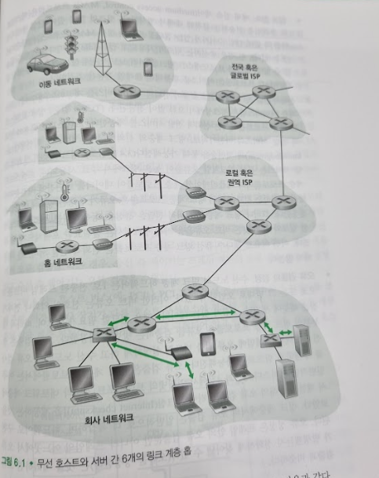
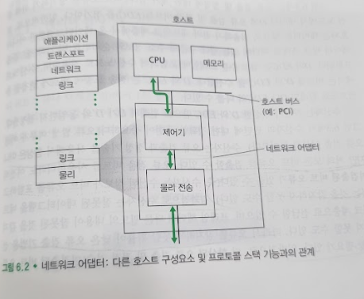

# 링크 계층 소개
## 문서 관리자
조승효(문서 생성자)
## 시작

   - 링크 계층(즉, 2계층) 프로토콜을 실행하는 장치를 노드라고 한다. 호스트, 라우터, 스위치, WiFi AP(access point) 등이 노드(node)가 될 수 있다.
   - 통신 경로상의 인접한 노드들을 연결하는 통신 채널은 링크(link)라고 한다.
   - 한 링크에서 전송 노드는 데이터그램을 링크 계층 프레임으로 캡슐화해서 링크로 전송한다.
## 링크 계층이 제공하는 서비스
   - 프레임화: 거의 모든 링크 계층 프로토콜은 네트워크 계층 데이터그램을 링크상으로 전송하기 전에 링크 계층 프레임에 캡슐화한다. 프레임은 네트워크 계층 데이터그램이 들어있는 데이터 필드와 여러 개의 헤더 필드로 구성된다.
   - 링크 접속: 매체 접속 제어(medium access control, MAC) 프로토콜은 링크상으로 프레임을 전송하는 규칙에 대해서 명시한다.
   - 신뢰적 전달: 링크 계층 프로토콜이 신뢰적 전달 서비스를 제공하는 경우 네트워크 계층 데이터그램은 링크상에서 오류 없이 전달된다.
   - 오류 검출과 정정: 오류 검출은 송신 노드에서 프레임에 오류 검출 비트를 설정하게 하고 수신 노드에서 오류 검사를 수행하게 함으로써 가능해진다.
## 링크 계층이 구현되는 위치

   - 링크 계층은 네트워크 인터페이스 카드(network interface card, NIC)로 알려진 네트워크 어댑터(network adapter)에 구현된다. 네트워크 어댑터의 중심에는 링크 계층 제어기가 있으며, 링크 계층 제어기는 링크 계층 서비스들(프레임화, 링크 접속, 오류 검출 등)의 대다수가 구현되어 있는 단일의 특수 용도 칩이다. 따라서 링크 계층 제어기의 기능 대부분은 하드웨어로 구현된다.
   - 송신 측의 제어기는 프로토콜 스택의 상위 계층에 의해서 생성되어 호스트 메모리에 저장된 데이터그램을 링크 계층 프레임으로 캡슐화(프레임의 여러 필드들을 채워 넣음)한 후, 링크 접속 프로토콜에 따라 이 프레임을 통신 링크상으로 전송한다. 수신 측의 제어기는 프레임을 수신한 후 네트워크 계층 데이터그램을 추출한다.