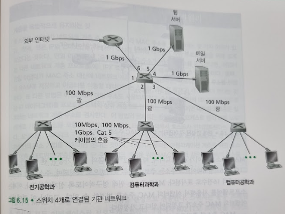
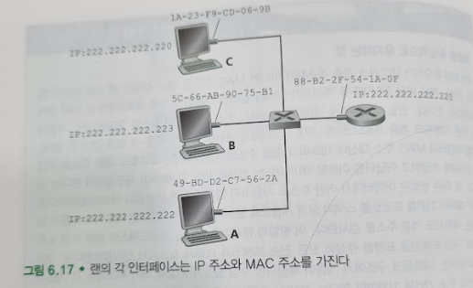
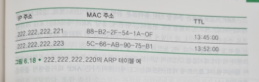
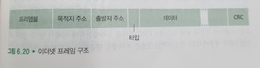
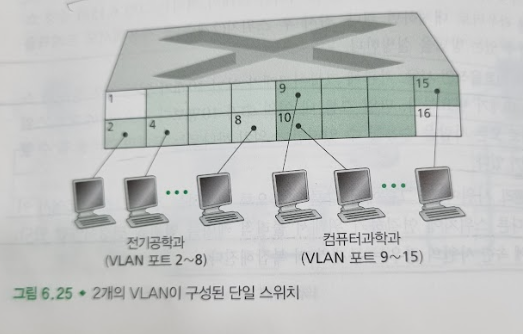
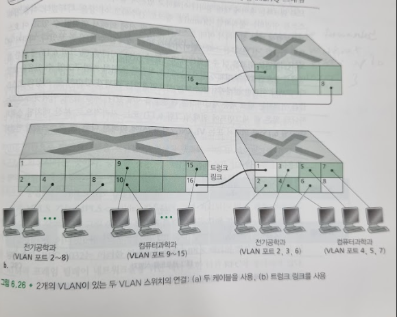

# 스위치 근거리 네트워크
## 문서 관리자
조승효(문서 생성자)
## 시작

   - 스위치 네트워크에서는 링크 계층 프레임을 전달하기 위해서 IP 주소가 아닌 링크 계층 주소를 사용한다.
## 링크 계층 주소체계와 ARP
### MAC 주소
   - 실제로 링크 계층 주소를 가진 것은 호스트나 라우터가 아닌 호스트나 라우터의 어댑터(네트워크 인터페이스)이다. 다수의 네트워크 인터페이스를 갖고 있는 호스트나 라우터는 여러 개의 링크 계층 주소를 갖게 된다.
   - 링크 계층 주소는 랜 주소(LAN address), 물리 주소(physical address) 또는 MAC 주소(MAC address)라고도 알려졌다.
   - MAC 주소는 길이가 6바이트이며, 따라서 $2^{48}$개 만큼의 사용 가능한 랜 주소가 있다. 6바이트의 주소는 주로 16진수 표기법으로 표시된다.
   - MAC 주소의 흥미로운 특징 중의 하나는 어떤 어댑터도 동일한 주소를 갖지 않는다는 것이다. IEEE에서는 MAC 주소의 첫 24비트를 고정하고, 나머지 24비트는 회사로 하여금 각 어댑터에게 유일하게 부여하는 방식으로 주소를 할당한다.
   - MAC 브로드캐스트 주소(broadcast address)는 48개의 1로 된 비트열이다.(즉, 16진 표기법으로 FF-FF-FF-FF-FF-FF이다.)
### ARP (Address Resolution Protocol)
   - 네트워크 계층 주소(예: 인터넷 IP 주소)와 링크 계층 주소(즉, MAC 주소)가 있으므로 이들 주소 사이에 변환이 필요하다. 인터넷에서는 이것을 ARP (Address Resolution Protocol) 에 서 해준다.
   
   - 데이터그램을 전송하기 위해서, 출발지 노드는 반드시 자신의 어댑터에게 IP 데이터그램뿐만 아니라 목적지 222.222.222.222의 MAC 주소도 주어야 한다. 송신 어댑터는 목적지의 MAC주소가 포함된 링크 계층 프레임을 구성해서 그 프레임을 랜으로 전송한다. 이 절에서 제기된 중요한 질문은 "송신 호스트가 어떻게 IP 주소 222.222.222.222를 가진 목적지 호스트의 MAC 주소를 결정할 수 있는가"이다. 이것은 ARP를 사용함으로써 가능해진다. 송신 호스트의 ARP 모듈은 입력값으로 동일한 랜상의 임의의 IP 주소에 대응되는 MAC 주소를 돌려준다. 이 예에서, 송신 호스트 222.222.222.220가 자신의 ARP 모듈에게 IP 주소 222.222.222.222를 주면, ARP 모듈은 대응하는 MAC 주소 49-BD-D2-C7-56-2A로 응답한다.
   - ARP는 동일한 서브넷상에 있는 호스트나 라우터 인터페이스의 IP 주소만을 해결한다는 것이다.
   
   - 각 호스트와 라우터는 자신의 메모리에 ARP 테이블을 갖고 있다. 이 ARP 테이블은 IP 주소와 MAC 주소 간의 매핑 정보를 포함한다. 호스트 222.222.220의 ARP 테이블이 어떻게 생겼는지 보여준다. ARP 테이블은 또한 테이블에서 각 매핑이 언제 삭제되는지를 나타내는 TTL(Time-To-Live)값을 포함한다. 이 테이블에 서브넷상의 모든 호스트와 라우터에 대한 엔트리를 가지고 있지 않아도 된다. 즉, 어떤 노드들에 대해서는 종료된 엔트리를 갖고 있을 수 있는 반면에 다른 노드들에 대한 엔트리는 테이블에 전혀 없을 수도 있다. 일반적인 엔트리의 종료 시간은 엔트리가 ARP 테이블에 들어간 후 20분이다.
   - 이제 노드 222.222.222.220이 같은 서브넷의 다른 IP 주소로 가는 데이터그램을 전송하려고 한다고 하자. 송신 호스트는 주어진 IP 주소로부터 목적지의 MAC 주소를 획득해야만 한다. 이것은 송신 노드의 ARP 테이블에 목적지 노드에 대한 엔트리가 있으면 쉬운 일이다. 그러나 ARP 테이블에 목적지 노드에 대한 엔트리가 없으면 어떻게 해야 할까? 노드 222.222.222.220이 노드 222.222.222.222로 데이터그램을 전송하려고 한다고 가정하자. 이 경우에 송신 노드는 주소를 해결하기 위해 ARP 프로토콜을 사용한다. 먼저 송신 노드는 ARP 패킷이라는 특수한 패킷을 구성한다. ARP 패킷은 송신 및 수신 IP 주소와 MAC 주소를 포함하는 필드들을 갖고 있다. ARP 질의 패킷과 응답 패킷 모두 같은 형식을 가진다. ARP 질의 패킷의 목적은 해결하려는 IP 주소에 대응되는 MAC 주소를 결정하기 위해 서브넷의 다른 모든 호스트와 라우터들에게 질의하는 것이다.
   - 222.222.222.220은 ARP 질의 패킷을 어댑터에게 전달하며, 이때 어댑터에세 MAC 브로드캐스트 주소, 즉 FF-FF-FF-FF-FF-FF로 패킷을 전송하도록 지시한다. 어댑터는 ARP 패킷을 링크 계층 프레임에 캡슐화하고, 이 프레임의 목적지 주소를 브로드캐스트 주소로 해서 서브넷으로 전송한다. ARP 질의를 포함하는 프레임은 서브넷상의 다른 모든 어댑터들에 의해서 수신되며, 브로드캐스트 주소 때문에, 각 어댑터는 프레임에 들어 있는 ARP 패킷을 자신의 ARP 모듈로 전달한다.
### 서브넷에 없는 노드로의 데이터그램 전송
   - 다른 네트워크에 있는 MAC 주소를 직접 적기 보다 첫 홉(first-hop)의 라우터 인터페이스 MAC 주소를 ARP 를 통해서 알아내야만 한다.
## 이더넷
   - 이더넷은 근거리 네트워킹에 대한 것이다.
   - 이더넷이 처음으로 널리 사용된 고속 랜
   - 토큰 링과 FDDI, ATM이 이더넷보다 복잡하고 비싸다
   - 이더넷은 아주 인기가 좋았으므로 이더넷 하드웨어(어댑터, 스위치 등)는 필수용품처럼 되었고 따라서 상당히 저렴함.
   - 최초의 이더넷 랜은 노드를 연결하기 위하여 동축(coaxial) 버스를 사용했음을 알 수 있다.
   - 1990년대 후반경에 대부분의 회사와 대학에서는 랜을 허브(hub)기반의 스타 토폴로지를 사용하는 이더넷으로 대체했다. 이 구조의 경우 호스트(와 라우터)는 꼬임쌍선(twisted-paircopper wire)을 사용해서 허브에 직접 연결된다. 허브는 프레임이 아닌 각각의 비트에 대한 처리를 하는 물리 계층 장치이다.
   - 2000년 초반에 이더넷은 또 다른 상당한 변화를 겪었다. 이더넷을 설치하는 데 있어서 여전히 스타 토폴로지를 사용했지만, 중앙의 허브가 스위치(switch)로 대체되었다.
### 이더넷 프레임 구조

   - 데이터 필드(46 ~ 1,500바이트): 이 필드는 IP 데이터그램을 운반한다. 이더넷의 최대 전송 단위(maximum transfer unit, MTU)는 1,500바이트이다. 그러므로 만일 IP 데이터그램이 1,500 바이트를 초과하면 호스트가 이 데이터그램을 단편화해야 한다는 것을 의미한다. 데이터 필드의 최소 크기는 46바이트이다. 이것 또한 IP 데이터그램이 46바이트보다 작으면 데이터 필드를 채워서(stuffed) 46바이트로 만들어야 함을 의미한다. 그러면 네트워크 계층으로 전달되는 데이터에 IP 데이터그램뿐만 아니라 임의로 채운 것도 포함된다. 네트워크 계층은 임의로 채운 부분을 제거하기 위해 IP 데이터그램 헤더에 있는 길이 필드를 사용한다.
   - 목적지 주소(6바이트): 이 필드는 목적지 어댑터의 MAC 주소를 포함한다.
   - 출발지 주소(6바이트): 이 필드는 프레임을 랜으로 전송하는 어댑터의 MAC 주소를 포함한다.
   - 타입 필드(2바이트): 타입 필드는 이더넷으로 하여금 네트워크 계층 프로토콜을 다중화하도록 허용한다. 이것을 이해하려면 호스트가 IP 이외의 다른 네트워크 계층 프로토콜을 사용할 수 있다는 것을 알아야 한다.
   - 순환중복검사(cyclic redundancy check, CRC)(4바이트): CRC 필드의 목적은 수신 어댑터인 어댑터 B로 하여금 프레임에 오류가 생겼는지 검출할 수 있게 하는 것이다.
   - 프리앰블(8바이트): 이더넷 프레임은 8바이트의 프리앰블(preamble) 필드로 시작한다. 프리앰블의 첫 7바이트는 10101010 값을 가진다. 마지막 바이트는 10101011 이다. 프리앰블의 첫 7바이트는 수신 어댑터를 깨우고 수신자의 클록을 송신조의 클록에 동기화시키는 역할을 한다. 왜 이들 클록들이 미리 동기화 되어있지 않을까? 항상 목표에서 어느 정도 벗어날 수 있으며, 벗어나는 정도는 랜 상의 다른 어댑터들에게 미리 알려져 있지 않기 때문이다. 수신 어댑터는 단순히 프리앰블의 첫 7바이트에 있는 비트들에 맞춤으로써 어댑터 A의 클록을 맞출 수 있다. 프리앰블의 8번째 바이트의 마지막 두 비트(처음 연속으로 오는 1)는 어댑터 B로 하여금 "중요한 것"이 오고 있음을 알려준다.
   - 네트워크 계층에게 비연결형 서비스를 제공해준다.
   - 이더넷은 네트워크 계층에게 비신뢰적인 서비스를 제공한다.
## 링크 계층 스위치
   - 스위치는 그 자체가 서브넷의 호스트와 라우터들에게 투명(transparent)하다. 즉, 호스트/라우터는 프레임을 스위치가 아닌 다른 호스트/라우터를 목적지로 해서 랜상으로 보내며, 중간에 스위치가 프레임을 받아서 다른 노드에게 전달하는 것을 알지 못한다.
### 전달 및 여과
   - 여과(filtering)은 프레임을 인터페이스로 전달할지 또는 폐기(drop)할지 결정하는 스위치의 기능이다.
   - 전달(forwarding)은 프레임이 전송될 인터페이스를 결정하고 프레임을 해당 인터페이스로 내보내는 기능이다.
   - 스위치의 여과와 전달은 스위치 테이블(switch table)을 이용한다. 스위치 테이블에는 랜상의 모든 호스트와 라우터는 아니지만 일부 노드에 대한 엔트리가 포함되어 있다. 스위치 테이블의 엔트리에는 (1) MAC 주소, (2) 그 MAC 주소로 가게 하는 스위치 인터페이스, (3) 해당 엔트리가 테이블에 만들어진 시점에 대한 정보가 들어있다.
   - 스위치의 여과 및 전달이 어떻게 동작하는지 이해하기 위해서 목적지 주소 DD-DD-DD-DD-DD-DD를 가진 프레임이 스위치의 인터페이스 x에 도착했다고 가정하자.
      - 테이블에 DD-DD-DD-DD-DD-DD에 대한 엔트리가 없다. 이 경우 스위치는 프레임의 복사본을 인터페이스 x를 제외한 모든 인터페이스 앞에 있는 출력 버퍼로 전달한다. 즉, 목적지 주소에 대한 엔트리가 없으면 스위치는 프레임을 브로드캐스트한다.
      - 테이블에 DD-DD-DD-DD-DD-DD가 인터페이스 x에 연관된 엔트리가 있다. 이 경우, 프레임은 어댑터 DD-DD-DD-DD-DD-DD를 포함하는 랜 세그먼트로부터 왔다. 이때는 프레임을 다른 인터페이스로 전달할 필요가 없으며, 프레임을 제거함으로써 여과 기능을 수행한다.
      - 테이블에 DD-DD-DD-DD-DD-DD가 인터페이스 y <> x와 연관된 엔트리가 있다. 이 경우 프레임은 인터페이스 y에 접속된 랜 세그먼트로 전달되어야 한다. 스위치는 인터페이스 y앞에 있는 출력 버퍼에 프레임을 넣음으로써 전달 기능을 수행한다.
### 자가학습
   - 스위치는 자신의 테이블을 자동으로, 동적으로, 자치적으로[네트워크 관리자나 구성(configuration) 프로토콜의 개입 없이]구축하는 놀라운 특징이 있다. 다시 말해서 스위치는 자가학습(self-learning)을 하며, 이 능력을 다음처럼 이루어진다.
      - 스위치 테이블은 초기에 비어 있다.
      - 인터페이스로 수신한 각 프레임에 대해 스위치는 (1) 프레임의 출발지 주소 필드에 있는 MAC 주소, (2) 프레임에 도착한 인터페이스, (3) 현재 시간을 테이블에 저장한다. 이런 식으로 스위치는 테이블에 송신 노드가 상주하는 랜 세그먼트를 기록한다. 랜에 있는 모든 호스트가 프레임을 송신하면, 결국 모든 호스트에 대한 정보가 테이블에 기록되게 된다.
      - 일정 시간(수명 시간; aging time)이 지난 후에도 스위치가 해당 주소를 출발지 주소로 하는 프레임을 수신하지 못하면 테이블에서 이 주소를 삭제한다. 이런식으로 PC가 다른 PC로 대체되면, 원래 PC의 MAC 주소가 스위치 테이블에서 결국 삭제되게 된다.
   - 스위치는 네트워크 관리자나 사용자의 개입을 요구하지 않으므로 플러그 앤 플레이 장치다.
### 링크 계층 스위치의 특성
   - 충돌 제거: 스위치로 (허브없이) 구축된 랜에는 충돌로 인해 낭비되는 대역폭이 없다.
   - 이질적인(heterogeneous) 링크들: 스위치는 링크들을 별개로 분리하기 때문에 랜의 각 링크는 상이한 속도로 동작할 수 있다.
   - 관리: 스위치는 향상된 보안을 제공할 뿐만 아니라 네트워크 관리를 쉽게 할 수 있게 해준다.
## 가상 근거리 네트워크(VLAN)
   - 트래픽 격리의 부족: 브로드캐스트 트래픽의 전달 범위를 제한시키면 랜 성능을 향상시킬 수 있다. 더 중요한 것은 보안/개인보안 때문에도 랜 브로드캐스트 트래픽을 제한할 필요가 있다는 것이다.
   - 스위치의 비효율적인 사용: 기관에 그룹이 3개가 아닌 10개가 있는 경우 첫 단계 스위치는 10개가 필요하다. 만일 그룹 내 인원수가 10명보다 작은 96 포트 스위치 하나로 모든 사람을 수용할 수 있지만 스위치 하나로는 트래픽 격리를 할 수 없는 문제가 있다.
   - 사용자 관리: 사원이 한 그룹에서 다른 그룹으로 이동하는 경우 그림 6.15에서 이 사원을 다른 스위치에 연결하기 위해서 물리적 케이블 연결을 변경해야만 한다. 두 그룹에 속한 사원의 경우는 문제가 더 복잡해진다.

   - 이러한 어려움은 가상 근거리 네트워크(virtual local area network, VLAN)을 지원하는 스위치를 사용해서 해결할 수 있다. VLAN이라는 이름에서 알 수 있듯이 VLAN을 지원하는 스위치는 하나의 물리적 근거리 네트워크 기반구조(infrastructure)상에서 여러 개의 가상 근거리 네트워크들을 정의할 수 있게 한다. VLAN에 속한 호스트들은 마치 스위치에 자신들만 연결된 것처럼 서로 통신한다. 포트 기반 VLAN에서는 네트워크 관리자가 스위치 포트(인터페이스)를 그룹으로 나눈다. 각 그룹은 하나의 VLAN을 구성하며, 한 VLAN의 포트들은 하나의 브로드캐스트 도메인을 형성한다.
   - 만약 논리적 그룹이 다르다면 라우터를 통해 통신하게 된다.

   - VLAN 스위치들을 연결하는 좀 더 확장 가능한 방법으로 VLAN 트렁킹(VLAN trunking)이 있다. VLAN 트렁킹 방법에서는 스위치마다 하나의 특수 포트가 2개의 VLAN 스위치를 연결하는 트렁크 포트로 구성되어 있다. VLAN을 식별하는 VLAN tag 가 있다.