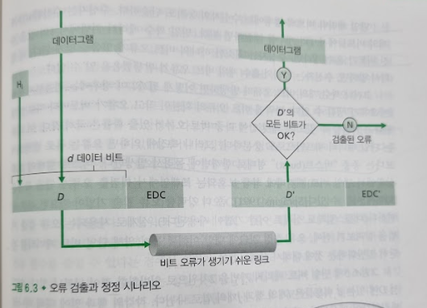
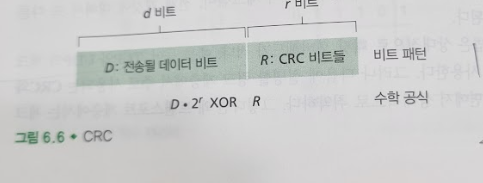
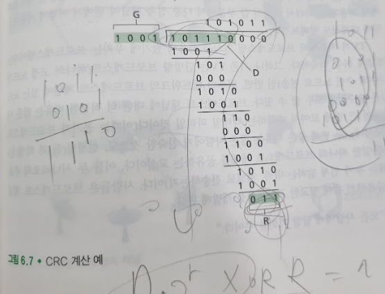

# 오류 검출 및 정정 기술
## 문서 관리자
조승효(문서 생성자)
## 시작
   - 한 노드에서 물리적으로 연결된 이웃 노드로 전송한 링크 계층 프레임 안의 비트 오류 검출과 정정, 즉 비트 수준 오류 검출과 정정(bit-level error detection and correction)

   - 비트 오류를 방지하기 위해 송신 노드에서 데이터 D에 오류 검출 및 정정 비트들(EDC)을 첨가한다.
   -수신자는 자신이 수신한 D'와 EDC' 만으로 원래의 D가 D'와 동일한지 결정한다. 수신자는 오류 검출과 정정 기술을 사용해서 항상은 아니지만 거의 모든 비트 오류를 검출할 수 있다. 오류 검출 비트를 사용하더라도 여전히 미검출된 비트 오류가 있을 수 있다. 따라서 오류를 감지하지 못할 확률이 낮은 오류 검출 기법을 선택할 필요가 있다. 일반적으로, 더 향샹된 오류 검출 및 정정 기술은 더 많은 오버헤드를 필요로 한다.
## 패리티 검사
   - 가장 단순한 형태의 오류 검출은 단일 패리티 비트(parity bit)의 사용
   - 짝수 패리티 기법은 사용자가 단순히 한 비트를 추가하고 그 비트값을 d + 1개의 비트들(원래 정보에 패리티 비트가 하나 더해진 것)에서 1의 총 개수가 짝수가 되도록 선택한다. 홀수 패리티 기법은 패리티 비트값을 1이 홀수 개가 되도록 선택한다.
   - 임의의 홀수 개의 비트 오류가 발생했음을 알 수 있다.
   - 짝수 개의 비트 오류가 발생하면 검출하지 못하는 오류가 생길 수 있다.
   - 2차원 패리티 기법에서는 반전된 비트들을 포함하는 열과 행에 대한 패리티에 오류가 생긴다. 따라서 수신자는 단일 비트 오류의 발생을 검출할 수 있을 뿐만 아니라, 패리티 오류가 있는 열과 행의 인덱스 값을 사용해 잘못된 비트를 실제로 식별해서 오류를 정정할 수 있다.
   - 오류를 검출 및 정정하는 수신자의 능력을 순방향 오류 정정(forward error correction, FEC)이라고 한다.
## 체크섬 방법
   - d 비트들을 일련의 k비트의 정수처럼 다룬다. 간단한 체크섬 방법 중의 하나는 이들 k 비트 정수들을 더해서 그 결과값을 오류 검출 비트들로 사용하는 것이다. 인터넷 체크섬(Internet checksum)에서 이 방법을 사용한다.
## 순환중복검사
   - CRC 코드는 다항식 코드(polynomial code)로도 알려졌는데, 그 이유는 전송되는 비트열에 있는 0과 1값을 계수로 갖는 다항식처럼 비트열을 생각할 수 있고, 또한 비트열에 적용되는 연산을 다항식 연산으로 이해하는 것이 가능하기 때문이다.
   
   - d 비트로 이루어진 데이터 D를 송신 노드가 수신 노드로 전송하고자 한다고 가정하자. 먼저 송신자와 수신자는 G로 표기되는 생성자(generator)로 알려진 r + 1 비트 패턴에 대해서 합의한다. G의 최상위(가장 왼쪽) 비트는 1이어야 한다. 주어진 데이터 D에 대해 송신자는 r개의 추가비트 R을 선택해서 D 뒤에 덧붙이며, 이 (이진수로 해석되는) d+r 비트 패턴은 모듈로 - 2 연산을 이용하면 G로 정확히 나누어진다. CRC를 이용한 오류 검사 절차는 단순하다. 수신자는 d+r개의 수신 비트를 G로 나눈다. 만일 나머지가 0이 아니면 오류가 발생한 것으로 그렇지 않으면 데이터가 정확한 것으로 판정할 수 있다.
   - 모든 CRC 검사는 덧셈의 올림(carry)이나 뺄셈의 빌림(borrow)이 없는 모듈로-2 연산을 사용한다. 이것은 덧셈과 뺄셈이 동일함을 뜻하며, 이들 모두 피연산자를 비트별로 XOR(bitwise exclusive-or)한 것과 같다. 따라서 예를 들면 다음과 같다
   1011 XOR 0101 = 1110
   1001 XOR 1101 = 0100
   또한 이와 유사한 다음과 같은 결과를 얻는다.
   1011 - 0101 = 1110
   1001 - 1101 = 0111
   더하기에 대해서도 다음과 같다
   1011 + 0101 = 1110
   1001 + 1101 = 0111
   - 사용되는 덧셈, 뺄셈에 올림이나 빌림이 없다는 것만 제외하면 이진수 기반 산술연산에서의 곱셈, 나눗셈과 같다. 일반 이진 연산에서 처럼, $2^k$을 곱하는 것은 비트 패턴을 k개의 위치만큼 왼쪽으로 이동하는 것이다. 따라서 주어진 D와 R에 대해 $D * 2^r \quad XOR \quad R$은 d + r 비트 패턴을 만든다.
   - 송신자가 어떻게 R을 계산하는지 알아보자. 먼저 다음과 같은 식을 만족하는 n이 있도록 하는 R을 구해야 한다.
   $D * 2^r \quad XOR \quad R = nG$
   즉, $D * 2^r \quad XOR \quad R$을 나머지 없이 G로 나눌 수 있도록 R을 선택해야 한다. 이 식의 양쪽에 R을 XOR(즉, 캐리 없는 모듈로-2 덧셈)하면 다음과 같다.
   $D*2^r=nG \quad XOR \quad R$
   이 식은 $D * 2^r$을 G로 나누면 나머지가 정확히 R이 되는 것을 뜻한다. 다시 말해서 다음처럼 R을 계산할 수 있다.
   $R = \frac{D*2^r}{G}$의 나머지
   
   - D = 101110, d = 6, G = 1001, r = 3인 경우의 계산이 위의 그림과 같다. 여기에서 나눗셈에 적용된 빼기 같은 경우 모듈로-2 빼기임에 주의하자. 곱하기 할 때 더하기에서도 모듈로-2 덧셈을 적용해야 한다.
   - 각각의 CRC 표준은 r + 1 비트보다 적은 수의 버스트 오류를 검출할 수 있다(즉, r개 이하의 연속적인 비트 오류를 모두 검출할 수 있다.) 또한, 적절하게 추정해 보면, r + 1 비트보다 큰 길이의 버스트 오류는 $1-0.5^r$의 확률로 검출된다. 또한 각각의 CRC 표준은 임의의 홀수개의 비트 오류를 검출할 수 있다.