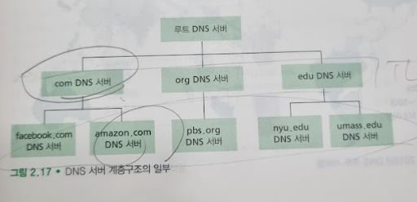
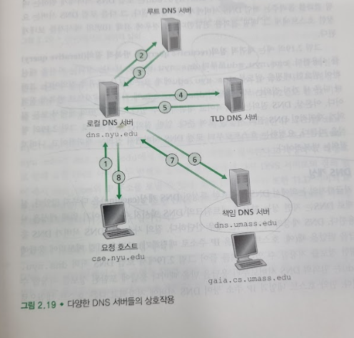
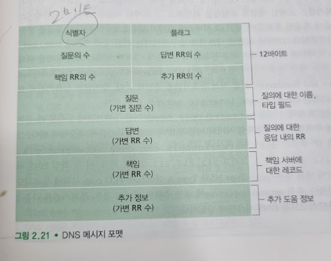

# DNS-인터넷의 디렉터리 서비스
## 문서 관리자
조승효(문서 생성자)
## 시작
   - 호스트에 대한 하나의 식별자는 호스트 네임(hostname)이다.
   - IP 주소로도 식별된다.
## DNS가 제공하는 서비스
   - 호스트 네임을 IP 주소로 변환해 주는 디렉터리 서비스가 필요하다. 이것이 인터넷 DNS(domain name system)의 주요 임무다.
   - DNS 서버들의 계층구조로 구현된 분산 데이터베이스
   - 호스트가 분산 데이터베이스로 질의하도록 허락하는 애플리케이션 계층 프로토콜
   - DNS는 다른 애플리케이션 프로토콜들이 HTTP, SMTP, FTP 등 사용자가 제공한 호스트 네임을 IP 주소로 변환하기 위해 주로 이용한다.
   - URL www.someschool.edu/index.html 을 발생할 때
   1. 같은 사용자 컴퓨터는 DNS 애플리케이션의 클라이언트 측을 수행한다.
   2. 브라우저는 URL로부터 호스트 네밍 www.someschool.edu를 추출하고 그 호스트 네임을 DNS 애플리케이션의 클라이언트 측에 넘긴다.
   3. DNS 클라이언트는 DNS 서버로 호스트 네임을 포함하는 질의를 보낸다.
   4. DNS 클라이언트는 결국 호스트 네임에 대한 IP 주소를 가진 응답을 받게 된다.
   5. 브라우저가 DNS로부터 IP 주소를 받으면, 브라우저는 그 IP 주소와 그 주소의 80번 포트에 위치하는 HTTP 서버 프로세스로 TCP 연결을 초기화한다.
   - 호스트 엘리어싱(host aliasing): 복잡한 호스트 네임을 가진 호스트는 하나 이상의 별명을 가질 수 있다.
   - 메일 서버 엘리어싱(mail server aliasing): DNS는 호스트의 IP 주소뿐만 아니라 제공된 별칭 호스트 네임에 대한 정식 호스트 네임을 얻기 위해 메일 애플리케이션에 의해 수행된다.
   - 부하 분산(load distribution): DNS는 중복 웹 서버 같은 여러 중복 서버 사이에 부하를 분산하기 위해서도 사용되고 있다. 중복 웹 서버의 경우, 여러 IP 주소가 하나의 정식 호스트 네임과 연관되어 있다. DNS 데이터베이스는 이 IP 주소 집합을 갖고 있다. 클라이언트가 주소 집합으로 매핑하는 호스트 네임에 대한 DNS 질의를 하면, 서버는 IP주소 집합 전체를 가지고 응답한다. DNS의 순환 방식은 여러 중복 서버들 사이에서 트래픽을 분산하는 효과를 낸다.
## DNS 동작 원리 개요
   - DNS 질의와 응답 메시지는 포트 53의 UDP 데이터그램으로 보내진다.
   - 호스트의 DNS는 요청한 매핑에 해당하는 DNS 응답 메시지를 받는다.
   - 중앙 집중형으로 설계하면 서버의 고장, 트래픽 양, 먼 거리의 중앙 집중 데이터베이스, 유지관리 등이 문제가 된다. 따라서 분산되어 설계되어 있다.
### 분산 계층 데이터베이스
   - DNS는 많은 서버를 이용하고 이들을 계층 형태로 구성한다.
   - 루트(root) DNS 서버, 최상위 레벨 도메인 네임(TLD, top-level domain) DNS 서버, 책임(authoritative DNS) 서버

   - 로컬 DNS 서버는 서버들의 계층구조에 엄격하게 속하지는 않지만, DNS 구조의 중심에 있다. 대체로 호스트에 가까이 있다.

   - 재귀적 질의(recursive query): 자신을 대신하여 필요한 매핑을 얻도록 요구하는 것
   - 반복적 질의(iterative query): 직접 보내는 것
### DNS 캐싱
   - DNS는 지연 성능 향상과 네트워크의 DNS 메시지 수를 줄이기 위해 캐싱을 사용한다.
   - 질의 사슬에 응답을 받았을 때 로컬 메모리에 응답에 대한 정보를 저장하는 것
## DNS 레코드와 메시지
   - DNS 분산 데이터베이스를 구현한 DNS 서버들은 호스트 네임을 IP 주소로 매핑하기 위한 자원 레코드(resource record, RR)를 저장한다.
   - 자원 레코드는 다음과 같은 필드를 포함하는 4개의 투플(tuple)로 되어 있다. (Name, Value, Type, TTL)
   - TTL은 자원 레코드의 생존기간이다(자원이 캐시에서 제거되는 시간을 결정)
   - Name과 Value의 의미는 Type에 따른다.
      - Type=A이면, Name은 호스트 네임이고 Value는 호스트 네임에 대한 IP 주소다.
      - Type=NS이면, Name은 도메인이고 Value는 도메인 내부의 호스트에 대한 IP 주소를 얻을 수 있는 방법을 하는 책임 DNS 서버의 호스트 네임이다.
      - Type=CNAME이면, Value는 별칭 호스트 Name에 대한 정식 호스트 네임이다.
      - Type=MX이면, Value는 별칭 호스트 네임 Name을 갖는 메일 서버의 정식 이름이다.
   - 서버가 특별한 호스트네임에 대한 책임 서버이면, 그 DNS 서버는 그 호스트 네임에 대한 Type A 레코드를 포함한다.
   - 서버가 호스트네임에 대한 책임 서버가 아니라면, 그 서버는 호스트 네임을 포함하는 도메인에 대한 Type NS 레코드를 포함할 것이고, NS 레코드의 Value 필드에 DNS 서버의 IP 주소를 제공하는 Type A 레코드도 포함할 것이다.
    - DNS 메시지

   - 처음 12바이트는 헤더 영역으로 여러 필드를 갖고 있다.
   - 질문 영역은 현재 질의에 대한 정보를 포함한다.
   - DNS 서버로부터의 응답에서 답변 영역은 원래 질의된 이름에 대한 자원 레코드를 포함한다.
   - 책임 영역은 다른 책임 서버의 레코드를 포함한다.
   - 추가 영역은 다른 도움이 되는 레코드를 포함하고 있다.