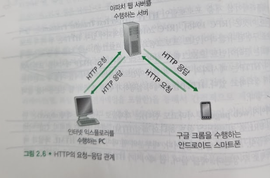
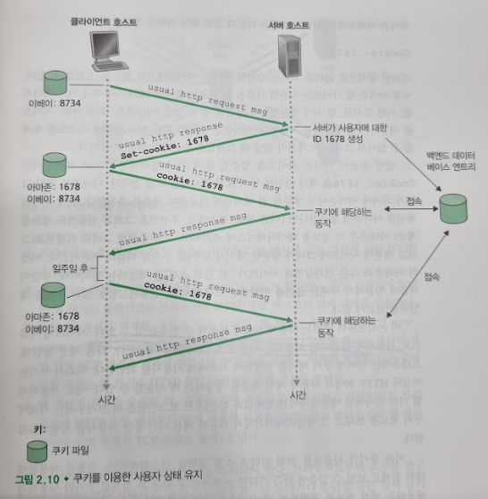

# 웹과 HTTP
## 문서 관리자
조승효(문서 생성자)
## 시작
   - 웹이 온-디맨드(on-demand)방식으로 동작한다
   - 모든 사람이 매우 낮은 비용으로 발행자가 될 수 있다.
## HTTP 개요
   - 서로 다른 종단 시스템에서 수행되는 클라이언트 프로그램과 서버 프로그램은 서로 HTTP 메시지를 교환하여 통신한다.
   - 웹 페이지(web page, 문서라고도 한다)는 객체들로 구성된다.
   - 객체(object)는 단순히 단일 URL로 지정할 수 있는 하나의 파일(HTML 파일, JPEG 이미지, GIF 이미지, 자바 애플릿, 오디오 클립 등)이다.
   - 대부분의 웹 페이지는 기본 HTML 파일과 여러 참조 객체로 구성된다.
   - 브라우저는 요구한 웹 페이지를 보여 주고 여러 가지 인터넷 항해와 구성 특성을 제공한다. HTTP의 서버 측을 구현하는 웹 서버(Web server)는 URL로 각각을 지정할 수 있는 웹 객체를 갖고 있다. 인기 있는 웹 서버로는 아파치, 마이크로소프트 인터넷 인포메이션 서버(IIS)등이 있다.

   - HTTP는 TCP를 전송 프로토콜로 사용한다.
   - HTTP는 데이터의 손실 또는 TCP가 어떻게 손실 데이터를 복구하고 네트워크 내부에서 데이터를 올바른 순서로 배열하는지 걱정할 필요가 없다.
   - HTTP 서버는 클라이언트에 대한 정보를 유지하지 않으므로, HTTP를 비상태 프로토콜(stateless protocol)이라고 한다.
## 비지속 연결과 지속 연결
   - 비지속 연결(non-persistent connection)
      - 분리된 TCP 연결을 통해서 보내져야 함
      - 객체가 여러개 있으면 하나의 TCP에 보내지 않고 TCP를 여러번 보냄
      - 작은 패킷이 클라이언트로부터 서버까지 가고, 다시 클라이언트로 되돌아오는 데 걸리는 시간인 RTT(round trip time)
      - 단점1. 각 요청 객체에 대한 새로운 연결이 설정되고 유지되어야 한다.
   - 지속 연결(persistent connection)
      - 모든 요구와 해당하는 응답들이 같은 TCP 연결상에 보내져야 함
      - 응답을 보낸 후에 TCP 연결을 그대로 유지한다.
      - 진행중인 요구에 대한 응답을 기다리지 않고 연속해서 만들어질 수 있다[파이프라이닝(pipeliningb)]
## HTTP 메시지 포맷
   - HTTP 요청 메시지
      - 메시지가 일반 ASCII 텍스트로 쓰여 있어 사람들이 읽을 수 있다.
      - 메시지 각 줄은 CR과 LF(carriage return & line feed)로 구별된다.
      - 마지막 줄에 이어서 추가 CR과 LF가 따른다.
      - HTTP 요청 메시지의 첫 줄은 요청 라인(request line)이라 부르고, 이 후 줄 들은 헤더 라인(header line) 이라고 부른다.
         - 요청 라인은 3개의 필드, 즉 "방식(method) 피드", "URL 피드", "HTTP 버전 필드"를 갖는다.
      - 개체 몸체(body)를 가질 수도 있다.
   - HTTP 응답 메시지
      - 상태 라인, 헤더 라인, 개체 몸체(entity body)로 이루어져 있다.
      - 상태 라인은 3개 필드, 즉 프로토콜 "버전 필드", "상태 코드", "해당 상태 메시지"를 갖는다.
## 사용자와 서버 간의 상호작용: 쿠키
   - 서버가 사용자 접속을 제한하거나 사용자에 따라 콘텐츠를 제공하기 원하므로 웹 사이트가 사용자를 확인하는 것이 바람직할 때가 있다. 이 목적으로 HTTP는 쿠키(cookie)를 사용한다.

## 웹 캐싱
   - 웹 캐시는 원출처의 웹 서버를 대신하여 HTTP 요구를 충족시키는 네트워크 개체다.