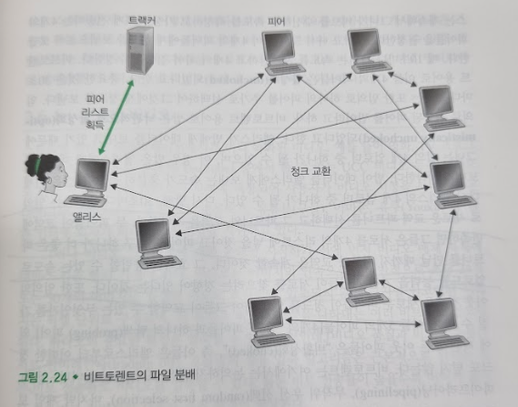
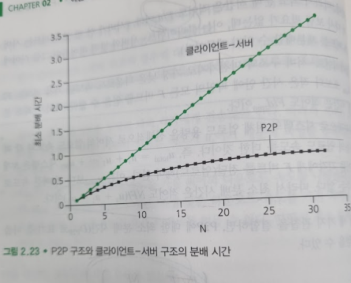

# P2P 파일 분배
## 문서 관리자
조승효(문서 생성자)
## 시작
   - P2P 구조는 항상 켜져 있는 기반구조 서버에 최소한으로(혹은 전혀 안함) 의존한다는 것을 기억하라. 대신 간헐적으로 연결되는 호스트 쌍들(피어라고 부름)이 서로 직접 통신한다. 피어는 서비스 제공자가 소유하는 것이 아니라 사용자가 제어하는 데스크톱과 랩톱이 소유한다.
   - 대표적으로 비트토렌트가 있다.

### P2P 구조의 확장성
   - 분배 시간(distribution time)은 모든 N개의 피어들이 파일의 복사본을 얻는 데 걸리는 시간이다.
   - 클라이언트-서버 구조에서 피어의 수 N이 충분히 크다면 분배 시간은 피어의 수 N에 따라 선형적으로 증가한다.
   - P2P 구조의 경우, 최소 분배 시간이 클라이언트-서버 구조의 분배 시간보다 항상 작지는 않다. 또한 임의의 피어 수 N에 대해서 한 시간보다 작다
   - P2P 구조를 가진 애플리케이션은 자가 확장성을 가진다.
