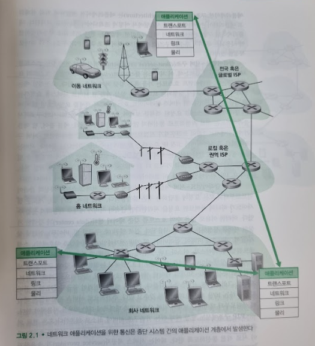
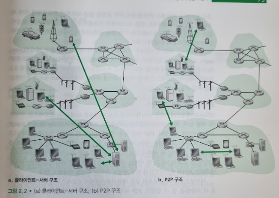
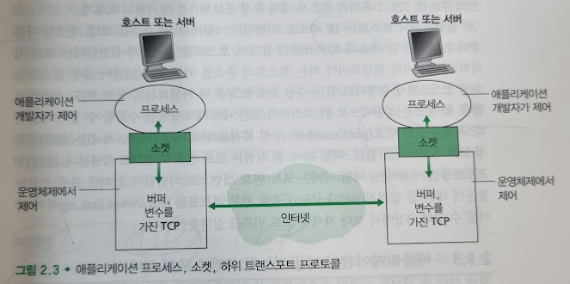
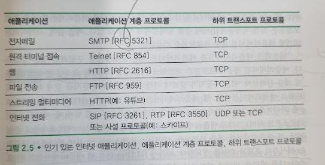

# 네트워크 애플리케이션의 원리
## 문서 관리자
조승효(문서 생성자)
## 시작
   - 네트워크 애플리케이션 개발의 중심은 다른 종단 시스템에서 동작하고 네트워크를 통해 서로 통신하는 프로그램을 작성하는 것

## 네트워크 애플리케이션 구조
   - 애플리케이션 구조(application architecture)는 애플리케이션 개발자에 의해 설계되고 애플리케이션이 다양한 종단 시스템에서 어떻게 조직되어야 하는지를 지시한다.

   - 클라이언트-서버 구조(client-server architecture)
      - 항상 켜져 있는 호스트를 서버(server)라고 부르는데, 이 서비스는 클라이언트(client)라는 다른 많은 호스트의 요청을 받는다.
      - 웹 애플리케이션이 대표적인 예
      - 클라이언트는 서로 직접적으로 통신하지 않는다
      - 서버가 고정 IP 주소라는 잘 알려진 주소를 갖는다.
      - 모든 요청에 응답하는 것이 불가능 하기에 많은 수의 호스트를 갖춘 데이터 센터(data center)가 강력한 가상의 서버를 생성하는 데 흔히 사용됨
   - P2P 구조
      - 항상 켜져 있는 기반구조 서버에 최소로 의존한다.(혹은 전혀 의존하지 않는다)
      - 애플리케이션은 피어(peer)라는 간헐적으로 연결된 호스트 쌍이 서로 직접 통신하도록 한다.
      - 비트 토렌트, 피어-지원 다운로드 가속기등
      - 자가 확장성(self-scalability): P2P 파일 공유 애플리케이션에서 비록 각 피어들이 파일을 요구함으로써 작업 부하를 만들어 내지만 각 피어들은 또한 파일을 다른 피어들에게 분배함으로써 그 시스템에 서비스 능력을 추가한다.
## 프로세스 간 통신
   - 운영체제 용어에서 실제 통신하는 것은 프로그램이 아니라 프로세스(process)다. 프로세스는 종단 시스템에서 실행되는 프로그램이다.
   - 2개의 다른 종단 시스템에서 프로세스는 컴퓨터 네트워크를 통한 메시지(message) 교환으로 서로 통신한다.
### 클라이언트와 서버 프로세스
   - 웹 애플리케이션에서 클라이언트 브라우저 프로세스는 웹 서버 프로세스와 메시지를 교환한다.
   - P2P 파일 공유 시스템에서는 한 피어의 프로세스에서 다른 피어의 프로세스로 파일을 전송한다.
   - 두 프로세스 간의 통신 세션에서 통신을 초기화(다른 프로세스와 세션을 시작하려고 접속을 초기화)하는 프로세스를 클라이언트라 하고, 세션을 시작하기 위해 접속을 기다리는 프로세스를 서버라고 한다.
### 프로세스와 컴퓨터 네트워크 사이의 인터페이스

   - 프로세스는 소켓(socket)을 통해 네트워크로 메시지를 보내고 받는다.
   - 프로세스는 집이고 소켓은 출입구로 비유 된다.
   - 소켓은 호스트의 애플리케이션 계층과 트랜스포트 계층 간의 인터페이스다.
   - 소켓은 네트워크 애플리케이션이 인터넷에 만든 프로그래밍 인터페이스이므로, 애플리케이션과 네트워크 사이의 API(Application Programming Interface)라고도 한다.
### 프로세스의 주소 배정
   - 한 호스트상에서 수행되고 있는 프로세스가 패킷을 다른 호스트에서 수행되고 있는 프로세스로 패킷을 보내기 위해서는 수신 프로세스가 주소를 갖고 있을 필요가 있다.
   - 인터넷에서 호스트는 IP 주소로 식별된다.
   - 송신 호스트는 수신 호스트에서 수행되고 있는 수신 프로세스도 식별해야 한다. 일반적으로 한 호스트가 많은 네트워크 응용을 수행할 수 있기 때문이다. 목적지 포트 번호(port number) 가 이 목적을 위해 사용된다.
## 애플리케이션이 이용 가능한 트랜스포트 서비스
   - 트랜스포트 프로토콜 중에서 하나를 선택해야 하는데 가장 적합한 것을 선택해야 한다.
   - 패킷 손실등에 복구할 수 있는 신뢰적 데이터 전송을 해야 한다.
   - 처리율도 중요하다. 처리율 요구 사항을 갖는 애플리케이션은 대역폭 민감 애플리케이션(bandwidth-sensitive application) 이라 한다. 탄력적 애플리케이션(elastic application)은 가용한 처리율이 많으면 많은 대로 적으면 적은 대로 이용할 수 있다.
   - 시간도 보장해야 한다.
   - 보안도 중요하다.
## 인터넷 전송 프로토콜이 제공하는 서비스
   - TCP 서비스
      - 연결지향형 서비스: 애플리케이션 계층 메시지를 전송하기 전에 TCP는 클라이언트와 서버가 서로 전송 제어 정보를 교환하도록 한다. 이 핸드셰이킹 과정이 클라이언트와 서버에 패킷이 곧 도달할 것이니 준비하라고 알려 주는 역할을 한다. 핸드셰이킹 단계를 지나면, TCP 연결이 두 프로세스의 소켓 사이에 존재한다고 얘기한다. 이 연결은 두 프로세스가 서로에게 동시에 메시지를 보낼 수 있기에 전이중 연결이라고 한다.
      - 신뢰적인 데이터 전송 서비스: 통신 프로세스는 모든 데이터를 오류 없이 올바른 순서로 전달하기 위해 TCP에 의존한다. TCP는 애플리케이션의 한쪽이 바이트 스트림을 소켓으로 전달하면 그 바이트 스트림을 손실하거나 중복되지 않게 수신 소켓으로 전달한다.
      - 혼잡제어 방식, 즉 통신하는 프로세스의 직접 이득보다는 인터넷의 전체 성능 향상을 위한 서비스를 포함한다.
   - UDP 서비스
      - 최소의 서비스 모델을 가진 가장 간단한 전송 프로토콜
      - 비연결형이므로 두 프로세스가 통신을 하기 전에 핸드셰이킹을 하지 않는다.
      - 비신뢰적인 데이터 전송 서비스를 제공한다. 즉, 하나의 프로세스가 UDP 소켓으로 메시지를 보내면, UDP는 그 메시지가 수신 소켓에 도착하는 것을 보장하지 않는다. 게다가 수신 소켓에 도착하는 메시지들의 순서가 뒤바뀔 수도 있다.
      - 혼잡제어 방식을 포함하지 않는다.
    - 인터넷 트랜스포트 프로토콜이 제공하지 않는 서비스
       - 시간 혹은 대역폭 보장을 제공할 수 없다.

## 애플리케이션 계층 프로토콜
   - 애플리케이션 계층 프로토콜은 다른 종단 시스템에서 실행되는 애플리케이션의 프로세스가 서로 메시지를 보내는 방법을 정의한다.
   - 여러 애플리케이션 계층 프로토콜은 RFC에 명시되어 있으므로 공중 도메인(public domain)에서 찾을 수 있다. 예를 들어 웹의 애플리케이션 계층 프로토콜인 HTTP(HyperText Transfer Protocol)는 RFC로 얻을 수 있다.
   - 애플리케이션 계층 프로토콜은 네트워크 애플리케이션의 한 요소일 뿐이다. 웹 애플리케이션 계층 프로토콜, HTTP는 브라우저와 웹 서버 사이에서 교환되는 메시지의 포맷과 순서를 정의한다. 따라서 HTTP는 단지 웹 애플리케이션의 한 요소다.