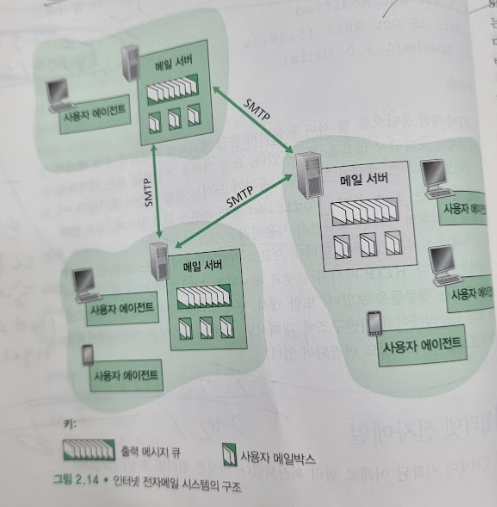
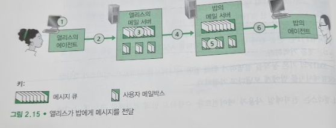
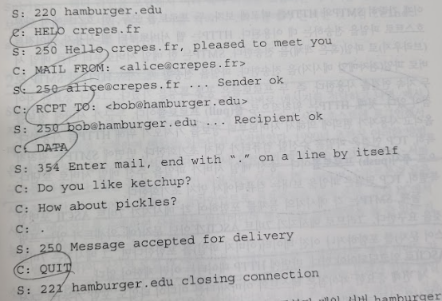

# 인터넷 전자 메일
## 문서 관리자
조승효(문서 생성자)
## 시작

   - 사용자 에이전트는 사용자가 메시지를 읽고, 응답하고, 전달하고, 저장하고 구성하게 해준다.
   - 사용자 에이전트는 메시지를 메일 서버로 보내고, 거기서 메시지는 메일 서버의 출력 메시지 큐에 들어간다.
   - 메일 서버는 전자메일 기반구조의 중심이다.
   - 수신자는 메일 서버 안에 메일박스(mailbox)를 갖고 있다.
   - 만약 메시지를 전달할 수 없다면 메시지 큐에 메시지를 보관하고 나중에 재시도 한다.
   - SMTP는 인터넷 전자메일을 위한 주요 애플리케이션 계층 프로토콜이다. TCP의 신뢰적인 데이터 전송 서비스를 이용한다.
## SMTP
   - SMTP는 송신자의 메일 서버로부터 수신자의 메일 서버로 메시지를 전송한다.
   - SMTP를 통해 이진 멀티미디어 데이터를 보내기 전에 ASCII로 변환할 필요가 생겼다. 그리고 SMTP 전송 후에는 ASCII를 다시 원래 메시지로 변환해야만 한다.

   1. 앨리스는 전자메일 사용자 에이전트를 수행하고 밥의 전자메일 주소를 제공하고, 메시지를 작성하고 사용자 에이전트에게 메시지를 보내라고 명령한다.
   2. 앨리스의 사용자 에이전트는 메시지를 그녀의 메일 서버에게 보내고 그것에서 메시지는 메시지 큐에 놓인다.
   3. 앨리스의 메일 서버에서 동작하는 SMTP의 클라이언트 측은 메시지 큐에 있는 메시지를 본다. 밥의 메일 서버에서 수행되고 있는 SMTP 서버에게 TCP 연결을 설정한다.
   4. 초기 SMTP 핸드셰이킹 이후에 SMTP 클라이언트는 앨리스의 메시지를 TCP 연결로 보낸다.
   5. 밥의 메일 서버 호스트에서 SMTP의 서버 측은 메시지를 수신한다. 밥의 메일 서버는 그 메시지를 밥의 메일박스에 놓는다.
   6. 밥은 편한 시간에 그 메시지를 읽기 위해 사용자 에이전트를 시동한다.
   - SMTP가 메일을 보내는 데 두 메일 서버가 먼 거리에 떨어져 있더라도 중간 메일 서버를 사용하지 않음을 이해하는 것이 중요하다. TCP 연결은 서버 사이의 직접 연결이다. 특히, 밥의 메일 서버가 죽어 있다면, 메시지는 어느 중간 메일 서버에 저장되는 것이 아니라, 앨리스의 메일 서버에 남아 있는 새로운 시도를 위해 기다린다.
   - SMTP 프로토콜이 마주 본(face-to-face) 사람의 상호작용에 이용되는 프로토콜과 유사하다.
      - 클라이언트 SMTP(송신 메일 서버 호스트에서 수행된다)는 서버 SMTP(수신 메일 서버 호스트에서 수행된다)의 25번 포트로 TCP 연결을 설정한다. 실패하면 일정시간 뒤에 재시도 한다.
      - 연결이 설정되면, 서버와 클라이언트는 애플리케이션 계층 핸드셰이킹을 수행한다.
      - 클라이언트와 서버가 서로에 대한 소개를 마치면, 클라이언트는 메시지를 보낸다.

   - 메시지는 CR 과 LF 로 구분된다.
## HTTP와의 비교
   - 지속 HTTP와 SMTP 모두 지속 연결을 사용한다.
   - HTTP는 원칙적으로 풀(pull) 프로토콜이다. 누군가 서버에 정보를 올리고 사용자가 편의에 의해서 서버로부터 정보를 가져오기 위해 HTTP를 사용한다. 특히 TCP 연결은 파일을 수신할 컴퓨터가 먼저 초기화한다.
   - SMTP는 원칙적으로 푸시(push) 프로토콜이다. 송신 메일 서버가 파일을 수신 메일 서버로 보낸다. 특히 TCP 연결은 파일을 보내는 컴퓨터에서 먼저 초기화한다.
   - SMTP는 각 메시지의 몸체를 포함하여 각 메시지가 7비트 ASCII 포맷일 것을 요구한다. HTTP 에는 이런 제약이 없다.
   - HTTP는 자신의 HTTP 응답 메시지에 각 객체를 캡슐화한다.
## 메일 메시지 포맷
   - 전자메일을 보낼 때는 주변 정보가 포함된 헤더가 메시지 몸체 앞에 오게 된다. 헤더 라인과 메시지 몸체는 CRLF로 분리된다.
   - 헤더 라인은 키워드, 콜론, 값의 순서로 구성되고 읽을 수 있는 텍스트를 포함한다.
   - 모든 헤더는 From: 헤더 라인과 To: 헤더 라인을 반드시 가져야 한다.
   - Subject: 헤더와 다른 옵션 헤더 라인을 가질 수도 있다.
   - 메시지 헤더 다음에 빈줄이 들어가고 메시지 몸체(ASCII 문자)가 나온다.
## 메일 접속 프로토콜
   - 오늘날의 메일 접속은 클라이언트 - 서버 구조를 사용한다.
   - 일반 사용자는 로컬 PC에서 사용자 에이전트를 수행하고 늘 켜져 있는 공유 메일 서버에 저장된 메일박스에 접근한다. 메일 서버는 보통 사용자들과 공유하고 전형적으로 사용자의 ISP들(예: 대학, 회사)이 유지 관리한다.
   - 로컬 PC에서 사용자 에이전트를 수행하는 수신자는 메일 서버에 있는 자신의 메시지를 얻기 위해 pull 방식으로 동작하는 메일 액세스 프로토콜을 통해서 접근할 수 있다.
   - POP3
      - POP3은 사용자 에이전트(클라인트)가 메일 서버의 포트 110번으로 TCP 연결을 열 때 시작한다.
      - TCP의 연결이 설정되면 POP3은 3단계 과정으로 진행한다. 즉, 인증, 트랜잭션, 갱신이다.
      - 인증에서 사용자 에이전트는 메일을 다운로드하는 사용자를 인증하기 위해 사용자 이름과 비밀번호를 보낸다.
      - 트랜잭션에서 사용자 에이전트는 메시지를 가져오고, 삭제를 위해 메시지에 표시하거나 그 삭제 표시를 지울 수도 있으며 메일 통계를 얻을 수도 있다.
      - 세 번째 단계인 갱신은 클라이언트가 POP3 세션을 끝내는 quit 명령이 내려진 후에 일어난다. 이때, 메일 서버는 삭제 표시된 메시지를 삭제한다.
   - IMAP
      - 로컬 컴퓨터 안의 폴더와 메시지 방식은 어떤 컴퓨터에서도 접속할 수 있는 원격 서버에 폴더 계층구조를 유지해 주기를 원하는 이동 사용자에게는 문제를 일으킨다. POP3로는 불가능하다. POP3 프로토콜은 사용자에게 원격 폴더를 생성하거나 폴더에 메시지를 할당하는 수단을 제공하지 않는다.
      - IMAP 서버는 폴더에 각각의 메시지를 연결한다.
      - IMAP 프로토콜은 사용자가 폴더를 생성하고 하나의 폴더에서 다른 폴더로 메시지를 옮기는 명령어를 제공한다.
      - 특정 조건에 맞는 원격 폴더를 찾는 명령도 제공한다.
      - IMAP 세션을 통해 사용자 상태 정보를 유지한다.
      - 사용자 에이전트가 메시지의 구성요소를 얻을 수 있게 허용하는 명령을 갖는다는 것이다.
   - 웹 기반 전자메일
      - 사용자 에이전트는 일반 웹 브라우저이고 사용자는 HTTP를 통해 메일 서버에 있는 원격 메일박스와 통신하게 된다.
      - 수신자는 HTTP 프로토콜을 이용해서 전달받는다.
      - 송신자가 전자메일 메시지를 보내고자 할 때, 전자메일 메시지는 SMTP 대신에 HTTP를 이용하여 브라우저에서 메일 서버로 전달된다. 그러나 메일 서버는 여전히 SMTP를 이용하여 메시지를 다른 메일 서버로 전달하거나 다른 메일 서버로부터 수신한다.