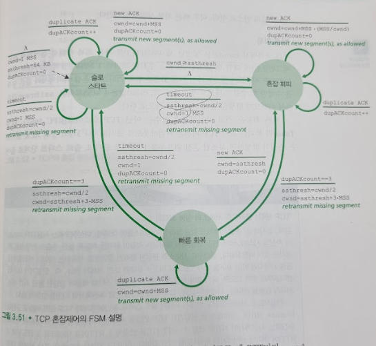
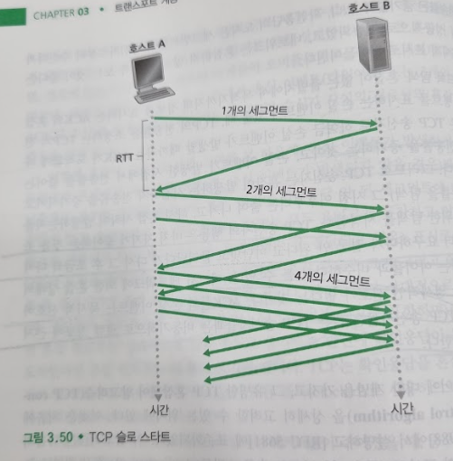
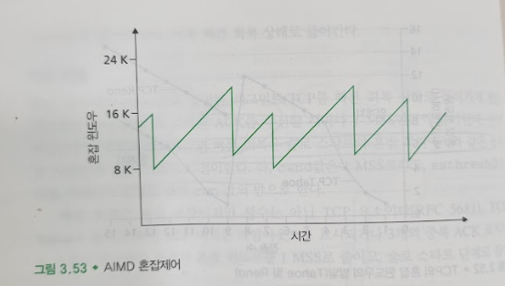
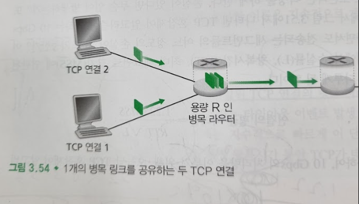
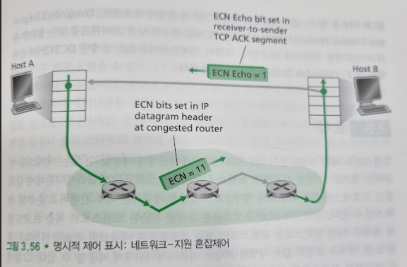

# TCP 혼잡제어
## 문서 관리자
조승효(문서 생성자)
## 시작
   - TCP가 취한 접근방법은 네트워크 혼잡에 따라 연결에 트래픽을 보내는 전송률을 각 송신자가 제한하도록 하는 것이다
   - TCP 송신자는 자신의 연결에 송신자 전송 트래픽 전송률을 어떻게 제한하는가? TCP 송신자는 자신과 목적지 사이 경로의 혼잡을 어떻게 감지하는가? 송신자는 종단간의 혼잡을 감지함에 따라 송신율을 변화시키기 위해서 어떤 알고리즘을 사용해야 하는가?
   - 혼잡 윈도우(congestion window) 변수를 cwnd 라고 할 때 혼잡 윈도우는 TCP 송신자가 네트워크로 트래픽을 전송할 수 있는 비율을 제한하도록 한다. 즉
   LastByteSent - LastByteAcked <= min {cwnd, rwnd}
   - TCP의 수신버퍼가 매우 크다고 가정할 때 송신자의 확인응답이 안 된 데이터의 양은 오로지 cwnd에 의해서 결정된다.
   - 왕복시간(RTT)의 시작일 때, 송신자는 앞에서 언급한 제약 조건에 따라 cwnd 바이트만큼의 데이터를 전송할 수 있고, RTT가 끝나는 시점에 데이터에 대한 확인응답을 수신한다. 그러므로 송신자의 송신율은 대략 cwnd/RTT 바이트/초이다. cwnd의 값을 조절하여, 송신자는 링크에 데이터를 전송하는 비율을 조절할 수 있다.
   - 이제 어떻게 TCP 송신자가 자신과 목적지 사이의 경로에 혼잡이 존재하는지를 감지하는지 살펴보자. 타임아웃 또는 수신자로부터 3개의 중복된 ACK들의 수신이 발생했을 때, TCP 송신자 측에 "손실 이벤트(loss event)"가 발생했다고 정의하자. 과도한 혼잡이 발생한다면, 경로에 있는 하나 이상의 라우터 버퍼들이 오버플로되고, 그 결과 데이터그램이 버려진다. 버려진 데이터그램은 송신 측에서 손실 이벤트(타임아웃 또는 3개의 중복된 ACK의 수신)를 발생시키고, 송신자는 송신자와 수신자 사이의 경로상의 혼잡이 발생했음을 알 수 있다.
   - 어떻게 혼잡이 검출되는지를 고려해 본 다음에, 손실 이벤트가 발생하지 않는 네트워크가 혼잡에서 자유로운 경우(즉, 손실 이벤트가 발생되지 않을 경우)가 되는 더 낙관적인 경우를 고려해 보자. 이 경우, 이전에 확인응답 안 된 세그먼트에 대한 확인응답이 TCP 송신자에서 수신될 것이다. TCP는 모두 올바르게 동작하고 있다는(네트워크로 전송되고 있는 세그먼트들은 목적지까지 잘 전달되고 있음) 표시로써, 확인응답들의 도착을 받아들일것이다. 그리고 TCP는 혼잡 윈도우 크기(그리고 이것의 전송률)를 증가시키기 위해 확인응답을 사용할 것이다. 확인응답이 상대적으로 늦은 속도로 도착한다면 혼잡 윈도우는 상대적으로 낮은 속도로 증가하는 반면에 확인응답이 높은 속도로 도착한다면 혼잡 윈도우는 더 빨리 증가될 것이다. TCP는 확인응답을 혼잡 윈도우 크기의 증가를 유발하는데 트리거(trigger) 또는 클록(clock)으로 사용하므로, TCP는 자체 클로킹(self-clocking)이라고 한다.
   - 어떻게 TCP 송신자가 자신이 송신할 속도를 결정하는가? 너무 빠르게 전송하면 인터넷 혼잡 붕괴가 나타날 것이다. 너무 조심스럽고 너무 천천히 송신한다면, 네트워크 내의 밴드폭을 충분히 활용하지 못하게 될 것이다.
   - 손실된 세그먼트는 혼잡을 의미하며, 이에 따라 TCP 전송률은 한 세그먼트를 손실했을 때 줄어져야 한다.
   - 확인응답된 세그먼트는 네트워크가 송신자의 세그먼트를 수신자에게 전송된다는 것이고, 이에 따라 이전에 확인응답되지 않은 세그먼트에 대해 ACK가 도착하면, 송신자의 전송률은 증가할 수 있다.
   - 밴드폭 탐색: TCP 송신자의 행동은 마치 자기가 좋아하는 것을 조금씩 더 요구하다가 결국 안된다고 야단맞고 물러났다가 다시 그 후 조금씩 다시 요구하는 아이들과 비슷하다고 볼 수 있다.
## TCP 혼잡제어 알고리즘(TCP congestion control algorithm)

### 슬로 스타트

   - TCP 연결이 시작될 때, cwnd의 값은 일반적으로 1MSS로 초기화되고, 그 결과 초기 전송률은 대략적으로 MSS/RTT가 된다.
   - 슬로 스타트 상태에서는 cwnd 값을 1MSS에서 시작하여 한 전송 세그먼트가 첫번째로 확인응답을 받을 때마다 1MSS씩 보낸다.
   - TCP 전송률은 작은 값으로 시작하지만 슬로 스타트 단계 동안에 지수적으로 증가하게 된다.
   - 이 지수적 증가는 언제 끝나는 것인가?
      - 만약에 타임아웃에 의한 손실 이벤트(즉, 혼잡)가 있을 경우, TCP 송신자는 cwnd값을 1로 하고, 새로운 슬로 스타트를 시작한다. TCP 송신자는 두 번째 상태 변수인 ssthresh("slow start threshold", 슬로 스타트 임계치의 약자)값을 cwnd/2(혼잡이 검출 되었을 시점에서의 혼잡 윈도우 값의 반)으로 정한다.
      - 슬로 스타트가 끝나는 방법은 ssthresh값과 직접적으로 연관된다. ssthresh가 혼잡이 마지막 검출된 시점에서의 cwnd값의 반이므로, 이 값에 도달하거나 지나칠 때 cwnd를 계속 두배로 하는 것은 신중하지 못할 것이다. 그러므로 cwnd값이 ssthresh과 같으면 슬로 스타트는 종료되고 TCP는 혼잡 회피모드로 전환한다.
      - 슬로 스타트가 종료될 수 있는 방법은 만약 3개의 중복 ACK들이 검출 되면, 다음에 설명하겠지만 TCP는 빠른 재전송을 수행하여 빠른 회복 상태로 들어간다.
### 혼잡 회피
   - 좀 더 보수적인 접근법을 채택하여 매 RTT 마다 하나의 MSS만큼 cwnd 값을 증가시킨다.
   - 언제 혼잡 회피의 선형 증가가 끝날 것인가?
      - 타임아웃이 발생하면 cwnd 값을 1로 하고, ssthresh의 값은 손실 이벤트가 발생했을 때의 cwnd 값의 반으로 설정한다.
      - ACK 3개를 수신하면 빠른 회복 상태로 간다.
### 빠른 회복
   - 매 중복된 ACK를 수신할 때마다 1MSS만큼씩 증가된다. 타임아웃 발생시 슬로 스타트와 혼잡 회피에서와 같은 동작을 수행한다.
### TCP 혼잡제어: 복습

   - 가법적 증가, 승법적 감수(additive-increase, multiplicative decrease, AIMD)의 혼잡제어 형식
   - 현재 대부분의 TCP 구현은 리노(Reno)알고리즘을 이용한다. 리노 알고리즘의 많은 변형이 제안되어왔다.
   - TCP 베가스(Vegas) 알고리즘은 좋은 처리율을 유지하면서 혼잡 회피를 시도하고자 한다. 베가스의 기본 아이디어는 (1) 손실이 발생하기 전에 출발지와 목적지 사이의 라우터에서 혼잡을 발견하고, (2) 임박한 패킷 손실이 발견되었을 때, 선형으로 비율을 낮추는 것이다.
## 공평성

   - 각 연결의 평균 전송률이 R/K에 가깝다면 혼잡 제어 메커니즘이 공평하다고 한다. 즉 , 각 연결은 링크 대역폭을 동등하게 공유한다.
   - TCP가 연결 사이에서 대욕폭을 똑같이 공유하는지에 대한 직관적인 느낌을 제공한다.
   - UDP 상에서 동작할 때, 애플리케이션은 혼잡할 때 "공평한" 레벨로 그들의 등급을 낮추고 어떠한 패킷도 손실하지 않기보다는 일정한 속도로 네트워크에 오디오와 비디오를 공급하기를 좋아하고 가끔 패킷을 손실한다.
   - 공평성과 병렬 TCP 연결: 만약 우리가 UDP 트래픽이 공평하게 행동하도록 강요하더라도, 공평성 문제는 여전히 환전하게 해결되지 않을 것이다. 이것은 TCP 기반 애플리케이션이 다중 병렬연결의 사용을 막을 방법이 없기 때문이다. 다중 병렬 연결때문에 불공평한 할당이 생기게 된다.
## 명시적 혼잡 표시(Explicit Congestion Notification, ECN): 네트워크-지원 혼잡제어

   - 네트워크가 명시적으로 TCP 송신자와 수신자에게 혼잡을 알리는 IP와 TCP의 확장이 제안되고, 구현 및 구축되었다.
   - 네트워크 계층에서는 IP 데이터그램 헤더의 서비스 형식(Type of Service) 필드 내에 두 비트(네 가지 경우의 값이 가능)가 ECN에 사용된다. ECN 비트들의 세팅 중에 하나는 라우터에 의해 사용되는데 라우터가 경험하는 혼잡을 표시한다. 이 혼잡 표시는 표시된 IP 데이터그램에 의해 목적지 호스트로 전송되고, 이 목적지 호스트가 이를 송신 호스트에게 알려주는 것이다. RFC 3618은 언제 라우터가 혼잡 되는 가를 정의하지 않는다. ECN 혼잡 표시는 지속적인 혼잡의 경우에만 세팅되도록 권고하고 있다.
   - 수신 호스트의 TCP가 수신된 데이터그램을 통하여 ECN 혼잡 표시를 수신하면, 수신 호스트의 TCP는 송신 호스트의 TCP에게 ECE(ECN Echo) 비트를 세팅함으로써 혼잡 표시를 알려준다. ECE 비트는 수신자에서 송신자로 가는 TCP ACK 세그먼트에서 정의된다. 이에 대해, ECE 혼잡 표시를 갖는 ACK를 받은 송신 TCP는 혼잡 윈도우를 반으로 줄이게 된다.
   - DCCP(데이터그램 혼잡제어 프로토콜, Datagram Congestion Control Protocol)은 ECN을 활용한 낮은 오버헤드를 갖는 UDP-유사 비신뢰적인 서비스를 제공한다.