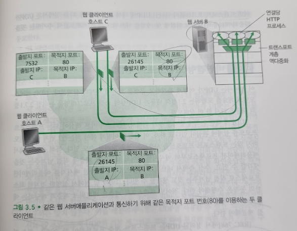

# 다중화와 역다중화
## 문서 관리자
조승효(문서 생성자)
## 시작
   - 목적지 호스트에서의 트랜스포트 계층은 바로 아래의 네트워크 계층으로부터 세그먼트를 수신한다. 트랜스포트 계층은 호스트에서 동작하는 해당 애플리케이션 프로세스에게 이 세그먼트의 데이터를 전달하는 의무를 가진다.
   - 트랜스포트 계층 세그먼트의 데이터를 올바른 소켓으로 전달하는 작업을 역다중화(demultiplexing)라고 한다.
   - 세그먼트들을 네트워크 계층으로 전달하는 작업을 다중화(multiplexing)라고 한다.
   - 트랜스포트 계층 다중화에는 다음 두 가지 요구 사항을 가지고 있음을 알 수 있다.
      - 소켓은 유일한 식별자를 가진다
      - 각 세그먼트는 세그먼트가 전달될 적절한 소켓을 가리키는 특별한 필드를 가진다. 특별한 필드라는 것은 출발지 포트 번호 필드(source port number field)와 목적지 포트 번호 필드(destination port number field) 이다.
## 비연결형 다중화와 역다중화
   - UDP 소켓은 목적지 IP 주소와 목적지 포트 번호로 구성된 두 요소로 된 집합에 의해서 식별된다. 출발지 IP 주소와 출발지 포트 번호가 모두 다르거나 또는 출발지 IP 주소와 출발지 포트 번호 어느 한 가지가 다를지라도, 동일한 목적지 IP 주소와 목적지 포트 번호를 가지면 2개의 세그먼트들은 같은 목적지 소켓을 통해 동일한 프로세스로 향할 것이다.
   - 출발지 포트 번호는 복귀주소의 한 부분으로 쓰인다.
## 연결지향형 다중화와 역다중화
   - TCP 소켓으로 세그먼트를 전달하기 위해 출발지 IP 주소, 출발지 포트 번호, 목적지 IP 주소, 목적지 포트 번호 모두 사용된다.
## 웹 서버와 TCP

   - 아파치 웹 서버(Apache Web Server) 와 같은 웹 서버가 포트 번호 80상에서 동작하는 호스트를 고려해보자.
   - 클라이언트(예: 브라우저)가 서버로 세그먼트를 보내면, 모든 세그먼트는 목적지 포트 번호 80을 가지고 있을 것이다.
   - 프로세스는 각자 연결 소켓을 가지며, 이 연결 소켓을 통해서 HTTP 요청을 수신하고, HTTP 응답을 전송한다.
   - 연결 소켓과 프로세스 사이에 항상 일대일 대응이 이루어지는 것은 아니다. 실제로 오늘날의 많은 고성능 웹서버들은 하나의 프로세스만 사용 한다.
   - 만약 클라이언트와 서버가 지속적인 (persistent) HTTP를 사용한다면, 지속적인 연결의 존속기간 동안에 클라이언트와 서버는 동일한 서버 소켓을 통해서 HTTP 메시지를 교환할 것이다.
   - 만약 클라이언트와 서버가 비지속(non-persistent)적인 HTTP를 사용한다면, 모든 요청/응답마다 새로운 TCP 연결이 생성되고 종료될 것이다.