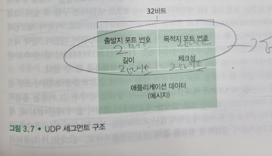
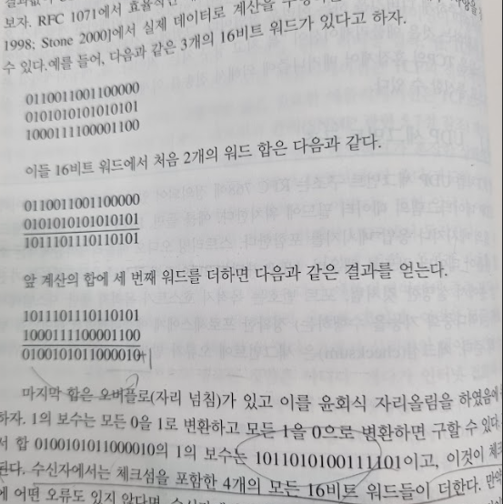

# 비연결형 트랜스포트: UDP
## 문서 관리자
조승효(문서 생성자)
## 시작
   - UDP는 트랜스포트 계층 프로토콜이 할 수 있는 최소 기능으로 동작한다.
   - UDP는 다중화/역다중화 기능과 간단한 오류 검사 기능을 제외하면 IP에 아무것도 추가하지 않는다.
   - 애플리케이션 개발자가 TCP 대신에 UDP를 선택한다면 애플리케이션은 거의 IP와 직접 통신하는 셈이다.
   - UDP는 애플리케이션 프로세스로부터 메시지를 가져와서 다중화/역다중화 서비스에 대한 출발지 포트 번호 필드와 목적지 포트 번호 필드를 첨부하고 다른 두 필드들을 추가한 후에 최종 세그먼트를 네트워크 계층으로 넘겨준다.
   - 핸드셰이크를 사용하지 않는다. 이런 이유로 UDP를 비연결형 이라고 한다.
   - DNS는 일반적으로 UDP를 사용하는 애플리케이션 계층 프로토콜의 예이다.
   - UDP는 데이터를 UDP 세그먼트로 만들고, 즉시 그 세그먼트를 네트워크 계층으로 전달한다.
   - UDP는 형식적인 예비동작 없이 전송한다. 그러므로 UDP는 연결을 설정하기 위한 어떤 지연도 없다.
   - UDP는 연결 상태를 유지하지 않으며 이 파라미터 중의 어떤 것도 기록하지 않는다. 그래서 일반적으로 특정 애플리케이션에 할당된 서버는 애플리케이션이 TCP보다 UDP에서 동작할 때 좀 더 많은 클라이언트를 수용할 수 있다.
   - 작은 패킷 헤더 오버헤드: TCP가 세그먼트마다 20바이트의 헤더 오버헤드를 갖는 반면에 UDP는 단지 8바이트의 오버헤드를 갖는다.
   - 혼잡제어를 하지 않으므로 폭주할 가능성도 있다.
## UDP 세그먼트 구조

   - 애플리케이션 데이터는 UDP 데이터그램의 데이터 필드에 위치한다.
   - UDP 헤더는 2바이트씩 구성된 4개의 필드를 가진다.
      - 포트 번호는 목적지 호스트가 목적지 종단 시스템에서 동작하는(역다중화 기능을 수행하는) 정확한 프로세스에게 애플리케이션 데이터를 넘기게 해준다.
      - 체크섬(checksum)은 세그먼트에 오류가 발생했는지를 검사하기 위해 사용된다.
## UDP 체크섬
   - UDP 세그먼트 안의 비트에 대한 변경사항이 있는지 검사하는 것
   - 송슨 측에서 UDP는 세그먼트 안에 있는 모든 16비트 워드 단위로 더하고 이에 대하여 다시 1의 보수를 수행하며 덧셈 과정에서 발생하는 오버플로는 윤회식 자리 올림(wrap around) 한다. 이 결과값이 UDP 세그먼트의 체크섬 필드에 삽입된다.

   - 출발지와 목적지 사이의 모든 링크가 오류 검사를 제공한다는 보장이 없기에 UDP 체크섬을 제공한다.
   - 주어진 링크 간의 신뢰성과 메모리의 오류 검사가 보장되지 않기 때문에, 종단간의 데이터 전송 서비스가 오류 검사를 제공한다면, UDP는 종단 간의 트랜스포트 계층에서 오류 검사를 제공해야만 한다. 이것이 시스템 설계에서의 그 유명한 종단간의 원리(end-end principle)의 한 예다. 즉, 어떤 기능이(이 경우엔 오류 검사) 종단 기반으로 구현해야 하므로, 하위 레벨에 위치한 기능들은 상위 레벨에서 이들을 제공하는 비용을 비교했을 때 중복되거나 거의 유용하지 않을 수 있다.