# 신뢰성 있는 데이터 전송의 원리
## 문서 관리자
조승효(문서 생성자)
## 시작
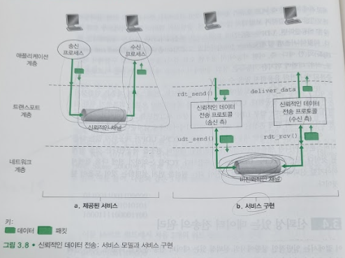
   - 상위 계층 개체에게 제공되는 서비스 추상화는 데이터가 전송될 수 있는 신뢰적인 채널의 서비스 추상화다.
   - 전송된 데이터가 손상되거나 손실되지 않는다.
   -모든 데이터는 전송된 순서대로 전달된다.
   - 이러한 서비스 추상화를 구현하는 것은 신뢰적인 데이터 전송 프로토콜(reliable data transfer protocol)의 의무이다.
## 신뢰적인 데이터 전달 프로토콜의 구축
### 완벽하게 신뢰적인 채널 상에서의 신뢰적인 데이터 전송: rdt1.0
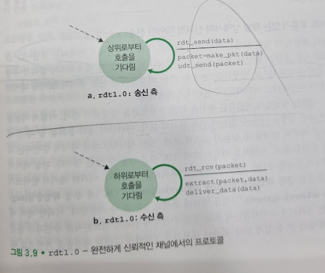
   - rdt의 송신 측은 rdt_send(data) 이벤트에 의해 상위 계층으로부터 데이터를 받아들이고 데이터를 포함한 패킷을 생성한다(make_pkt(data) 에 의해서). 그리고 난 후 패킷을 채널로 송신한다. 실제로 rdt_send(data) 이벤트는 상위 계층 애플리케이션의 프로시저 호출(예: rdt_send())에 의해서 발생한다.
   - 수신 측에서, rdt 는 rdt_rcv(packet) 이벤트에 의해 하위의 채널로부터 패킷을 수신하고, 패킷으로부터(extract(packet, data) 에 의해서) 데이터를 추출한 후 데이터를 상위 계층으로 전달한다(deliver_data(data)). rdt_rcv(packet) 이벤트는 하위 계층 프로토콜로부터의 프로시저 호출(예: rdt_rcv()) 에 의해서 발생한다.
   - 완전히 신뢰적인 채널에서는 오류가 생길 수 없으므로 수신 측이 송신측에게 어떤 피드백(feedback)도 제공할 필요가 없다.
### 비트 오류가 있는 채널 상에서의 신뢰적 데이터 전송: rdt2.0
   - 재전송을 기반으로 하는 신뢰적인 데이터 전송 프로토콜은 자동 재전송 요구(Automatic Repeat reQuest, ARQ) 프로토콜
      - 오류 검출: 첫째, 비트 오류가 발생했을 때 수신자가 검출할 수 있어야 하는 기능이 필요하다.
      - 수신자 피드백: 송신자와 수신자가 일반적으로 수천 킬로미터 떨어진 서로 다른 종단 시스템에서 동작하므로, 송신자가 수신자의 상태(패킷이 정확하게 수신되었는지 아닌지와 같은 경우)를 알기 위한 유일한 방법은 수신자가 송신자에게 피드백을 제공하는 것
      - 재전송: 수신자에서 오류를 가지고 수신된 패킷은 송신자에 의해서 재전송된다.
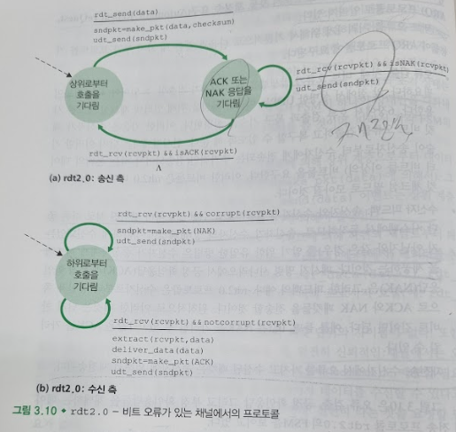
   - rdt2.0 의 송신 측은 2개의 상태를 가진다. 왼쪽에서 나타낸 상태에서, 송신 측 프로토콜은 상위 계층으로부터 데이터가 전달되기를 기다린다. rdt_send(data) 이벤트가 발생하면, 송신자는 패킷 체크섬과 함께 전송될 데이터를 포함하는 패킷(sndpkt)을 생성하고, 그 패킷을 udt_send(sndpkt) 동작을 통해 전송할 것이다. 오른쪽에 나타난 상태에서, 송신자 프로토콜은 수신자로부터의 ACK 또는 NAK 패킷을 기다린다. 만약 ACK 패킷이 수신된다면(그림에서 표기 rdt_rcv(rcvpkt) && isACK(rcvpkt) 는 이 이벤트에 대응), 송신자는 가장 최근에 전송된 패킷이 정확하게 수신되었다는 것을 알게 된다. 그래스 프로토콜은 상위 계층으로부터 데이터를 기다리는 상태로 돌아간다. 만약 NAK가 수신되면 프로토콜은 마지막 패킷을 재전송하고 재전송된 데이터 패킷에 대한 응답으로 수신자에 의해 응답되는 ACK 또는 NAK를 기다린다. 송신자가 ACK 또는 NAK를 기다리는 상태에 있을 때, 상위 계층으로부터 더 이상의 데이터를 전달받을 수 없다는 것에 유의하라. 송신자는 수신자가 현재의 패킷을 정확하게 수신했다는 것을 확인하기 전까지 새로운 데이터를 전달하지 않을 것이다. 이러한 행동 때문에 rdt2.0과 같은 프로토콜은 전송-후-대기(stop-and-wait) 프로토콜로 알려져 있다.
   - rdt2.0에 대한 수신자 측 FSM은 아직 단일 상태를 갖는다. 패킷이 도착했을 때, 수신자는 수신된 패킷이 손상되었는지 아닌지에 따라 ACK 또는 NAK로 응답한다. 그림에서 rdt_rcv(rcvpkt) && corrupt(rcvpkt) 는 패킷이 수신되고 오류가 검출되는 이벤트에 대응한다.
   - ACK와 NAK 패킷이 손상될 수 있기에 rdt2.0 은 문제가 있다.
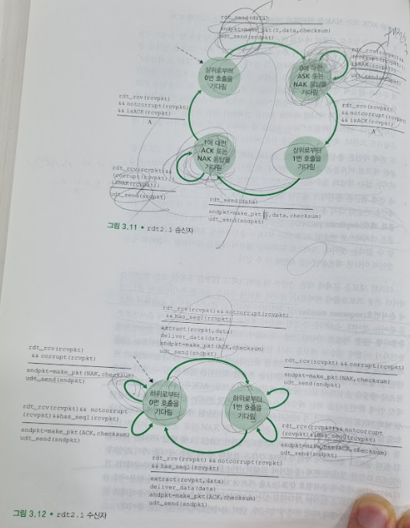
   - rdt2.0의 문제를 해결하기 위해서 데엍 패킷에 새로운 필드를 추가하고 이 필드 안에 순서번호(sequence number)를 삽입하는 방식으로 데이터 패킷에 송신자가 번호를 붙이는 것이다. 수신자는 수신된 패킷이 재전송 인지를 결정할 때는 이 순서번호만 확인하면 된다. 이러한 간단한 전송-후-대기 프로토콜의 경우, 한 비트 순서번호면 송신자가 이전에 전송된 패킷을 다시 전송한 것인지(수신된 패킷의 순서번호는 가장 최근에 수신된 패킷과 동일한 순서번호를 갖는다), 아니면 새로운 패킷(순서번호가 변하면, 모듈로-2 연산에 의해 "진행"한다)을 전송한 것인지 충분히 알 수 있다. 일반적으로 패킷을 손실하지 않는 채널을 가정하고 있으므로, ACK와 NAK 패킷들은 이들 패킷 안에 확인응답을 하는 패킷의 순서번호를 표시할 필요는 없다.
   - rdt2.1의 송신자와 수신자 FSM 각각은 전보다 두 배 많은 상태를 가지고 있다. 이는 프로토콜 상태가 현재 (송신자에 의해서) 전송되고 있거나, 아니면 (수신자가) 기다리고 잇는 패킷이 순서번호 0 또는 1을 가져야 하는지를 반영해야 하기 때문이다.
   - rdt_rcv(rcvpkt) && notcorrupt(rcvpkt) && has_seq1(rcvpkt), rdt_rcv(rcvpkt) && notcorrupt(rcvpkt) && has_seq0(rcvpkt) 가 있어야 하는 이유는 송신자 측에서 상위로부터 "0번 호출을 기다림 상태"에서 패킷을 수신자에게 전송을 하고 "0에 대한 ACK 또는 NAK 응답을 기다림 상태"가 된다. 수신자는 "하위로부터 0번 호출을 기다림 상태"에서 정상 패킷을 받아 ACK 패킷을 송신자 측에서 전송을 한 다음에 "하위로부터 1번 호출을 기다림 상태가 된다." 근데 여기에서 송신자 측에서 NAK 를 받아버리면 0번 패킷을 다시 수신자 측에게 전송을 하는데 수신자 측에서 ACK를 받으면 상태가 "하위로부터 1번 호출을 기다림 상태가 된다." 이거이기 때문에 rdt_rcv(rcvpkt) && notcorrupt(rcvpkt) && has_seq0(rcvpkt) 에 대응한다. 그러니까 다시 송신자가 ACK 상태가 되어서 "상위로부터 1번 호출을 기다림" 상태가 되게 하기 위해 패킷을 다시 보낸다
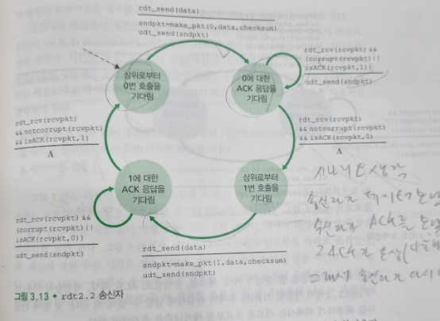
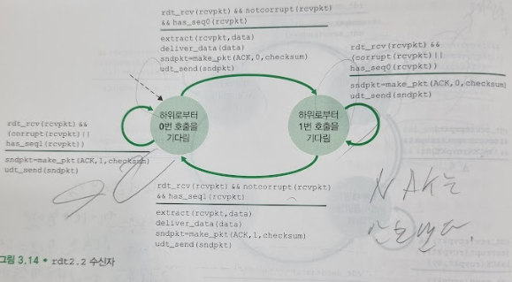
   - 프로토콜 rdt2.1은 수신자로부터 송신자까지의 긍정 확인응답과 부정 확인응답을 모두 포함한다.
   - NAK 없는 신뢰적인 데이터 전송 프로토콜을 나타낸 것이 rdt2.2 수신자가 반드시 ACK 메시지에 의해서 확인응답하는 패킷의 순서번호를 포함해야 한다
### 비트 오류와 손실 있는 채널 상에서의 신뢰적 데이터 전송: rdt3.0
   - 어떻게 패킷 손실을 검출할 것인가? 그리고 패킷 손실이 발생했을 때 어떤 행동을 할 것인가
   - 만약 송신자가 패킷을 잃어버렸다는 것을 확신할 정도로 충분한 시간을 기다릴 수만 있다면, 데이터 패킷은 간단하게 재전송될 수 있다.
   - 송신자는 적어도 송신자와 수신자 사이의 왕복시간 지연(중간 라우터에서의 버퍼링을 포함)에 수신 측에서 패킷을 처리하는 데 필요한 시간을 더한 만큼 기다린다.
   - 실제 상황에서 채택한 접근 방법으로는 송신자가 패킷 손실이 일어났다는 보장은 없지만, 손실이 일어났을 만한 그런 시간을 현명하게 선택하는 것이다.
   - 중복 데이터 패킷(duplicate data packet)의 가능성을 포함한다.
   - 주어진 시간이 경과된 후에 송신자를 인터럽트(중단)할 수 있는 카운트다운 타이머(countdown timer)가 필요하다.
   - 송신자는 다음처럼 동작해야 한다.
   1. 매 패킷(첫 번째 또는 재전송 패킷)이 송신된 시간에 타이머를 시작함
   2. 타이머 인터럽트에 반응함(적당한 행동을 취함)
   3. 타이머를 멈춤
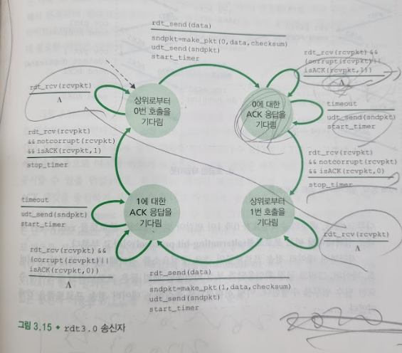
   - 프로토콜 rdt3.0은 때로 얼터네이팅 비트 프로토콜(alternating-bit protocol)이라고 부른다.
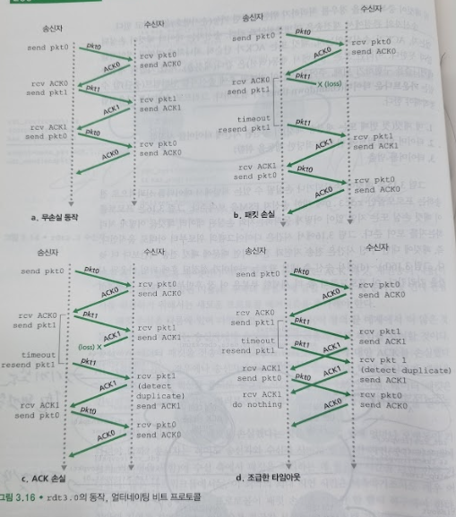
## 파이프라인된 신뢰적 데이터 전송 프로토콜
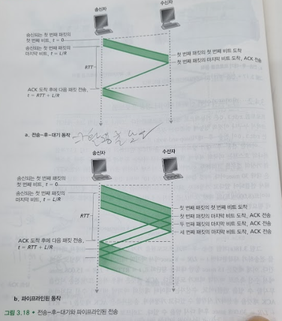
   - 전송 후 대기 같은 경우 이용률(utilization) 이 형편없이 낮다
   - 응답률을 높이기 위해서는 확인 응답을 기다리지 않고 여러 패킷을 전송하도록 허용하는 것
   - 파이프라이닝(pipelining) 방식은 신뢰적인 데이터 전송 프로토콜에서 다음과 같은 중요성을 가지고 있다.
      - 순서번호의 범위가 커져야 한다. 각각의 전송 중인 패킷(재전송은 고려하지 않음)은 유일한 순서번호를 가져야 하고 거기에 전송 중이고 확인응답이 안 된 여러 패킷이 있을지도 모르기 때문이다.
      - 프로토콜의 송신 측과 수신 측은 한 패킷 이상을 버퍼링해야 한다. 최소한 송신자는 전송되었으나 확인응답 되지 않은 패킷을 버퍼링해야 한다. 정확하게 수신된 패킷의 버퍼링은 수신자에서도 필요하다.
      - 필요한 순서번호의 범위와 버퍼링 조건은 데이터 전송 프로토콜이 손실 패킷과 손상 패킷 그리고 상당히 지연된 패킷들에 대해 응답하는 방법에 의존한다. 파이프라인 오류 회복의 두가지 기본적인 접근 방법으로 N부터 반복(Go-Back-N, GBN)과 선택적 반복(Selective Repeat, SR) 등이 있다.
## N부터 반복(Go-Back-N ,GBN)
   - GBN 프로토콜에서 송신자는 확인응답을 기다리지 않고 여러 패킷을 전송(가능할 때) 할 수 있다. 그러나 파이프라인에서 확인응답이 안 된 패킷의 최대 허용 수 N보다 크지 않아야 한다.
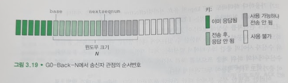
   - 확인 응답이 안 된 가장 오래된 패킷의 순서번호를 base로 정의하고 사용되지 않은 가장 작은 순서번호를 nextseqnum(전송될 다음 패킷의 순서번호)으로 정의한다면, 순서 번호의 범위에서 4개의 간격을 식별할 수 있다. 간격 [0, base-1] 에서 순서번호는 이미 전송되고 확인응답이 된 패킷에 대응된다. 간격 [base, nextseqnum - 1] 은 송신은 되었지만 아직 확인응답 되지 않은 패킷에 대응된다. 간격 [nextsequm, base + N - 1] 은 상위 계층으로부터 데이터가 도착하면 바로 전송될 수 있는 패킷을 위하여 사용될 수 있다. 마지막으로 base + N 이상의 순서번호는 파이프라인에서 확인응답 안 된 패킷(특별히, 순서번호 base를 가진 패킷)의 확인응답이 도착될 때까지 사용될 수 없다.
   - 전송되었지만 아직 확인응답 안 된 패킷을 위해 허용할 수 있는 순서번호의 범위는 순서번호의 범위 상에서 크기가 N인 윈도우로 나타낸다. 프로토콜이 동작할 때, 이 윈도우는 순서번호 공간에서 오른쪽으로 이동(slide) 된다. 이러한 이유 때문에 N을 윈도우 크기(window size)라 부르며, GBN 프로토콜은 슬라이딩 윈도우 프로토콜(sliding-window protocol)이라고 부른다.
   - 모듈 2^k 연산을 이용한다.
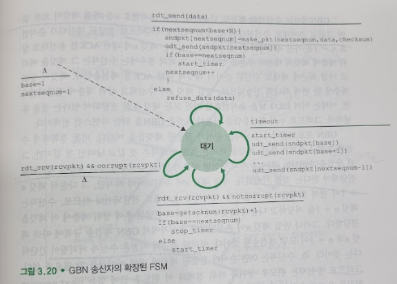
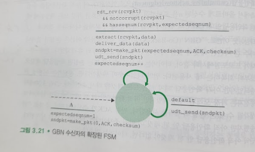
   - ACK 기반의 NAK 없는 GBN 프로토콜의 송신 측과 수신 측의 확장된 FSM을 보여준다. 
   - 상위로부터의 호출: 윈도우가 가득 차지 않았으면 송신, 윈도우가 가득 차있다면 상위 계층이 나중에 다시 시도
   - ACK의 수신: GBN 프로토콜에서 순서번호 n을 가진 패킷에 대한 확인응답은 누적확인응답(cumulative acknowledgment)으로 인식된다. 이 누적확인응답은 수신 측에서 올바르게 수신된 n을 포함하여, n까지의 순서번호를 가진 모든 패킷들에 대한 확인응답이다.
   - 타임아웃 이벤트: 타임아웃 발생시 송신자는 이전에 전송되었지만 아직 확인응답 되지 않은 모든 패킷을 다시 송신한다.
   - 만약 순서번호 n을 가진 패킷이 오류 없이 그리고 순서대로 수신된다면(즉, 상위 계층에 마지막으로 전달된 데이터가 순서번호 n-1을 가진 패킷에서 온 것이라면), 수신자는 패킷 n에 대한 ACK를 송신하고 상위 계층에 패킷의 데이터 부분을 전달한다. 그 외의 경우에는 수신자는 그 패킷을 버리고 가장 최근에 제대로 수신된 순서의 패킷에 대한 ACK를 재전송한다.
   - 순서가 잘못된 패킷을 버린다.
   - 버퍼링 단순, 많은 재전송이 필요함
## 선택적 반복(Selective Repeat, SR)
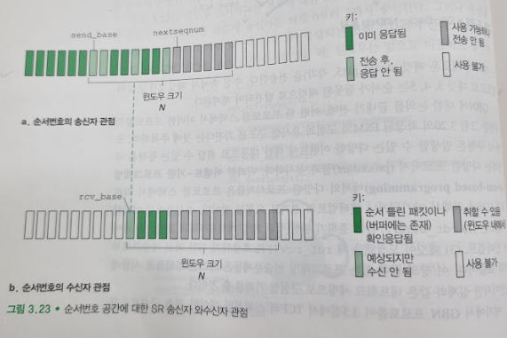
   - 선택적 반복(selective repeat, SR) 프로토콜은 수신자에서 오류(손실되거나 변조된)가 발생한 패킷을 수신했다고 의심되는 패킷만을 송신자가 다시 전송하므로 불필요한 재전송을 피한다.
   - 각 패킷은 논리적인 타이머를 가지고 있다.
   - base 보다 아래의 특정 순서번호에 대해서도 ACK를 재전송해야 한다. 송신자와 수신자의 윈도우가 항상 같지 않기 때문이다.