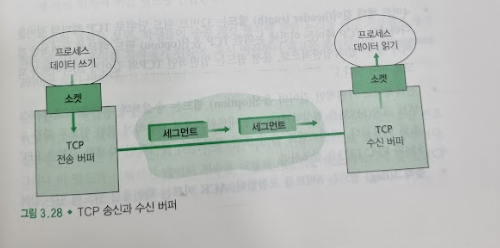
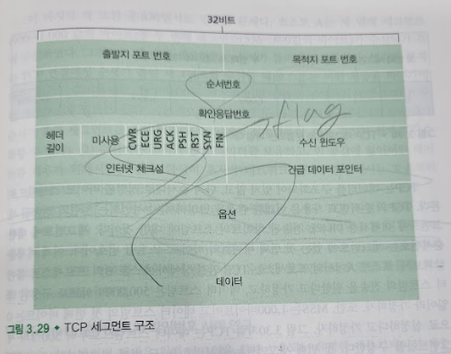
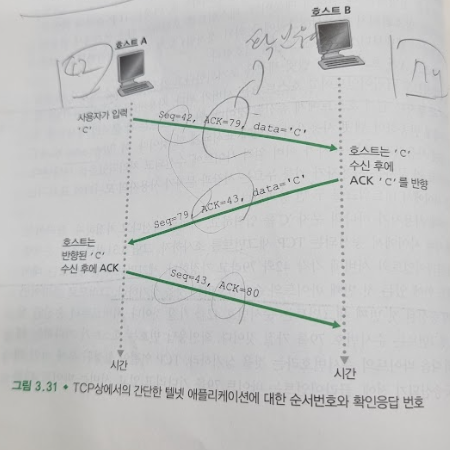
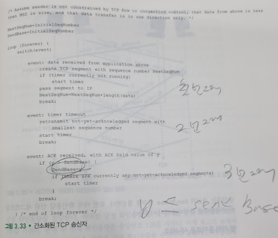
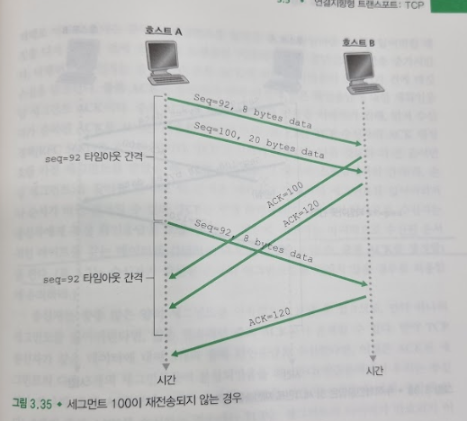
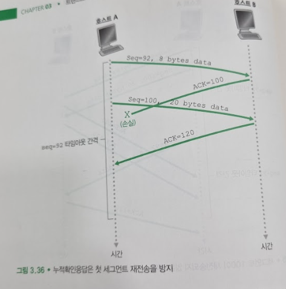
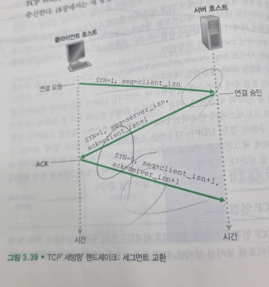
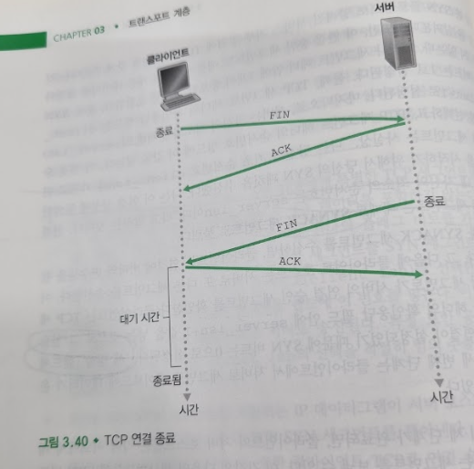
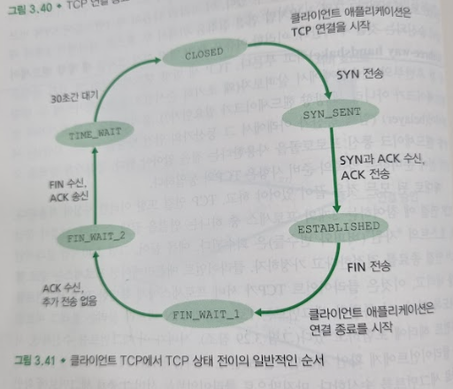
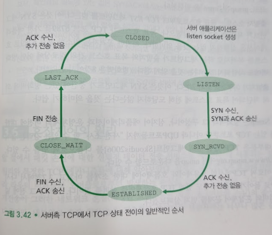

# 연결지향형 트랜스포트: TCP
## 문서 관리자
조승효(문서 생성자)
## TCP 연결
   - 핸드셰이크를 먼저 해야 하므로 연결지향형(connection-oriented)이다.
   - TCP 프로토콜은 오직 종단 시스템에서만 동작하고 중간의 네트워크 요소(라우터와 브리지)에서는 동작하지 않으므로, 중간의 네트워크 요소들은 TCP 연결상태를 유지하지 않는다.
   - TCP 연결은 전이중(full-duplex) 서비스를 제공한다.
   - TCP 연결은 항상 단일 송신자와 단일 수신자 사이의 점대점(point-to-point)이다. 멀티캐스팅은 불가능하다.
   - 연결을 초기화하는 프로세스를 클라이언트 프로세스, 다른 프로세스를 서버 프로세스라고 한다.
   - 세 방향 핸드셰이크(three-way handshake)
   - TCP 연결이 설정되면, 두 애플리케이션 프로세스는 서로 데이터를 보낼 수 있다.

   - 클라이언트 프로세스는 소켓을 통해서 데이터의 스트림을 전달한다.
   - 데이터가 관문을 통해 전달되면, 이제 데이터는 클라이언트에서 동작하고 있는 TCP에 맡겨진다.
   - TCP는 초기 세 방향 핸드셰이크 동안 준비된 버퍼의 하나의 연결의 송신 버퍼(send buffer)로 데이터를 보낸다.
   - 세그먼트의 크기는 최대 세그먼트 크기(maximum segment size, MSS)로 제한된다. MSS는 일반적으로 로컬 송신 호스트에 의해 전송될 수 있는 가장 큰 링크 계층 프레임의 길이[최대 전송 단위(maximum transmission unit, MTU)]에 의해 일단 결정되고, 그런 후에 TCP 세그먼트와 TCP/IP 헤더 길이가 단일 링크 계층 프레임에 딱 맞도록 하여 정해진다.
   - TCP 세그먼트를 형성한다.
## TCP 세그먼트 구조

   - TCP 세그먼트는 헤더 필드와 데이터 필드로 구성되어 있다.
   - 데이터 필드는 한 줌의 애플리케이션 데이터를 담는다.
   - MSS는 세그먼트의 데이터 필드의 크기를 제한한다.
   - 헤더는 상위 계층 애플리케이션으로부터 다중화와 역다중화를 하는 데 사용하는 출발지(source)와 목적지(destination) 포트 번호를 포함한다.
   - 체크섬 필드를 포함한다.
   - 32비트 순서번호 필드(sequence number field)와 32비트 확인응답번호 필드(acknowledement number field)는 전에 논의한 것처럼 신뢰적인 데이터 전송 서비스 구현에서 TCP 송신자와 수신자에 의해서 사용된다.
   - 16비트 수신 윈도우(receive window) 필드는 흐름제어에 사용된다. 이는 수신자가 받아들이려는 바이트의 크기를 나타내는 데 사용된다.
   - 4비트 헤더 길이(header length) 필드는 32비트 워드 단위로 TCP 헤더의 길이를 나타낸다
   - 선택적이고 가변적인 길이의 옵션(option) 필드는 송신자와 수신자가 최대 세그먼트 크기를 협상하거나 고속 네트워크에서 사용하기 위한 윈도우 확장요소로 사용된다.
   - 플래크(flag) 필드는 6비트를 포함한다. ACK 비트는 확인응답 필드에 있는 값이 유용함을 가리키는 데 사용된다. CWR과 ECE 비트는 명시적인 혼합표시에서 사용된다. RST, SYN 그리고 FIN 비트는 연결 설정과 해제에 사용된다. PSH 비트가 설정될 때, 이것은 수신자가 데이터를 상위 계층에 즉시 전달해야 한다는 것을 가리킨다. URG 비트는 이 세그먼트에서 송신 측 상위 계층 개체가 긴급으로 표시하는 데이터임을 나타낸다.
### 순서번호와 확인응답 번호
   - TCP는 데이터를 구조화되어 있지 않고, 단지 순서대로 정렬된 바이트 스트림으로 본다.
   - 순서번호는 일련의 전송된 세그먼트에 대해서가 아니라, 전송된 바이트의 스트림에 대한 것이다. 세그먼트에 대한 순서번호는 세그먼트에 있는 첫 번째 바이트의 바이트 - 스트림 번호이다.
   - 호스트 A가 자신의 세그먼트에 삽입하는 확인응답 번호는 호스트 A가 호스트 B로부터 기대하는 다음 바이트의 순서번호이다. 이걸 통해 누적 확인응답을 제공한다.
   - 만약에 전 세그먼트가 수신되기 전에 다음 세그먼트가 수신된다면 즉시 버리든지 아니면 그걸 어느 공간에 저장하든지 택한다.
### 텔넷(Telnet): 순서번호와 확인번호 사례 연구

   - 호스트 A가 호스트 B와 텔넷 세션을 초기화한다고 가정하자. 호스트 A가 세션을 초기화하므로 클라이언트이고 호스트 B는 서버가 된다.
   - 사용자가 하나의 문자 'C'를 입력하고, 커피를 마신다고 가정하자. 클라이언트와 서버 사이에서 송신되는 TCP 세그먼트를 조사하자. 초기 순서번호가 클라이언트와 서버에 각각 42와 79라고 가정하자. 세그먼트의 순서번호는 데이터 필드 안에 있는 첫번째 순서번호라는 것을 상기하자. 그러므로 클라이언트에서 송신된 첫 번째 세그먼트는 순서번호 42를 가질 것이다. 서버로부터 송신된 첫번째 세그먼트는 순서번호 79를 가질 것이다. 확인응답 번호는 호스트가 기다리는 데이터의 다음 바이트의 순서번호라는 것을 상기하라. TCP 연결이 설정된 후에 어떤 데이터도 송신되기 전에, 클라이언트는 바이트 79를 기다리고 있고, 서버는 바이트 42를 기다리고 있다.
   - 3개의 세그먼트가 송신된다. 첫 번째 세그먼트는 클라이언트에서 서버로 송신된다. 그 세그먼트는 데이터 필드 안에 문자 'C'의 1바이트의 ASCII 표현을 포하만다. 순서번호 필드 안에 42를 갖는다. 확인응답 번호 필드에 79를 가질 것이다.
   - 두ㅂ 번째 세그먼트는 서버에서 클라이언트로 송신된다. 이는 두 가지의 목적을 가진다. 첫째, 이것은 수신하는 서버에게 데이터에 대한 확인 응답을 제공한다. 확인응답 필드 안에 43을 넣음으로써, 서버는 클라이언트에게 바이트 42를 성공적으로 수신했고 앞으로 43을 기다린다는 것을 말해준다. 두 번째 목적은 문자 'C'를 반대로 반향되도록 하는 것이다.
   - 이러한 확인응답은 "서버 대 클라이언트" 데이터 세그먼트 상에서 피기백(piggybacked) 된다고 한다.
   - 세 번째 세그먼트는 클라이언트에서 서버로 송신된다. 그것의 목적은 서버로부터 수신한 데이터를 확인응답을 하는 것이다.
## 왕복시간(RTT) 예측과 타임아웃
   - SampleRTT라고 표시되는 세그먼트에 대한 RTT 샘플은 세그먼트가 송신된 시간(즉, IP에게 넘겨진 시간) 으로부터 그 세그먼트에 대한 긍정응답이 도착한 시간까지의 시간 길이다.
   - 모든 전송된 세그먼트에 대해서 SampleRTT를 측정하는 대신, 대부분의 TCP는 한 번에 하나의 SampleRTT 측정만을 시행한다.
   - 어떤 시점에서 SampleRTT는 전송되었지만 현재까지 확인응답이 없는 세그먼트 중 하나에 대해서만 측정되며, 이는 대략 왕복시간마다 SampleRTT의 새로운 값을 얻게 한다.
   - 또한 TCP는 재전송한 세그먼트에 대한 SampleRTT는 계산하지 않으며 한번 전송된 세그먼트에 대해서만 측정한다.
   - SampleRTT 값은 라우터에서의 혼잡과 종단 시스템에서의 부하 변화 때문에 세그먼트마다 다르다. 이러한 변동성 때문에 SampleRTT값은 불규칙적이다. 대체로 RTT를 추정하기 위해서 SampleRTT의 평균값을 채택한다.
   - EstimatedRTT = (1-a) * EstimatedRTT + a * SampleRTT. 권장되는 a의 값은 a=0.125 이다.
   - EstimatedRTT는 현재 혼잡을 더 잘 반영한다. 통계에서 이런 평균은 지수적 가중 이동 평균(exponential weighted moving average, EWMA)이라고 부른다.
   - RTT의 변화율을 의미하는 DevRTT를 SampleRTT가 EstimatedRTT로부터 얼마나 많이 벗어나는지에 대한 예측으로 정의한다.
   - 재전송 주기는 EstimatedRTT보다 크거나 같아야 한다. 그러나 너무 크면 안된다. 그러니 EstimatedRTT 에 약간의 값을 더하는 거시 낫다.
   - TimeoutInterval = EstimatedRTT + 4 * DevRTT
   - 초기 TimoueoutInterval의 값으로 1초를 권고한다.
## 신뢰적인 데이터 전달
   - TCP는 IP의 비신뢰적인 "최선형" 서비스에서 신뢰적인 데이터 전달 서비스(reliable data transfer service)를 제공한다.

   - 첫 번째 주요 사건발생에서 TCP는 애플리케이션으로부터 데이터를 받고, 세그먼트로 이 데이터를 캡슐화하고, IP에게 이 세그먼트를 넘긴다.
   - 두 번째 주요 사건은 타임아웃이다. 타임아웃 발생시 재 전송후 다시 타이머를 시작한다.
   - 세 번째 주요 사건은 수신자로부터 수신 확인 응답 세그먼트의 수신이다. 만약 아직 ACK 를 받은게 없다면 타이머를 킨다.

   - TCP 재전송 때마다 타임아웃 주기를 이전 값의 두 배로 설정한다.
   - 빠른 재전송: 세그먼트의 타이머가 초과되기 전에 손실된 세그먼트 재전송
   - TCP는 GBN 과 SR 의 혼합이라 보는 것이 적절하다.
## 흐름제어
   - TCP는 송신자가 수신자의 버퍼를 오버플로 시키는 것을 방지하기 위해서 애플리케이션에게 흐름제어 서비스(flow-control service)를 제공한다. 이같이 흐름제어는 속도를 일치시키는 서비스이다.
   - TCP는 송신자가 수신 윈도우(receive window)라는 변수를 유지하여 흐름제어를 제공한다.
   - 수신 윈도우는 수신 측에서 가용한 버퍼 공간이 얼마나 되는지를 송신자에게 알려주는 데 사용된다.
   - LastByteRead: 호스트 B의 애플리케이션 프로세스에 의해서 버퍼로부터 읽힌 데이터 스트림의 마지막 바이트 수
   - LastByteRcvd: 호스트 B에서 네트워크로부터 도착하여 수신 버퍼에 저장된 데이터 스트림의 마지막 바이트 수
   - 할당된 수신 버퍼의 크기를 RcvBuffer 라고 할 때 LastByteRcvd - LastByteRead <= RcvBuffer 가 성립된다.
   - rwnd로 명명된 수신 윈도우 는 버퍼의 여유 공간으로 설정된다. rwnd = RcvBuffer - [LastByteRcvd - LastByteRead]
   - 호스트 B가 호스트 A에게 전송하는 모든 세그먼트의 윈도우 필드에 현재의 rwnd값을 설정함으로써 연결 버퍼에 얼마만큼의 여유 공간이 있는지를 호스트 A에게 알려준다.
   - 호스트 A는 명백한 의미를 가지는 두 변수인 LastByteSent와 LastByteAcked를 유지해서 LastByteSent-LastByteAcked <= rwnd 임을 보장한다.
   - 호스트 A에게 rwnd = 0 이라고 알린 후에 호스트 B는 호스트 A에게 전송할 게 없다고 가정하자. 그러면 호스트 B는 버퍼를 비워도 호스트 A에게 새로운 rwnd 세그먼트를 전송하지 않는다. 그래서 호스트 A는 호스트 B가 버퍼를 가지고 있는지 몰라 전송을 할 수 없게 된다. 이를 해결하기 위해 호스트 A가 호스트 B의 수신 윈도우가 0일 때, 1바이트 데이터로 세그먼트를 계속해서 전송하도록 요구한다.
## TCP 연결 관리

   - 1단계: 먼저 클라이언트 측 TCP는 서버 TCP에게 특별한 TCP 세그먼트를 송신한다. 이 특별한 세그먼트는 애플리케이션 계층 데이터를 포함하지 않는다. 그러나 세그먼트의 헤더에 SYN 비트라고 불리는 하나의 플래그 비트를 가진다. 이러한 이유 때문에, 이 특별한 세그먼트를 SYN 세그먼트라고 부른다. 추가로 클라이언트는 최초의 순서번호(client_isn)를 선택한다. 그리고 최초의 TCP SYN 세그먼트의 순서번호 필드에 이 번호를 넣는다. 이 세그먼트는 IP 데이터그램 안에서 캡슐화되고 서버로 송신된다. 특정 보안 공격들을 피하기 위해 client_isn의 선택을 적절히 임의 추출하는 것에 유의해야 한다.
   - 2단계: TCP SYN 세그먼트를 포함하는 IP 데이터그램이 서버 호스트에 도착했을 때, 서버는 데이터그램으로부터 TCP SYN 세그먼트를 뽑아낸다. 그리고 연결에 TCP 버퍼와 변수들을 할당한다. 또한 클라이언트 TCP로 연결 승인 세그먼트를 송신한다. 또한, 이 연결 승인 세그먼트도 애플리케이션 계층 데이터를 포함하지 않는다. 그러나 세그먼트 헤더 안에 3개의 중요한 정보를 포함한다. 첫째, SYN 비트는 1로 설정된다. 둘째, TCP 세그먼트 헤더의 확인응답 필드는 client_isn+1로 설정된다. 마지막으로, 서버는 자신의 최초의 순서번호(server_isn)을 선택하고, TCP 세그먼트 헤더의 순서번호 필드에 이 값을 넣는다. 이 연결 승인 세그먼트는 사실상, "나는 당신의 최초 순서번호 client_isn을 가지고 연결을 시작하기 위해서 당신의 SYN 패킷을 수신했다. 나는 이 연결 설정에 동의한다. 내 자신의 최초의 순서번호는 server_isn이다."라고 말하는 것이다. 연결 승인 세그먼트는 때때로 SYNACK 세그먼트로 불린다.
   - 3단계: SYNACK 세그먼트를 수신하면, 클라이언트는 연결에 버퍼와 변수들을 할당한다. 그 다음에 클라이언트 호스트는 서버로 또 다른 세그먼트를 송신한다. 이 마지막 세그먼트가 서버의 연결 승인 세그먼트를 확인한다.(클라이언트는 TCP 세그먼트 헤더의 확인응답 필드 안에 server_isn+1 값을 넣는 것으로 그 일을 한다) 연결이 설정되었기 때문에 SYN 비트는 0으로 설정된다.
   - TCP 연결 설정 절차를 세 방향 핸드셰이크(three-way handshake) 라고 부른다.

   - 연결을 끝낼 때에는 FIN 비트를 가진 세그먼트를 보낸다.

   - TCP 상태들을 두루 전이한다.
   - RST 플래그 비트는 호스트가 리셋 세그먼트를 전송할 때, 출발지에게 "그 세그먼트에 대한 소켓을 가지고 있지 않으니 세그먼트를 재전송하지 말라"고 말하는 것이다.
