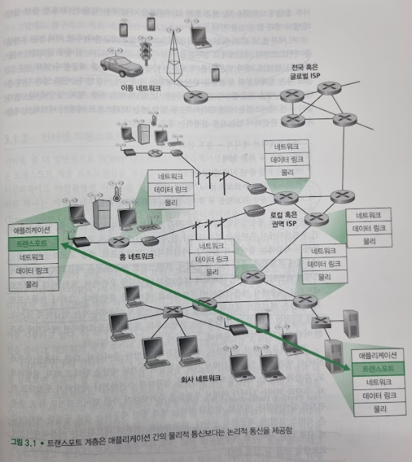

# 트랜스포트 계층 서비스 및 개요
## 문서 관리자
조승효(문서 생성자)
## 시작

   - 트랜스포트 계층 프로토콜은 서로 다른 호스트에서 동작하는 애플리케이션 프로세스들 간의 논리적 통신(logical communication)을 제공한다. 논리적 통신은 애플리케이션의 관점에서 보면 프로세스들이 동작하는 호스트들이 직접 연결된 것처럼 보인다는 것을 의미한다.
   - 트랜스포트 계층 프로토콜은 네트워크 라우터가 아닌 종단 시스템에서 구현된다.
## 트랜스포트 계층과 네트워크 계층 사이의 관계
   - 트랜스포트 계층 프로토콜은 서로 다른 호스트에서 동작하는 프로세스들 사이의 논리적 통신을 제공하지만, 네트워크 계층 프로토콜은 호스트들 사이의 논리적 통신을 제공한다.
   - 트랜스포트 계층 프로토콜은 종단 시스템에 존재한다.
   - 트랜스포트 프로토콜은 메시지가 네트워크 계층 내부에서 어떻게 이동하는지는 언급하지 않는다.
   - 컴퓨터 네트워크는 애플리케이션에게 서로 다른 서비스를 제공하도록 하는 개별 프로토콜을 갖는 다양한 트랜스포트 프로토콜을 만들 수 있게 한다.
   - 트랜스포트 계층이 제공할 수 있는 서비스는 하위 네트워크 계층 프로토콜의 서비스 모델에 의해서 제약받는다.
   - 트랜스포트 계층은 하위 네트워크 프로토콜이 비신뢰적일 때, 즉 네트워크 프로토콜이 패킷을 분실하거나 손상하거나 복사본을 만들 때에도, 애플리케이션에게 신뢰적인 데이터 전송 서비스를 제공할 수 있다.
   - 트랜스포트 프로토콜은 네트워크 계층이 트랜스포트 계층 세그먼트의 기밀성을 보장할 수 없을 때도 침입자가 애플리케이션 메시지를 읽지 못하도록 암호화를 사용할 수 있다.
## 인터넷 트랜스포트 계층의 개요
   - UDP(User Datagram Protocol): 애플리케이션에게 비신뢰적이고 비연결형인 서비스를 제공
   - TCP(Transmission ControlProtocol) : 애플리케이션에게 신뢰적이고 연결지향형 서비스를 제공