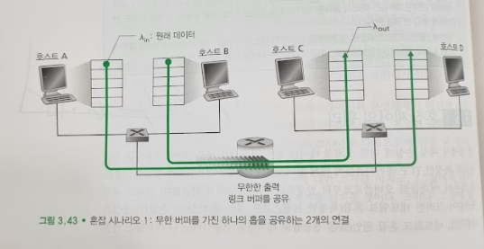
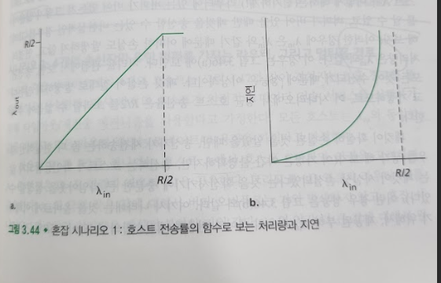
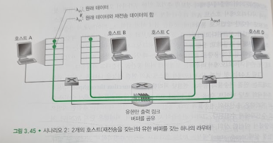
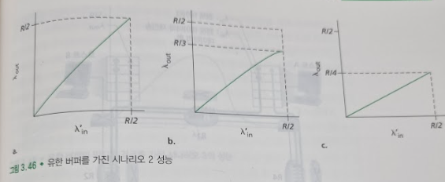
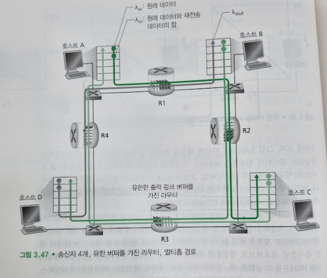
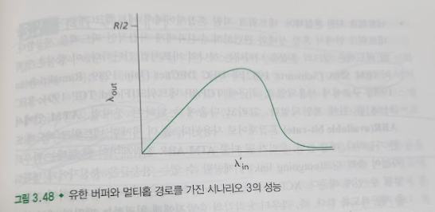

# 혼잡제어의 원리
## 문서 관리자
조승효(문서 생성자)
## 혼잡의 원인과 비용
   - 시나리오 1: 2개의 송신자와 무한 버퍼를 갖는 하나의 라우터

      - 두 호스트 A와 B가 각각 출발지와 목적지 사이에 단일 홉을 공유하는 연결을 가진다고 생각하자.
      - 호스트 A의 애플리케이션이 람다 인 바이트/초의 평균 전송률로 연결에 데이터를 보내고 있다고 가정하자. 이 데이터들은 각 데이터 단위가 단 한 번 소켓으로 전송된다는 점에서 오리지널 데이터이다. 하위의 트랜스포트 계층 프로토콜은 단순하게 데이터를 캡슐화하고 전송한다. 오류 복구, 흐름제어 또는 혼잡제어를 수행하지 않는다. 트랜스포트 계층과 하위 계층에서 헤더 정보의 추가로 인한 부가적인 오버헤드를 무시하면, 첫번째 시나리오에서 호스트 A가 라우터에게 제공하는 속도는 람다 인 바이트/초이다.
      - 호스트 B도 비슷한 방법으로 동작하며, 설명을 쉽게 하기 위해, 람다 인 바이트/초의 전송률로 많은 데이터를 전송한다고 가정하자.
      - 호스트 A로부터 호스트 B로 전송되는 패킷은 라우터를 통해서 전달되고, 용량 R의 공유 출력 링크상으로 전달된다.
      - 라우터는 패킷 도착률이 출력 링크의 용량을 초과하여 입력되는 패킷들을 저장하는 버퍼를 가지고 있다. 라우터는 무제한의 버퍼 공간을 가진다고 가정한다.
      - 그림3-44 왼쪽 그래프는 연결 전송률의 함수로 연결당 처리량(per-connection throughput: 수신자 측에서의 초당 바이트 수)을 그린것이다. 0과 R/2 사이의 전송률에 대해서 수신자 측의 처리량은 송신자의 전송률과 같다. 송신자가 보내는 모든 데이터는 유한한 지연으로 수신자에게 수신된다. 그러나 전송률이 R/2 이상일 때, 처리량은 단지 R/2 이다. 처릴ㅇ에서 이러한 상위 제한은 두 연결 사이에서 링크 용량 공유의 결과이다. 링크는 "안정 상태(steady state)"에서는 R/2를 초과해서 패킷을 수신자에게 전달할 수 없다. 호스트 A와 B가 그것들의 전송률을 아무리 높게 설정하더라도 각자 R/2보다 더 높은 처리량을 결코 얻을 수 없다.
      - 오른쪽 그래프는 링크 용량 근처에서의 동작의 결과들을 보여준다. 전송률이 R/2에 근접했을 때 평균 지연은 점점 커진다. 전송률이 R/2를 초과할 때, 라우터 안에 큐잉된 패킷의 평균 개수는 제한되지 않는다. 그리고 출발지와 목적지 사이의 평균 지연이 무제한이 된다.
      - 따라서 R 근처의 전체 처리량에서 동작하는 것은 처리량 관점에서는 이상적이지만, 지연 관점에서는 이상적이지 않다. 심지어 이 이상적인 시나리오에서도 혼잡 네트워크의 한 비용을 발견했다. 즉, 패킷 도착률이 링크 용량에 근접함에 따라 큐잉 지연이 커진다.
   - 시나리오 2: 2개의 송신자, 유한 버퍼를 가진 하나의 라우터

      - 첫째, 라우터 버퍼의 양이 유한하다고 가정한다. 이 현실적인 가정의 결과는 이미 버퍼가 가득 찼을 때 도착하는 패킷들이 버려진다는 것을 의미한다.
      - 둘째, 각 연결은 신뢰적이라고 가정한다. 트랜스포트 계층 세그먼트를 포함하는 패킷이 라우터에서 버려지면, 결국 송신자에 의해 재전송될 것이다.
      - 패킷이 재전송될 수 있으므로, 이제는 송신율(sending rate)이라는 용어 사용에 좀 더 주의해야 한다. 특히, 애플리케이션이 원래의 데이터를 소캣으로 보내는 송신율을 람다 인 바이트/초로 표기하자. 네트워크 안으로 세그먼트(원래 데이터와 재전송 데이터를 포함)을 송신하는 트랜스포트 계층에서의 송신율은 람다 인' 바이트/초로 표시하고 제공된 부하(offered load)라고 부른다.
      - 호스트 A가 어떻게 해서든 라우터에 있는 버퍼가 비어 있는지 그렇지 않은지를 알 수 있고, 버퍼가 비어 있을 때만 패킷을 송신할 수 있는 비현실적인 경우를 고려해보자. 이 경우 람다 인은 람다 인'와 같기 때문에 어떠한 손실도 발생하지 않고, 연결된 처리량은 람다 인과 같다. 이는 그림 3.46(a)에 보인다. 처리율 관점에서 보면, 송신된 모든 것이 수신되기 때문에 성능은 이상적이다. 패킷 손실이 절대로 발생하지 않는다고 가정하므로, 이 시나리오에서 평균 호스트 송신율은 R/2 를 초과할 수 없음에 주목하자.
      - 패킷이 확실히 손실된 것을 알았을 때만, 송신자가 재전송하는 좀 더 현실적인 경우를 생각 해 보자(이 가정은 약간 불명확하지만, 송신하는 호스트가 확인응답되지 않는 패킷이 사실상 손실되었다는 것을 확신시키기에 충분한 큰 타임아웃을 설정할 수 있다). 이런 경우 성능은 그림 3.46(b)와 같다. 여기서 나타내는 것을 올바르게 이해하기 위해 제공된 부하 람다 인'(최초의 데이터 전송과 재전송합의 속도)이 0.5R일 경우를 고려해보자. 그림 3.46(b) 에 따르면 제공된 부하의 값에서 수신자 애플리케이션으로 전달되는 데이터의 전송률은 R/3이다. 그러므로 전송된 데이터의 0.5R 중 0.333R 바이트/초(평균)는 원래의 데이터이고, 초당 0.166R 바이트/초(평균)는 재전송 데이터이다. 여기서 혼잡 네트워크의 또 다른 비용을 알 수 있다. 즉, 송신자는 버퍼 오버플로 때문에 버려진 패킷을 보상하기 위해 재전송을 수행해야 한다.
      - 송신자에서 너무 일찍 타임아웃 되는 바람에 패킷이 손실되지 않았지만 큐에서 지연되고 있는 패킷을 재전송하는 경우를 생각해보자. 이러한 경우 원래의 데이터 패킷과 재전송 패킷 둘 다 수신자에게 도착한다. 물론 수신자는 단지 하나의 패킷 복사본만 필요하므로 재전송된 패킷은 버린다. 이러한 경우 수신자가 이미 패킷의 원래 복사본을 수신했을 때, 라우터에서 원래 패킷의 재전송된 복사본을 포워딩하는 작업은 낭비이다. 이것 대신에 라우터는 다른 패킷을 송신하기 위해 링크 전송 용량을 사용하는 것이 좋다. 따라서 여기에 혼잡 네트워크의 또 다른 비용이 있다. 즉, 커다란 지연으로 인한 송신자의 불필요한 재전송은 라우터가 패킷의 불필요한 복사본들을 전송하는 데 링크 대역폭을 사용하는 원인이 된다.
   - 시나리오 3: 4개의 송신자와 유한 버퍼를 가지는 라우터, 그리고 멀티홉 경로

      - 4개의 호스트는 그림 3.47과 같이 겹쳐지는 2-홉 경로를 통해 패킷을 전송한다. 다시 각각의 호스트가 안정적인 데이터 전송 서비스를 실행하기 위해 타임아웃/재전송 메커니즘을 사용한다고 가정한다. 모든 호스트는 람다 인의 동일한 값을 가지고, 모든 라우터 링크는 R 바이트/초 용량을 가진다고 가정한다.
      - 라우터 R1과 R2를 지나가는 호스트 A에서 호스트 C까지의 연결을 고려하자. A~C 연결은 D~B 연결과 라우터 R1을 공유한다. 그리고 B~D 연결과 라우터 R2를 공유한다. 람다 인의 극히 작은 값에 대해서 버퍼 오버플로는 거의 발생하지 않고, 혼잡 시나리오 1과 2처럼 처리량은 제공된 부하와 거의 같다. 람다 인의 약간 더 큰 값에 대해서 원래의 데이터가 네트워크로 전송되고 목적지에 전달되고, 오버플로가 거의 발생하지 않으므로, 해당되는 처리량은 약간 커진다. 그러므로 람다인이 작은 값일 때, 람다 인의 증가는 람다 아웃의 증가를 가져온다.
      - 지금까지 극히 작은 트래픽의 경우를 살펴보았고, 이제 람다인값(따라서 람다인')이 매우 큰 경우를 살펴보겠다. 라우터 R2를 고려해보자. 라우터 R2에 도착하는 A~C 트래픽은 (R1에서 전달된 후 R2에 도착하는) R2에서 람다인 값에 관계없이, R1에서 R2까지의 링크 용량, R인 도착률을 가질 수 있다. 만약 람다인'이 모든 연결(B~D 연결을 포함하는)에 대해 매우 크다면, R2의 B~D 트래픽 도착률을 A~C 트래픽 도착률보다 클 수 있다. A~C 와 B~D의 트래픽은 버퍼 공간을 R2 라우터에서 경쟁해야 하므로, R2를 성공적으로 통화하는 A~C 트래픽의 양은 B~D에서 제공된 부하가 크면 클수록 더 작아진다. 극한적인 경우에 제공된 부하가 무한대에 가까워짐에 따라, R2의 빈 버퍼는 즉시 B~D 패킷으로 채워진다. 그리고 R2에서 A~C의 연결의 처리량은 0이 된다. 이것은 트래픽이 많은 경우 A~C 종단간 처리율이 0이 된다는 것을 의미한다.
      - 혼잡 때문에 패킷을 버려야 하는 또 다른 비용을 확인할 수 있다 패킷이 경로상에서 버려질 때, 버려지는 지점까지 패킷을 전송하는 데 사용된 상위 라우터에서 사용된 전송 용량은 헛된 것이다.
## 혼잡제어에 대한 접근법
   - 종단간의 혼잡 제어: 네트워크 계층은 혼잡 제어 목적을 위해 트랜스포트 계층에게 어떤 직접적인 지원도 제공하지 않는다. 종단 시스템이 추측해야 한다.
   - 네트워크 지원 혼잡 제어 네트워크 지원 혼잡제어에서 네트워크 계층 구성요소는 네트워크 안에서 혼잡 상태와 관련하여 송신자에게 직접적인 피드백을 제공한다. ATM 안에서 ABR(available bit-rate) 혼잡제어로 사용된다.