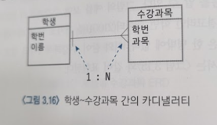
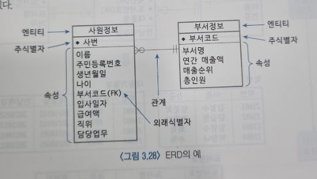

# 데이터 모델링의 주요 개념
## 문서 관리자
조승효(문서 생성자)
## 개요
   - 논리적 데이터베이스 설계란 현실세계의 업무를 분석하여 이를 약속된 표기법을 사용하여 개념적 모델(ERD)로 표현하는 과정을 말하며 전체 데이터베이스 설계에서 핵심적인 부분이다.
   - 데이터 모델링에서도 약속된 개념들을 사용하여 현실세계를 표현하는 데 엔티티(entity), 속성(attribute), 관계(relationship) 등이 그것이다.
## 엔티티
### 엔티티의 정의
   - 엔티티란 업무의 관심 대상이 되는 정보를 갖고 있거나 그에 대한 정보를 관리할 필요가 있는 유형, 무형의 사물(개체)을 말한다.
   - 엔티티가 클래스(class)에 해당하고 엔티티의 인스턴스는 객체(object)에 해당한다는 것을 알 수 있다.
### 엔티티의 분류
   - 유형 엔티티: 물리적인 형태가 있고 쉽게 엔티티임을 알 수 있다.
   - 무형 엔티티: 물리적인 형태가 없고 개념적으로 존재하는 엔티티이다.
   - 문서 엔티티: 업무 절차상에서 사용되는 문서나 장부, 전표에 대한 엔티티이다.
   - 이력 엔티티: 업무상 반복적으로 이루어지는 행위나 사건의 내용을 일자별, 시간별로 저장하기 위한 엔티티이다.
   - 코드 엔티티: 무형 엔티티의 일종으로 각종 코드를 관리하기 위한 엔티티이다.
### 엔티티의 성질
   - 엔티티는 업무의 관심 대상이 되는 사물이어야 한다.
   - 엔티티가 의미 있기 위해서는 두 개 이상의 인스턴스를 갖는 것이 확인되어야 한다.
   - 엔티티는 속성을 가져야 한다.
## 속성
   - 속성이란 엔티티에서 관리해야 할 최소 단위의 정보 항목을 말하며 엔티티는 하나 이상의 속성을 포함한다.
   - 기본 속성은 업무 분석 과정에서 업무의 관심 대상으로 분류된 정보 항목들로 전체 속성들 중에서 가장 많은 비중을 차지한다.
   - 유도 속성은 다른 속성의 값들로부터 유도될 수 있는 속성을 말한다.
   - 설계 속성은 현실 세계에는 존재하지 않지만 설계를 보다 효과적으로 할 수 있기 위해서, 혹은 나중에 정보 시스템이 운영될 때의 필요성 때문에 강제적으로 만들어주는 속성을 말한다. 설계 속성의 대표적인 것은 코드(code) 속성이다.
## 관계
### 관계의 정의
   - 관계(Relationship)란 두 엔티티 사이의 관련성을 나타내는 용어이다. 현실세계에서는 여러 사물들이 상호 관련성을 가지고 움직이기 때문에 이를 모델링하면 엔티티와 엔티티 사이의 관계로 표현된다.
   - 두 엔티티가 관계가 있다는 의미는 상호 공유하는 속성이 있다는 의미이다.
### 관계의 카디낼러티
   - 카디낼러티(cardinality)는 각 엔티티에 속해 있는 인스턴스들 간에 수적으로 어떤 관계에 있는지를 나타내는 개념이다.
   
   - 학생 엔티티와 수강과목 엔티티는 1:N의 관계에 있다고 말한다.
### 관계의 참여도

   - 참여도(partiality)에는 필수(mandatory), 선택(optional) 두가지가 있다.
   - 기준이 되는 엔티티의 인스턴스와 대응되는 인스턴스가 상대방 엔티티에 있을 수도 있고 없을 수도 있을 때 선택 관계에 있다고 말한다.
   - 필수 참여도는 선택과는 달리 기준이 되는 엔티티의 모든 인스턴스에 대하여 대응되는 인스턴스가 상대방 엔티티에 반드시 존재해야 하는 경우이다. 어느 한쪽이 존재하면 다른 쪽도 반드시 존재해야 하는 관계를 필수 관계라고 한다.
### 부모 엔티티와 자식 엔티티
   - 정보가 어느 쪽에 먼저 생성이 되는가에 따라 결정됨
   - 두 엔티티가 부모-자식의 관계에 있다면 일반적으로 부모 엔티티와 자식 엔티티의 가디낼러티는 1:N이고 참여도는 부모 쪽이 필수, 자식 쪽이 선택으로 나타난다.
## 주식별자와 외래식별자
   - ERD 상에서 주식별자를 다른 속성과 구분하기 위해서 속성 이름 뒤에 (PK)로 표기한다. 엔티니 내에서 인스턴스와 인스턴스를 구별하는 기준의 역할을 한다. 테이블에서 주식별자가 튜플과 튜플을 구분하는 기준의 역할을 한다
   - ERD 상에서 외래키는 속성 이름 뒤에 (FK)로 표기한다. 엔티티와 엔티티를 연결해주는 고리의 역할을 한다.
   - 부모 엔티티와 자식 엔티티 관계에서 자식 엔티티의 외래 시별자는 부모 엔티티의 주식별자와 연결된다는 사실을 공식처럼 기억해두자.
## ERD 표기법
