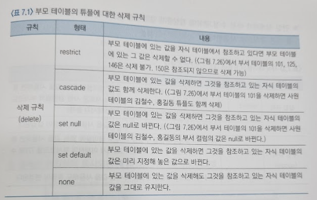
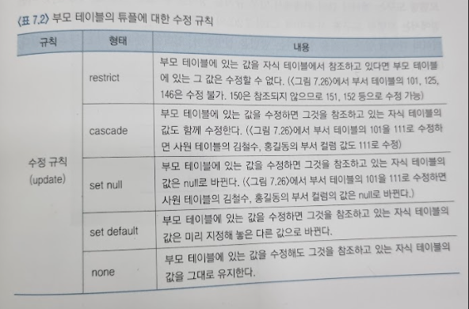
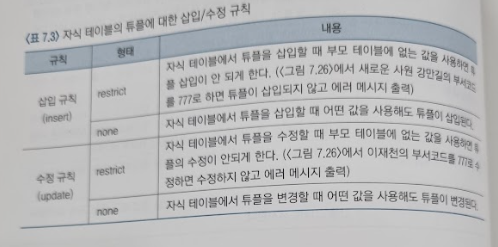

# 식별자, 관계, 속성의 정의
## 문서 관리자
조승효(문서 생성자)
## 주식별자의 정의
### 주식별자 정의 사례
   - 주식별자(primary identifier)는 엔티티에 소속된 인스턴스들을 구별하는 기준 역할을 하는 속성을 말한다. 물리적 데이터베이스의 용어로 말하자면 테이블에서 각 튜플의 유일성을 구별해 줄 수 있는 컬럼을 말하며 기본키라고 부른다.
   - 만일 어떤 속성 X가 엔티티의 주식별자라면 그 엔티티에 있는 모든 인스턴스들의 속성 X 값을 비교했을 때 중복된 값이 나타나지 않아야 한다.
   - 중복이 없어야 한다는 말은 현재 시점에서뿐만 아니라 미래에도 중복된 값이 없어야 한다는 뜻이다.
   - 주식별자는 길이가 짧고, 단순하며, 나중에 자료를 검색할 때 기준이 되는 것이 좋다.
   - 인위적으로 만든 일련번호를 주식별자로 사용한다.
### 주식별자의 여러 형태
   - 복합 속성으로 이루어진 주식별자: 일반적으로 엔티티 이름에 '일별', '기간별'과 같은 내용이 포함되면 복합속성을 주식별자로 갖는 경우가 많고, 날짜 속성이 주식별자의 일부가 된다.
   - 마땅한 주식별자가 없는 경우: 적당한 주식별자가 없는 경우에는 모든 속성을 합친 복합 속성이 주식별자가 될 수 있다.
   - 인위적 주식별자의 문제점: 원하지 않게 중복 정보가 저장될 수 있으므로 사용에 신중해야 한다. 또한 인위적 주식별자를 사용하는 경우는 데이터의 중복을 관리할 수 있는 대안을 미리 마련하여야 한다.
   - 불필요한 속성이 주식별자에 포함되는 경우의 문제점: 의미적 중복이 발생할 가능성이 있으므로 최소한의 속성으로 주식별자를 구성해야 한다.
## 관계/외래식별자의 정의
### 관계의 정의 방법
   1. 문서로부터 동사를 구분한다. 이렇게 도출된 엔티티들 사이의 관계를 찾기 위해서는 '동사'를 검토한다.
   2. 관계 매트릭스를 그려본다. 엔티티들을 매트릭스상의 가로, 세로에 나열하고 교차지점에 있는 두 엔티티가 관계가 있는지를 검토해본다.
   3. 부모, 자식 관계에 있는 엔티티들을 찾아본다. 어떤 엔티티 A의 정보가 만들어지기 위해서는 다른 엔티티 B의 정보를 필요로 하는 관계에 있을 때 엔티티 B는 엔티티 A와 관계를 가지며 엔티티 B는 엔티티 A의 부모 엔티티가 된다.
   4. 관계가 정의되면 카디낼러티와 관계의 참여도를 표시한다. 두 엔티티가 관계가 있다고 판단되면 ERD상에 관계를 표시하고 관계의 카디낼러티와 참여도를 표시한다.
### 외래식별자의 정의
   - 두 엔티티가 관계가 있다면 자식 엔티티의 외래식별자 속성이 부모 엔티티의 주식별자를 참조하게 된다.
   - 관계가 있는 두 엔티티를 부모, 자식으로 구분한다. 두 엔티티 중 정보를 먼저 생성하여 가지고 있는 쪽이 부모 엔티티이고, 부모 엔티티의 정보를 가져다 사용하는 쪽이 자식 엔티티이다.
   - 부모 엔티티의 주 식별자에 해당하는 속성이 자식 엔티티에도 존재하는지 확인한다. 만일 부모 엔티티의 주식별자 속성이 자식 엔티티에도 공통적으로 존재한다면 자식 엔티티에 있는 공통 속성이 외래식별자가 된다. 만일 부모 엔티티의 주식별자 속성이 자식 엔티티에 존재하지 않는다면 자식 엔티티에 속성을 추가한 후 외래 식별자로 지정하면 된다.
### 관계/외래식별자에 대한 규칙
   - Rule 1. 두 엔티티가 관련이 있다는 의미는 두 엔티티가 공유하는 속성이 있다는 뜻이다.
   - Rule 2. 공통 속성 값이 먼저 생성되는 쪽이 부모 엔티티가 되고, 가져다 쓰는 쪽이 자식 엔티티가 된다.
   - Rule 3. 부모 엔티티에 있는 공통 속성은 주식별자가 되고, 자식 엔티티의 공통 속성은 외래식별자가 된다.
   - Rule 4. 부모 엔티티와 자식 엔티티의 카디낼러티는 1:N이다. (어떤 두 엔티티가 관계가 있고 카디낼러티가 1:N이라면 카디낼러티가 1인 쪽이 부모 엔티티이고 N인 쪽이 자식 엔티티이다.)
## 업무 규칙의 정의
### 업무 규칙이란
   - 업무 규칙이란 참조 무결성 제약조건을 유지하기 위한 규칙을 말한다.
   - 업무 규칙은 부모 테이블의 튜플이 삭제되거나 수정되었을 때의 처리 규칙과 자식 테이블에 새로운 튜플이 추가되거나 수정될 때의 처리 규칙으로 분류
   - 부모 테이블에서 튜플의 '변경'이란 튜플의 기본키 값이 변경되는 것을 말한다. 자식 테이블에서 부모 테이블의 기본키를 가져다 사용하기 때문에 기본키가 아닌 다른 컬럼의 값이 변경되는 것은 자식 테이블에 영향을 미치지 않는다. 자식 테이블에서 튜플의 변경이란 튜플의 외래키 값이 변경되는 것을 말한다.
   
   
   
## 속성의 정의
### 속성의 정의 개요
   - 속성은 모델링 과정 동안 변화가 많다는 사실을 기억하도록 하자.
   - 속성의 정의에서 한 가지 기억해야 할 것은 같은 데이터를 관리하는 속성은 ERD 전체에서 한 번만 나타나야 한다는 것이다.
   - 데이터베이스의 철학은 데이터의 중복 관리를 최소화하는 것이다. 따라서 속성의 중복은 배제하도록 한다. 물론 외래식별자 속성은 예외이다. 외래식별자는 다른 엔티티와 관계를 맺기 위해서 불가피하게 존재하는 중복이다.
### 속성의 종류
   - 기본 속성(basic attribute): 업무의 분석 과정에서 도출되는 속성들로서 현실세계에 존재하는 정보를 반영한다.
   - 설계 속성(designed attribute): 설계 업무의 분석 내용에는 있지 않았지만 정보를 효과적으로 관리하기 위해 설계의 차원에서 새로 만든 속성을 말한다. 설계 속성의 대표적인 것이 코드 속성이다.
   - 유도 속성(derived attribute): 유도 속성이란 문자 그대로 다른 속성들로부터 유도될 수 잇는 속성을 말한다. 유도 속성을 사용할지의 여부는 사용 빈도나 성능을 고려하여 결정하되 사용하기로 한 경우는 데이터 간 불일치가 발생하는 것을 방지하기 위한 대책을 세워 놓아야 한다.