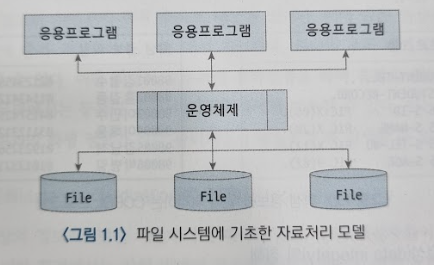
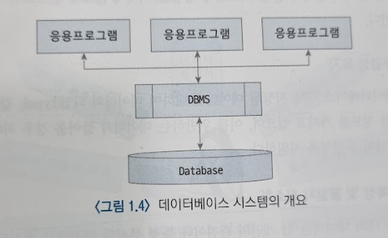
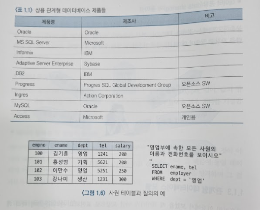
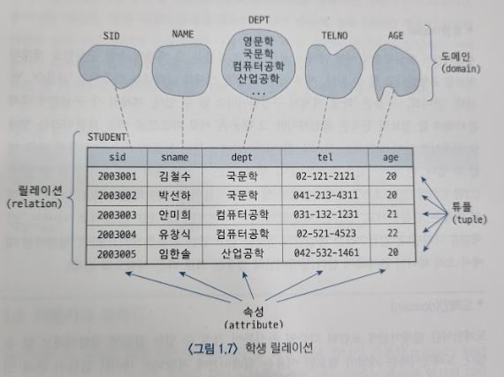
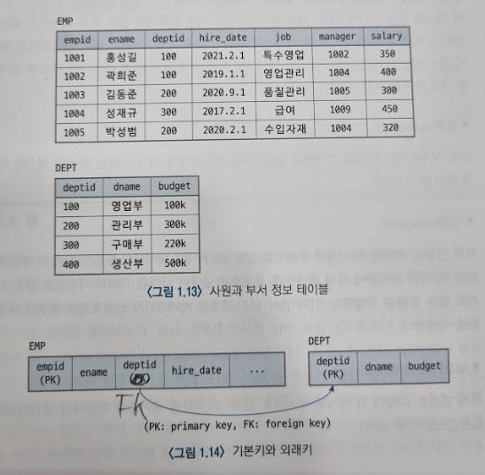
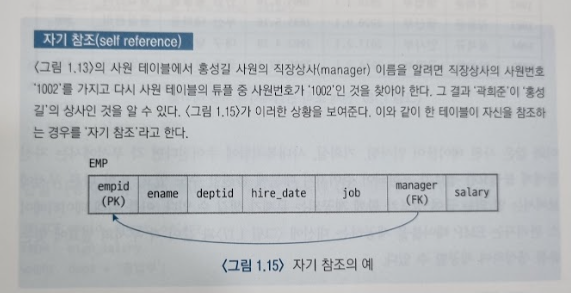
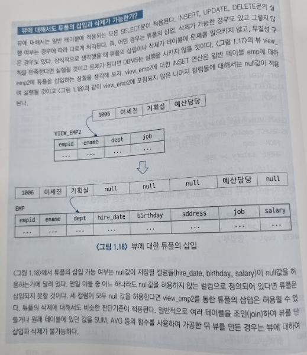
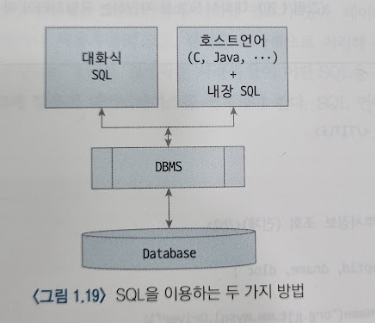

# 관계형 데이터베이스의 주요 개념
## 문서 관리자
조승효(문서 생성자)
## 데이터베이스의 역사
### 파일 시스템의 위기
   - 파일에 기초하여 자료나 정보를 처리하는 시스템을 파일 시스템(file system)이라고 부른다.
   
   - 컴퓨터 시스템이 일반적인 비즈니스 업무에 효과적으로 적용될 수 있음이 알려지면서 각 기업들은 앞다투어 정보시스템을 구축하기 시작하였다. 그 결과 컴퓨터의 저장장치에는 방대한 양의 데이터들이 축적되기 시작하였다. 파일에 기초한 정보시스템에서 데이터의 급속한 증가는 하드웨어나 소프트웨어의 성능 향상에도 불구하고 다음과 같은 문제점들을 드러내었다.
   - 데이터 종속성(data dependency)
      - 데이터 종속성이란 데이터를 사용하는 프로그램의 구조가 데이터 구조(파일 구조)의 영향을 받는다는 것을 의미한다.
      - 데이터의 구조 변화에 따라 응용프로그램이 영향을 받을 때 '프로그램이 데이터에 종속되어 있다'라고 말한다. 이와 같은 데이터 종속성은 프로그램의 개발과 유지보수를 어렵게 한다.
   - 데이터 무결성(data integrity)의 침해
      - 데이터 무결성이란 저장된 데이터의 내용이 본래 의도했던 데이터의 형식, 범위를 준수해야 한다는 성질이다.
      - 파일을 이용하는 과거의 정보시스템에서는 데이터 무결성을 지켜야 할 책임이 개발자에게 있었다. 즉, 응용프로그램에서 사용자가 데이터를 올바르게 입력했는지 검사하는 기능을 구현해야 했다. 만일 응용프로그램이 올바르지 않은 데이터가 저장되는 것을 허용하게 된다면 저장된 데이터에 근거해서 어떤 판단을 내려야 하는 경우 문제가 된다. 정보화 사회에서는 인간의 삶이 많은 부분 컴퓨터 시스템에 저장된 데이터에 의존하고 있기 때문에 데이터 무결성의 침해는 매우 심각한 문제가 된다.
   - 데이터 중복성(data redundancy)
      - 데이터 중복성이란 같은 내용의 데이터가 여러 곳에 중복하여 저장되는 것을 의미한다.
      - 과거의 정보시스템에서는 개별부서나 응용프로그램에서 필요로 하는 데이터 파일을 각각 만들어 사용하는 일이 많았고, 그 결과 동일 데이터가 여러 파일에 중복 저장되는 일이 많았다. 데이터가 중복 저장되면 저장 공간의 낭비라는 문제 외에도 다음에 설명할 데이터의 불일치, 보안의 어려움과 같은 문제들이 발생할 수 있다.
   - 데이터 불일치(data inconsistency)
      - 데이터 불일치란 중복 저장된 데이터들이 서로 일치하지 않는 것을 의미한다.
   - 데이터 표준화(data standardization)의 어려움
      - 일정 규모 이상의 정보시스템을 개발하기 위해서는 많은 수의 개발자들이 협력 작업을 해야 한다. 이러한 환경에서는 작업 방법의 표준화가 필수적이다.
      - 표준화된 규칙이 있다 하더라도 응용 개발자가 이를 지키지 않을 수 있는 여지가 있기 때문에 과거의 정보시스템 개발 환경에서는 표준화가 어려운 문제였다.
   - 데이터 보안성(data security)의 결여
      - 데이터가 저장되어 있는 파일은 그 내용이 Text 형식이나 잘 알려진 형식으로 저장되기 때문에 응용프로그램 없이도 쉽게 파일을 열어 내용을 볼 수 가 있고 파일의 공유를 위해 접근이 쉬운 위치에 파일을 저장했기 때문에 보안을 유지하기가 어려웠다.
### 데이터베이스의 등장
   - 파일 시스템의 단점을 극복하면서도 다수의 사용자들이 정보를 공유할 수 있어야 한다는 시대적 요구에 부응하기 위하여 연구자들은 데이터베이스 개념을 제안하였다.
   - 파일 형태로 여기저기에 흩어져 있는 데이터, 정보들을 하나로 모아서 관리하자
   - 응용프로그램들이 운영체제를 통해 시스템 자원을 이용하는 것처럼 모아놓은 데이터들을 관리하고 사용자(응용프로그램)와 데이터 사이에 인터페이스 역할을 할 수 있는 S/W를 만들자
   
   - 모아놓은 데이터의 집합을 데이터베이스(database)
   - 데이터를 관리하는 S/W를 데이터베이스 관리 시스템(DBMS: Database Management System)
   - 데이터베이스에 기초해서 데이터나 정보를 처리하는 체제를 데이터베이스 시스템(database system)
   - 데이터 독립성(independency) 지원: 데이터베이스 시스템에서는 사용자 혹은 응용프로그램이 직접 데이터베이스에 접근할 수 없고 반드시 DBMS를 통해서만 접근이 가능하다. DBMS는 데이터베이스 내에 있는 데이터의 물리적, 논리적 변화가 응용 시스템에 영향을 미치지 않도록 함으로써 데이터 독립성을 보장한다.
   - 데이터 무결성 유지: DBMS는 데이터베이스 내에 저장될 데이터에 대하여 데이터의 타입(type), 길이, 값의 범위 등에 대한 정보를 가지고 있으며, 이를 위반하는 데이터가 들어올 경우 처리를 거절함으로써 데이터의 무결성을 지원한다.
   - 데이터 중복성 및 불일치 최소화: 데이터베이스 내의 데이터는 한 개인의 관점이나 특정 부서의 관점에서 관리되는 것이 아니라 데이터베이스를 공용하는 조직 전체의 관점에서 관리를 한다. 그 때문에 동일 데이터가 여러 부서에서 사용하는 경우 이를 하나로 관리함으로써 중복성을 방지하며 그 결과로서 중복된 데이터 간의 불일치 문제를 해결한다.
   - 데이터 표준화의 용이성: 데이터베이스 시스템에는 응용 개발자와는 별도의 데이터베이스 관리자(DBA)가 존재하며 DBA는 데이터베이스의 설계과정을 주도함으로써 부서 간 이해를 조정하고 관리될 데이터를 표준화시킬 수 있다. 또한 DBMS는 데이터의 구조에 관한 정보(예: 테이블 이름, 컬럼 이름, 컬럼의 데이터 타입)를 가지고 있으며 응용프로그램에서 데이터에 접근하기 위해서는 DBMS가 가지고 있는 구조 정보에 따라야 하기 때문에 자연스럽게 표준화가 이루어질 수 있다.
   - 높은 데이터 보안성: DBMS는 사용자의 권한에 따라 데이터베이스 내에 있는 데이터에 대한 접근을 제한할 수 있다. 또한 저장된 데이터베이스는 일반적으로 DBMS를 통하지 않고는 외부에서 내용을 알아내기 매우 어렵기 때문에 데이터가 보호될 수 있다.
   - 데이터 공유(data sharing)의 용이성: 데이터베이스 시스템의 기본 철학이 데이터를 통합 관리하고 이를 여러 부서, 사용자들이 공유하도록 하는 것이다. DBMS는 여러 사용자의 요구를 동시적으로 처리할 수 있는 능력을 가지고 있으며 데이터를 쉽게 이용할 수 있는 수단을 제공한다.
### 관계형 데이터베이스 모델

   - 데이터가 테이블 형태로 표현되며, 사용자가 데이터를 쉽게 다룰 수 있도록 해주는 질의어(SQL)가 제공된다는 것이다.
   - SQL은 자연어에 가까운 문법을 가지고 있어서 배우기 쉽고, 데이터를 어떻게(how) 가져올 것인가 대신에 어떤(what) 데이터를 원하는지만 기술해주면 되기 때문에 사용자나 개발자의 입장에서는 데이터를 다루는 작업이 매우 단순해진다. 또한 SQL 명령어나 문법은 표준화되어 있기 때문에 대부분의 명령어는 모든 관계형 데이터베이스 제품에서 공통적으로 사용될 수 있다.
## 관계형 데이터베이스 용어

   - 릴레이션(relation): 릴레이션은 우리가 지금까지 테이블이라고 지칭했던 것으로 관계형 데이터베이스에서 정보를 구분하여 저장하는 기본 단위가 된다. 릴레이션들은 서로를 구분할 수 있는 이름을 가지며 동일한 데이터베이스 내에서는 같은 이름을 가진 릴레이션이 존재할 수 없다. 일반적으로 데이터베이스는 많은 수의 릴레이션들을 포함하게 된다.
   - 속성(attribute): 표현할 개체의 구체적인 정보 항목에 해당하는 것이 속성이다. 속성 역시 고유한 이름을 가지며 동일 릴레이션 내에서는 같은 이름의 속성이 존재할 수 없다. 단, 릴레이션이 다르면 같은 속성 이름을 공통으로 사용할 수 있다.
   - 튜플(tuple): 튜플은 그 개체에 속한 구성원들 개개의 정보를 표현한다고 할 수 있다. 한 릴레이션에 포함된 튜플의 개수는 시간에 따라 변할 수 있다.
   - 도메인(domain): 도메인이란 릴레이션에 포함된 각각의 속성들이 가질 수 있는 값들의 집합이라고 할 수 있다. 도메인이라는 개념이 필요한 이유는 릴레이션에 저장되는 데이터 값들이 본래 의도했던 값들만 저장되고 관리되도록 하는 데 있다.
## 기본키와 외래키
   - 후보키(candidate key)란 테이블에서 각 튜플을 구별하는 데 기준이 되는 하나 혹은 그 이상의 컬럼들의 집합이다(후보키는 테이블에 있는 각 튜플을 고유하게 식별할 수 있어야 한다).
   - 후보키(candidate key)는 기본키(primary key)와 대체키(alternate key)로 구분된다.
      - 테이블은 한 개 이상의 후보키를 가질 수 있다.
      - 선택된 후보키를 기본키, 선택되지 않은 후보키를 대체키라고 한다.
      - 후보키 중 어느 것을 기본키로 정할 것인가에는 정해진 규칙은 없으나 대체로 데이터의 길이가 짧고 현실세계에서 빈번히 이용하는 컬럼을 기본키로 정한다.
   - 두 개 이상의 컬럼이 모여 키의 역할을 하는 경우를 복합키(composite key) 라고 한다.
   - 최소한의 컬럼 혹은 컬럼들의 집합으로 후보키를 구성해야 한다.
   
   - 테이블 간의 데이터의 일치와 무결성을 보증해주는 수단이 외래키(foreign key)이다.
   - 테이블 A가 테이블 B의 기본키에 해당하는 컬럼을 가지고 있을 때 테이블 A가 테이블 B를 참조한다고 말한다. 그리고 테이블 A에 있는 테이블 B의 기본키 컬럼을 외래키라고 부른다.
   - 외래키를 사용함으로써 삽입 삭제에서 데이터 무결성을 유지할 수 있게 된다.
   - 참조되는 쪽 테이블의 튜플이 삭제되거나 기본키 값이 변경되면 데이터 무결성이 깨지게 되는데 이때 DBMS는 제한(restricted, 삭제 연산 거절), 연쇄(cascade, 함께 삭제), 널값으로 대체(nullify) 조치를 하게 된다.
   
## 뷰
   - 뷰는 단어의 뜻 그대로 하나의 테이블, 혹은 여러 테이블에 대하여 특정 사용자나 조직의 관점에서 데이터를 바라볼 수 있도록 해주는 수단으로서 가상 테이블이라고도 부른다.
   - 일반 테이블이 실제로 물리적인 데이터를 갖고 있는 반면에 뷰는 물리적인 데이터를 갖고 있지 않고, 뷰가 정의된 일반 테이블로부터 데이터를 가져다 보여준다는 것이다.
   - 뷰가 쓰이는 목적은
      - 서로 다른 관점으로 보기를 원할 때
      - 일반 사용자에게는 감추어야 할 컬럼이 있을 때
      - 자주 사용하는 복잡한 질의문을 미리 뷰로 정의하여 두고 간편하게 쓰고자 할 때
   
## SQL 언어

   - SQL 언어는 비절차적 언어(non-procedural language)이다. 사용자는 자신이 원하는 것만들 명시하며, 원하는 것을 DBMS가 어떻게 처리할 지는 명시할 필요가 없다.
   - SQL 언어는 자연어와 비슷한 문법체계를 가지고 있기 때문에 처음 보는 사람도 SQL문의 의미를 이해하는 것이 어렵지 않다.
   - 대화식 SQL이란 DBMS회사에서 제공하는 유틸리티 프로그램(예: ORACLE의 SQL*Plus)을 이용하여 사용자가 직접 SQL문을 입력하고 실행결과를 확인하는 방식
   - 내장 SQL은 SQL문이 C, Java 등의 다른 언어로 작성된 삭제 프로그램 안에 포함되어져서 사용되는 방식
   - SELECT는 테이블에 저장된 정보를 조회하는 데 사용한다.
   - INSERT는 테이블에 튜플을 삽입할 때 사용한다.
   - UPDATE는 테이블에 저장되어 있는 튜플의 값을 변경할 때 사용한다.
   - DELETE는 테이블에 있는 튜플을 삭제할 때 사용한다.
   - CREATE는 테이블, 뷰, 사용자 등 데이터베이스 내의 객체들을 생성하는 데 사용된다.
   - ALTER는 CREATE 로 생성한 데이터베이스 내의 객체를 변경할 때 사용한다.
   - DROP은 CREATE의 반대 역할을 하는 명령어로 데이터베이스 내의 객체를 제거하는 역할을 한다.