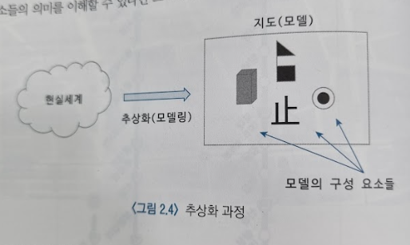
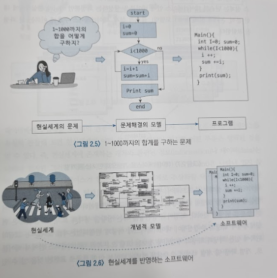
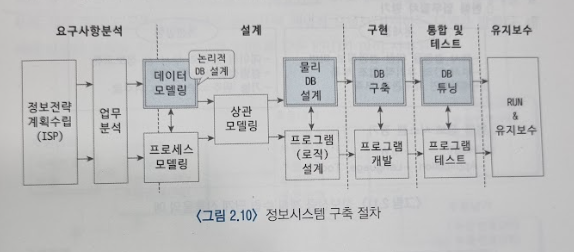

# 정보시스템 구축 절차와 데이터베이스 설계
## 문서 관리자
조승효(문서 생성자)
## 추상화와 모델링
   - 데이터베이스 설계 과정은 소프트웨어(정보시스템) 개발 과정의 일부이며, 소프트웨어의 개발 과정은 곧 현실세계에 대한 추상화 과정으로 설명될 수 있다. 데이터베이스 설계 능력은 곧 현실세계를 추상화할 수 있는 능력과 일치한다.
   - 추상화는 모델(model)이라는 수단을 통해 이루어지기 때문에 추상화를 모델링이라고 표현하기도 한다.
   - 현실세계와 정확히 일치하지는 않지만 현실 세계에 대한 '모델'의 역할을 하는 지도 같은 것
   - 매우 제한적인 정보를 담지만 그럼에도 유용하다.
   
   - 모델이란 사람들이 복잡한 현실세계를 쉽게 이해하기 위해 현실세계를 개념화, 단순화시켜 표현한 것을 말한다. 모델을 만드는 과정을 모델링이라 하며 이러한 과정을 다른 말로 현실세계에 대한 추상화 과정이라고 한다.
   - 소프트웨어란 현실세계(real world)에서 수행되는 작업이나 행위가 컴퓨터세계(computer world)에서 수행될 수 있도록 해 주는 수단이다. 즉, 소프트웨어는 현실세계를 모델링한 결과이다.
   
   - 컴퓨터가 알 수 있도록 문제를 해결하는 방법을 알려주는 수단이 프로그램이다. 따라서 컴퓨터가 문제를 풀기 이전에 문제를 해결하는 절차를 수립해야 하는데 이러한 절차를 보통 알고리즘이라고 한다.
   - 전산학에서 유명한 명제 중에 '사람이 종이와 연필을 가지고 해결할 수 없는 문제는 컴퓨터도 해결할 수 없다'라는 명제가 있다. 이 말을 풀어서 설명하면 인간이 문제해결 절차를 모델링할 수 없다면, 즉 알고리즘을 만들 수 없다면 컴퓨터세계에서도 문제를 해결할 수 없다
## 데이터베이스 설계의 개념
   - 정보시스템이나 웹사이트에서 필요로 하는 데이터를 데이터베이스에 저장하고 나중에 다시 불러오는 형태로 개발을 한다. 따라서 오늘날의 시스템 개발자들은 기본적으로 데이터베이스 연동 프로그래밍이 기본적인 지식으로 되어 있다.
   - 데이터베이스를 기반으로 시스템을 개발하기 위해서는 먼저 데이터베이스가 구축되어야 한다. 데이터베이스 설계란 데이터베이스 안에 어떤 테이블들이 있어야 하고 각 테이블들은 어떤 컬럼이 있어야 하며, 기본키와 외래키는 어떤 것인지를 정하고, 응용 프로그램에서 필요로 하는 뷰와 인덱스를 생성하는 일련의 과정을 말한다.
   - 데이터베이스를 설계하기 위해서는 프로그래밍과 마찬가지로 현실세계에 대한 분석이 있어야 한다.
   - 데이터베이스 설계는 소프트웨어 개발 과정 중의 일부이므로 데이터베이스의 설계 역시 현실세계에 대한 모델링 과정에 속한다. 그리고 구축된 데이터베이스 역시 현실세계의 어떤 부분을 반영한 것이다.
   - 개념적 모델은 보통 ERD(Entity-Relationship Diagram)를 이용해서 표현한다. 이렇게 현실세계를 분석하여 이를 개념적 모델로 표현하고, 이를 바탕으로 데이터베이스를 구축하는 과정을 데이터베이스 설계라고 한다.
## 정보시스템 구축과 데이터베이스 설계
   - 대부분의 정보시스템은 데이터베이스를 기반으로 개발이 이루어진다는 특징이 있다
   
   - 정보전략 계획 수립: 정보 시스템 구축의 선행 단계로서 정보시스템을 구축하고자 하는 기업의 경영전략 및 장단점을 분석하고 현행 업무 절차를 평가하여 개선사항을 도출하며, 새로운 전략 및 업무 절차에 기초하여 정보시스템 구축 계획을 수립하는 단계
   - 업무의 분석: 현실세계에서 업무가 어떻게 이루어지는지를 파악하는 것으로 누가 어떤 행위를 하는지, 업무 과정에서 어떤 정보가 발생하거나 오고가는지, 어떤 절차를 거쳐 업무가 진행되는지 등을 파악하여 문서로 정리하는 단계
   - 데이터 모델링: 현실세계를 데이터의 관점에서 파악하여 개념적인 모델로 표현하는 단계. ERD가 예
   - 프로세스 모델링: 업무가 어떻게 구성되어 있는지, 업무의 처리 절차와 방법이 어떻게 되는지를 파악. 프로세스 흐름도 등
   - 상관 모델링: 데이터 모델링과 프로세스 모델링이 완료되면 데이터 모델과 프로세스 모델을 비교 검토하여 서로 간에 잘 맞는지를 평가하게 되는데 이를 상관 모델링 단계라고 한다. 데이터 모델과 프로세스 모델은 동일한 현실세계의 서로 다른 면을 표현한 것이기 때문에 상호 조화를 이루어야 한다. CRUD 매트릭스가 많이 이용된다. (CRUD : Create, Read, Update, Delete)
   - 물리적 DB 설계: 물리적 DB 설계에서는 실제 데이터베이스 구축을 위한 테이블, 뷰, 인덱스, 용량 등을 설계한다. 테이블 기술서
   - 데이터베이스 구축: 데이터베이스 구축이란 물리적 DB 설계의 내용을 가지고 실제 DBMS 안에 테이블, 인덱스, 뷰 등을 생성하는 과정
   - 데이터베이스 튜닝이란 데이터베이스가 일정한 성능을 유지할 수 있도록 비효율적인 요소를 제거하고 성능 개선을 위하여 SQL 문장을 포함, 데이터베이스의 여러 요소를 조정하는 작업을 말한다.
   - 유지보수는 프로그램이 다 만들어진 뒤에도 필요한 것이다.