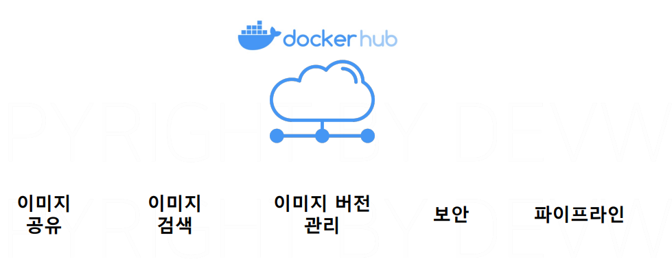
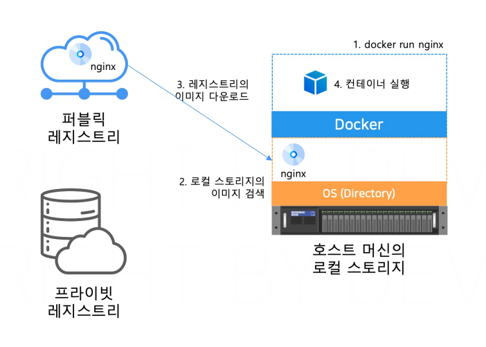
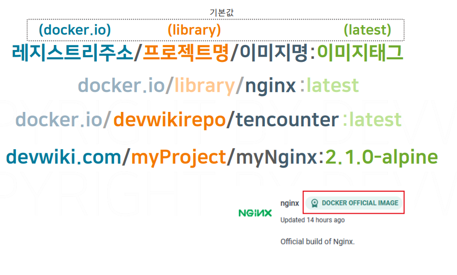

# 이미지 레지스트리

## 문서 관리자

조승효(문서 생성자)

## 레지스트리와 이미지명

- docker hub 는 이미지를 공유하는 저장소
  
  
  
- 레지스트리 주소는 어떤 레지스트리를 사용할지 지정함(도커 허브, 아니면 다른 레지스트리등) 비어있으면 기본값으로 지정된것을 사용(도커 같은 경우 docker.io)
- 프로젝트명은 이미지를 보관하는 폴더같은 개념(도커 허브같은 경우 가입한 사용자명, 기본값은 library)
- 이미지명은 다운로드받을 이미지 이름, 이미지 태그는 이미지의 버전
- 이미지명만 쓰는 경우는 도커사가 직접 검증한 오피셜 이미지라는 것 예를 들어 nginx
