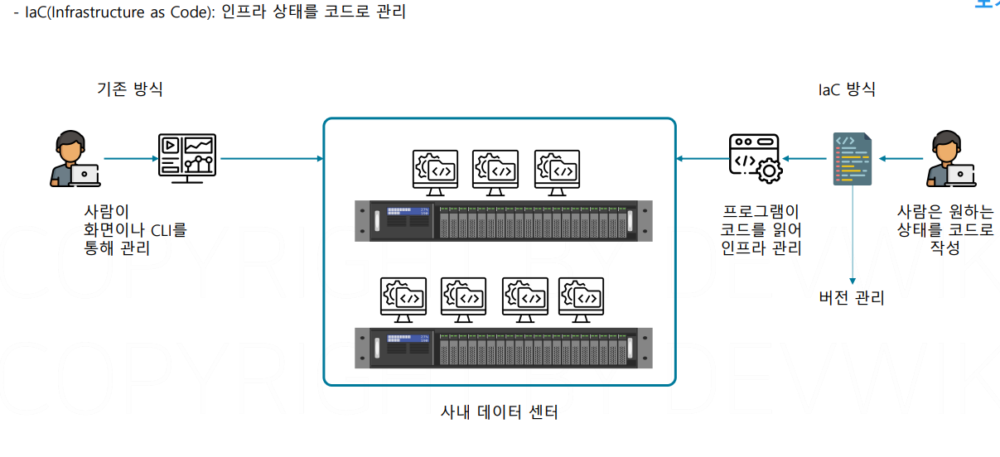
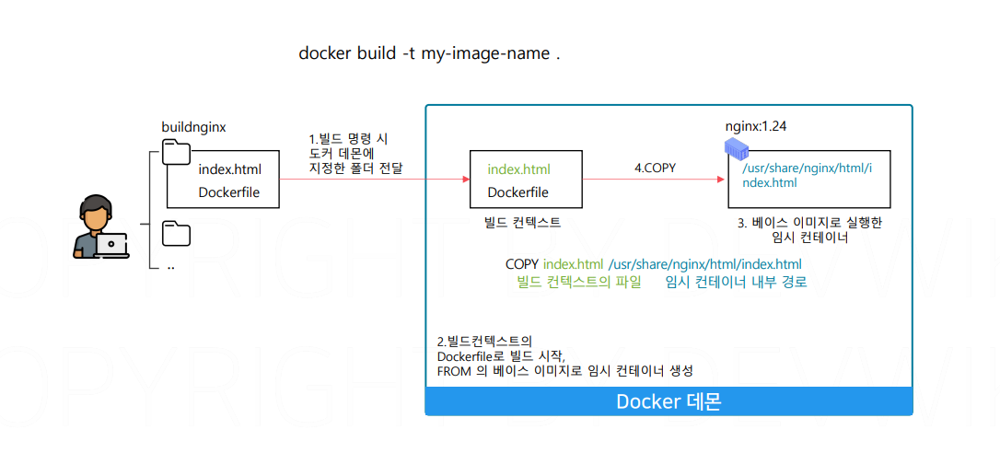
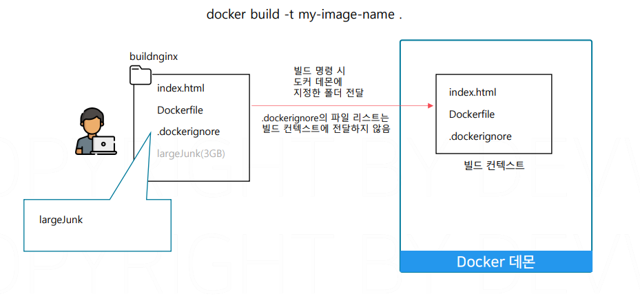
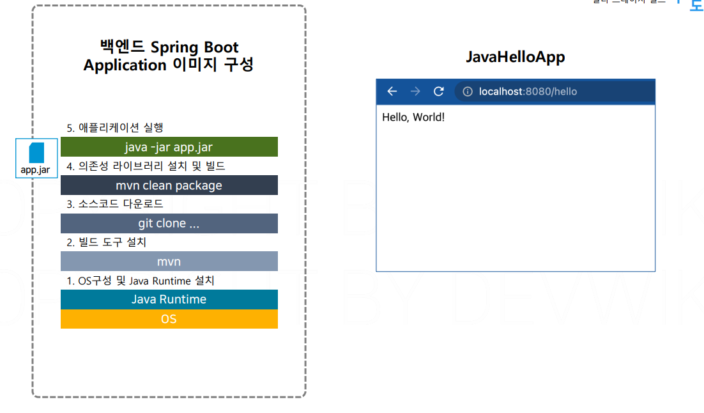
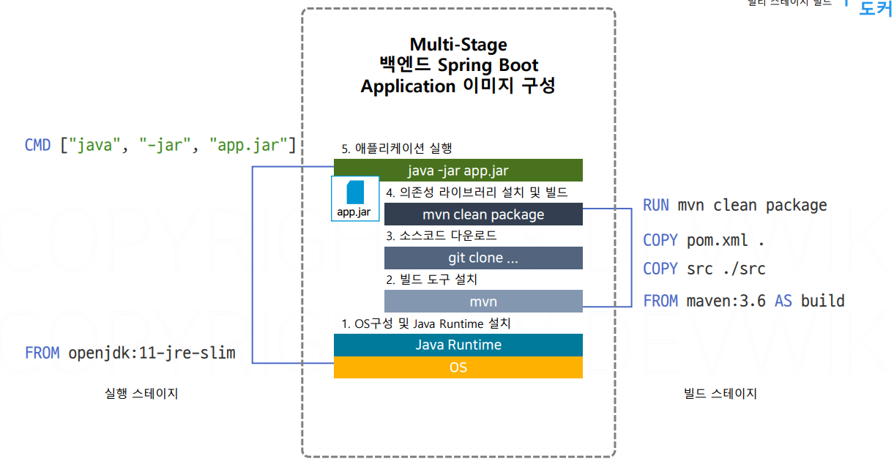

# 이미지 빌드

## 문서 관리자

조승효(문서 생성자)

## 이미지와 레이어

- 레이어라는 것은 하나의 층
- 왜 하나의 이미지를 여러개의 레이어로 구성했을까? 레이어드구조가 재사용에 유리한 구조이기 때문이다. 효율적인 데이터 저장과 전송
  
- 소프트웨어를 설치하면 이 OS의 특정 폴더에 Nginx 소프트웨어와 관련된 파일들이 추가된다. 그래서 이 Nginx를 설치한다는 것은 기존 OS 파일 시스템 즉 이전 레이어에서 추가가 되는 것
- 이미지의 레이어는 순차적으로 쌓임. 각각의 레이어는 이전 레이어에서 변경된 부분을 저장. 같은 변경이 일어난 레이어는 공유해서 재사용 가능
  
- 모든 컨테이너는 각자 자기만의 읽기 쓰기 레이어를 한장 가지게 된다. 컨테이너를 만들 대 사용된 이미지에 따라서 이미지의 읽기 전용 레이어 전체를 공유할 수도 있고 일부만 공유할 수도 있다.
  
- Layering: 각 레이어는 이전 레이어 위에 쌓이며, 여러 이미지 간에 공유될 수 있습니다. 레이어 방식은 중복 데이터를 최소화하고, 빌드 속도를 높이며, 저장소를 효율적으로 사용할 수 있게 해줍니다.
- Copy-on-Write(CoW) 전략: 다음 레이어에서 이전 레이어의 특정 파일을 수정할 때, 해당 파일의 복사본을 만들어서 변경 사항을 적용합니다. 이렇게 함으로써 원래 레이어는 수정되지 않고 그대로 유지됩니다.
- Immutable Layers(불변 레이어): 이미지의 각 레이어는 불변으로, 한 번 생성되면 변경되지 않습니다. 이렇게 함으로써 이미지의 일관성을 유지하고, 여러 컨테이너에서 안전하게 공유할 수 있습니다.
- Caching(캐싱): 레이어를 캐시하며, 이미 빌드된 레이어를 재사용할 수 있습니다. 이는 이미지 빌드 시간을 크게 줄여주며, 같은 레이어를 사용하는 여러 이미지에서 효율적으로 작동합니다.

## 이미지 커밋

## 이미지 빌드

- 사람이 직접 인프라를 컨트롤하다 보면 실수가 나올 수 있다. 개인이 인프라를 관리하면 이렇게 인프라의 상태를 변경한 기록들을 관리하기도 쉽지 않다.
  
- 빌드 방식은 컨테이너를 생성하고 커밋하는 것을 도커가 대신 수행해줌
  

## 빌드 컨텍스트

 -도커 데몬에게 전달해 주는 폴더가 바로 빌드 컨텍스트

## Dockerfile 지시어

- 파일 시스템의 내용을 변경하는 부분이 있으면 일반적으로 레이어를 추가함. 메타데이터에만 영향을 주는 부분은 레이어를 추가하지 않음

## 멀티 스테이지 빌드

- 멀티 스테이지 빌드는 도커 파일에서 두 개의 베이스 이미지를 활용하는 방법
  
- maven 같은 경우 build 할 때만 필요하지 실행할 때는 필요하지 않다. 이걸 분리할 수 있는 방법은?
  
- 이미지를 빌드할 때 애플리케이션 빌드에 사용하는 빌드 스테이지와 이미지를 실행하는 실행 스테이지 두개로 나누어서 빌드하는 방식을 멀티 스테이지 빌드
