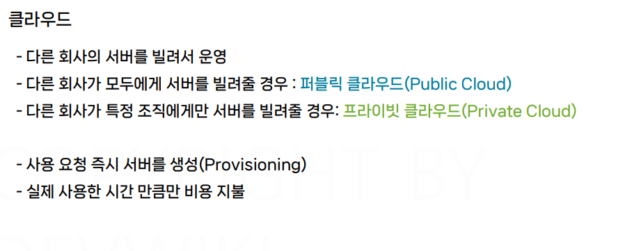
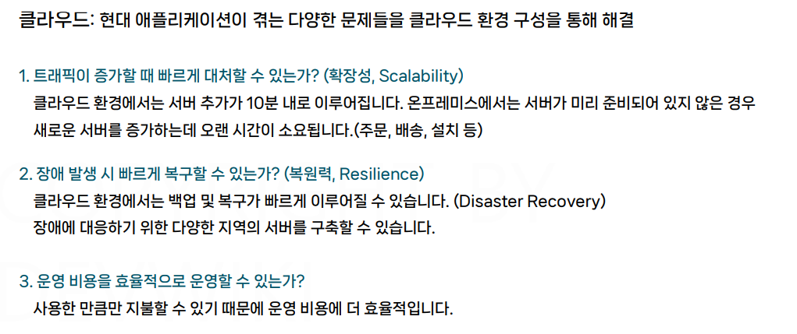
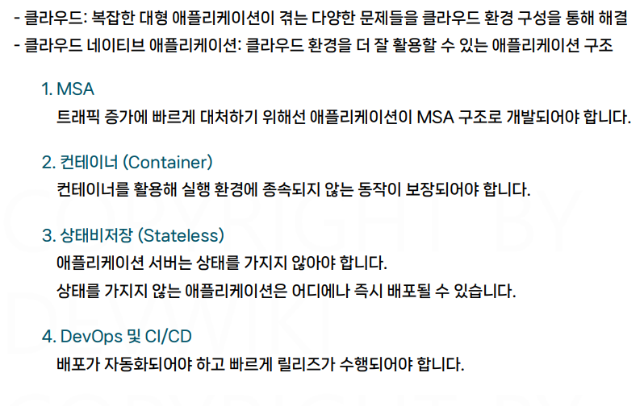
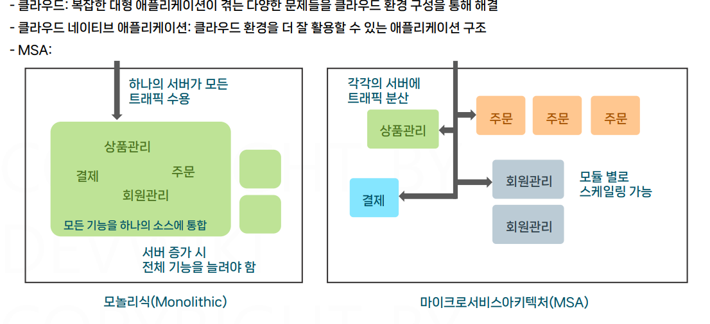
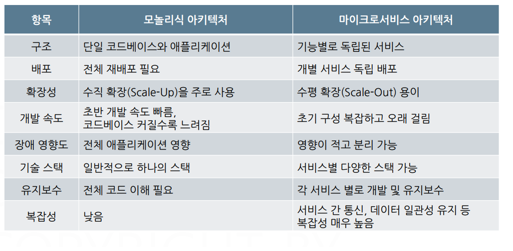

# 컨테이너 애플리케이션 구성

## 문서 관리자

조승효(문서 생성자)

## 클라우드 네이티브 애플리케이션

- 클라우드는 공유경제와 연관이 깊다.
  
  
  
- 서버를 스케일아웃한다는 것은 서버의 대수를 늘려서 트래픽에 대처한다는 것을 의미한다. 스케일 인은 서버의 개수를 줄이는 것. 스케일 아웃은 수평 확장, 스케일 업은 수직 확장을 의미한다.
- 모듈별로 다른 언어를 사용해도 된다.
- 장애도 모듈 단위로 발생하기 때문에 최소한의 영향으로 간다.
  
