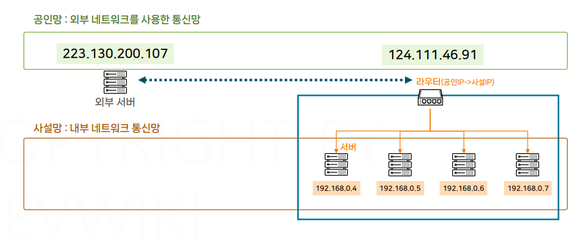
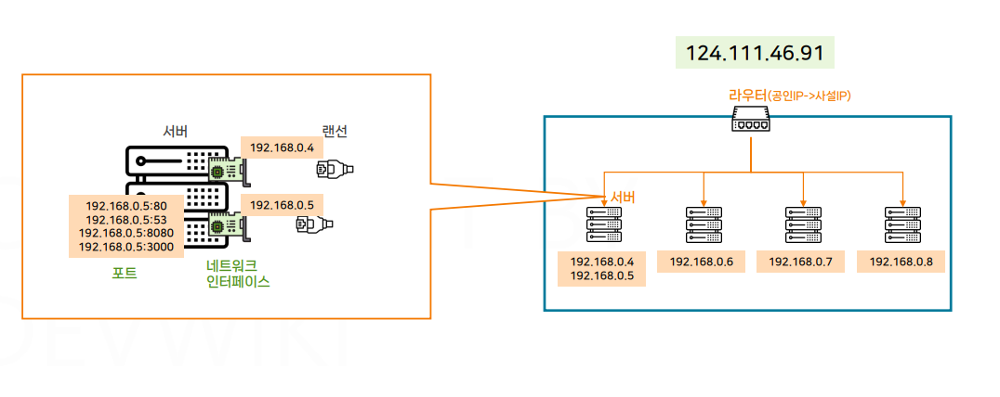
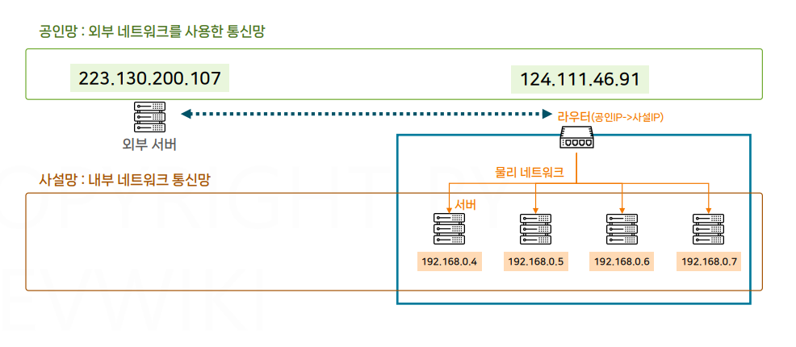
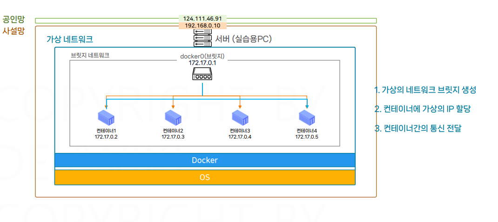
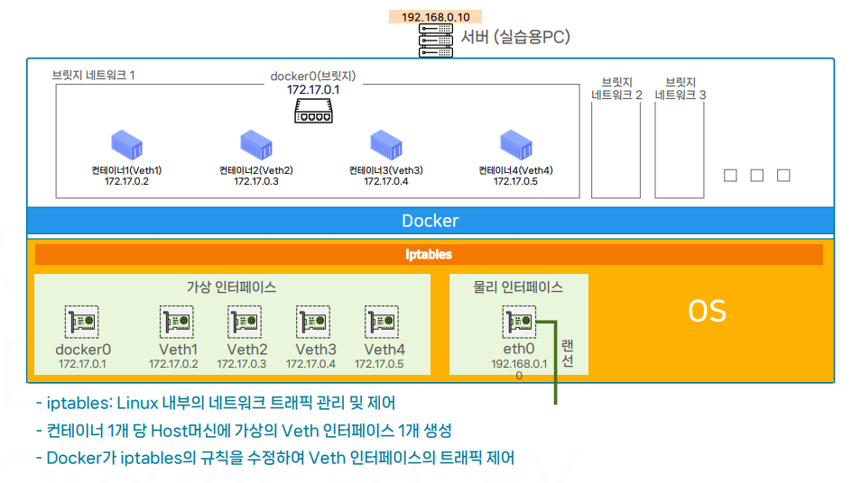
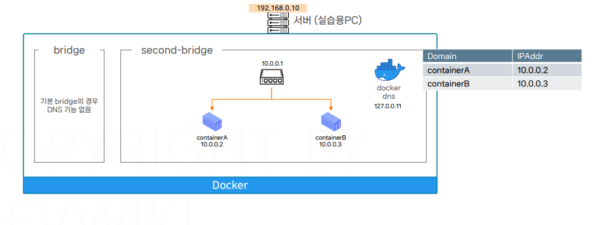
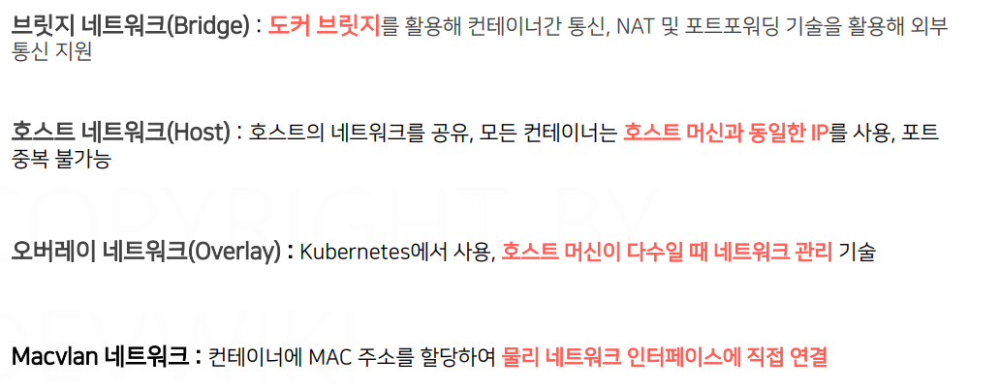

# 네트워크

## 문서 관리자

조승효(문서 생성자)

## 네트워크 기본

- 서버에서 출발하는 신호를 OutBound, 클라이언트나 외부의 서버에서 출발하여 자신의 서버로 오는 신호를 InBound
- NAT 테이블은 공인 IP의 랜덤한 포트를 여러 개 지정해두고 각각의 포트에 사설 IP의 정보를 매칭시켜서 활용함
- 외부에서 사내망으로 접근할 때는 포트포워딩이라는 기술을 사용함
  포트 포워딩은 사용자가 직접 NAT 테이블을 관리하는 것

## 도커 네트워크

- 컨테이너 가상화: 서버 한대를 여러 컨테이너로 격리
- 가상 네트워크: 서버 한대 안에서 여러 네트워크 구성
- 네트워크 망 안에서 컨테이너들이 서로 통신할 수 있고, 내부의 컨테이너와 바깥의 서버와도 통신할 수 있다.
- 도커는 가상 네트워크 기술을 활용해서 컨테이너의 네트워크를 구성함. 가상 네트워크는 물리적인 선 없이 논리적으로 정의되어 있는 네트워크
- 도커는 브릿지 네트워크를 통해서 가상 네트워크를 구성하고 컨테이너의 IP를 할당하면서 컨테이너 간의 통신을 전달해줌. 논리적으로 네트워크 환경을 구성하는 기술을 SDN(Software Defined Network) 라고 부른다.
  
- 도커는 컨테이너의 통신을 위해서 브릿지 네트워크를 정의하고 호스트 OS의 가상 인터페이스들을 생성함. 호스트 OS(Linux)의 iptables 규칙을 관리하면서 가상 인터페이스들 간의 통신 규칙을 만든다. 그래서 사용자는 별도의 설정을 하지 않아도 이 같은 브릿지 네트워크에서 생성된 컨테이너들은 서로 통신을 할 수 있는 상태
- 브릿지 네트워크끼리 분리하면 특정 컨테이너들끼리 통신이 안되게 할 수도 있다.
  
- 도커는 DNS 서비스를 제공하며 도메인 이름은 컨테이너 이름으로 자동으로 저장된다. 기본 브릿지의 경우 DNS 기능이 없다. 사용자가 직접 생성한 브릿지만 컨테이너의 이름을 통해서 통신할 수 있다.
- 도메인 주소는 IP 주소가 변경되어도 사용할 수 있다.
  
