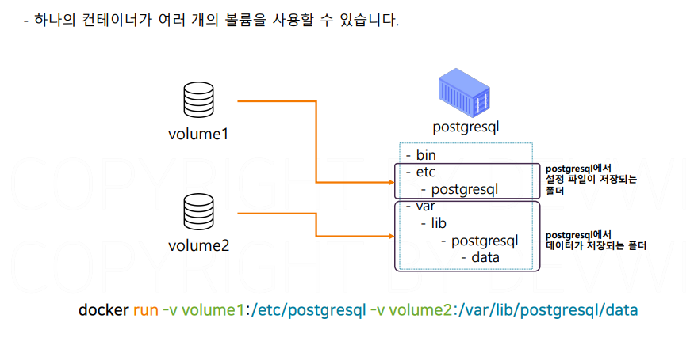

# 도커볼륨

## 문서 관리자

조승효(문서 생성자)

## 컨테이너의 상태

- 각각의 서버에 변경사항을 따로 적용한다는 것은 서버 한 대 한 대 마다 유일한 상태를 가진다는 것을 의미함.
- 기존 방식은 여러 문제가 있어 배포 속도를 늦추지만 컨테이너는 이미지라는 템플릿을 기반으로 동작하기 때문에 기존과는 다른 방식으로 동작함. 컨테이너 자체는 상태를 가지지 않음. 모든 상태는 이미지에 기록된다. 그래서 애플리케이션의 소스나 라이브러리 버전이 업데이트 되는 것과 같은 변경 사항은 모두 새로운 버전의 이미지로 만들어야 한다.
  
- 컨테이너는 상태가 없기 때문에 여러 대의 컨테이너를 여러 곳에 빠르게 배포할 수 있다.
  
  
  
- 개발서버, QA서버, 운영서버

## 도커 볼륨

- 로드밸런싱은 한 서비스의 트래픽을 여러 대의 서버로 분산해주는 네트워크 기술
- 영속성이 필요한 데이터(데이터베이스같은거)는 같은 종류의 모든 컨테이너가 함께 공유하고 있어야 한다.
- 컨테이너는 상태가 없기 때문에 재생성되면 데이터가 모두 삭제되고 그래서 영속성이 필요한 데이터를 저장할 공간이 필요합니다.
- 운영환경에서는 동일한 역할을 하는 서버가 2대 이상이기 때문에 이 서버들이 동일한 데이터를 제공하기 위해서는 영속성이 필요한 데이터는 공유해야 한다.
- 도커는 이렇게 영속성이 필요한 데이터를 위해서 도커 볼륨이라는 기능을 제공함
- 컨테이너의 특정 폴더를 공유용 폴더로 만들수 있다. 여기서 컨테이너의 폴더를 볼륨에 마운트 한다고 표현한다.
  
- NFS를 사용하면 네트워크에만 연결되어 있으면 USB와 동일하게 데이터를 외부에 저장할 수 있다. 네트워크 파일 시스템에는 동시에 많은 PC를 연결할 수 있음
- NFS는 PC의 특정 폴더를 이 NFS에 마운트 시킬 수 있다.
  
  
  
  
  
- 도커 볼륨은 호스트 OS 의 특정 위치에 저장된다.
  
- 호스트 OS 에서 데이터를 직접 관찰하고 싶으면 바인드 마운트 기능을 이용해보자. 디버깅할 때 잘 쓰임
