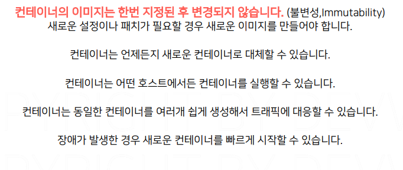

# 도커볼륨

## 문서 관리자

조승효(문서 생성자)

## 컨테이너의 상태

- 각각의 서버에 변경사항을 따로 적용한다는 것은 서버 한 대 한 대 마다 유일한 상태를 가진다는 것을 의미함.
- 기존 방식은 여러 문제가 있어 배포 속도를 늦추지만 컨테이너는 이미지라는 템플릿을 기반으로 동작하기 때문에 기존과는 다른 방식으로 동작함. 컨테이너 자체는 상태를 가지지 않음. 모든 상태는 이미지에 기록된다. 그래서 애플리케이션의 소스나 라이브러리 버전이 업데이트 되는 것과 같은 변경 사항은 모두 새로운 버전의 이미지로 만들어야 한다.
  
- 컨테이너는 상태가 없기 때문에 여러 대의 컨테이너를 여러 곳에 빠르게 배포할 수 있다.
  
  
  
- 개발서버, QA서버, 운영서버
