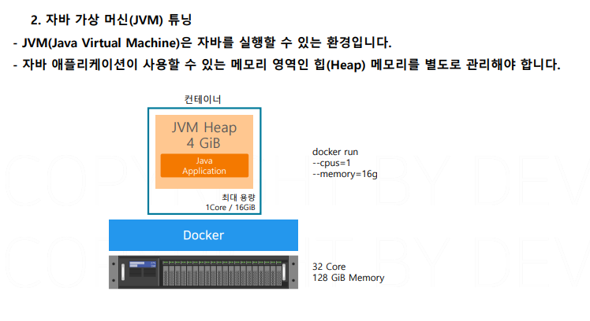

# 도커 실무

## 문서 관리자

조승효(문서 생성자)

## 레이어 관리

- 이미지 크기 줄이기: 모듈로 분리하기, 베이스 이미지는 가능한 작게 alpine os 를 선택하는 것이 좋음, .dockerignore 파일을 이용해서 불필요한것 추가하지 않기
- 실무에서는 이미지 용량을 줄이려고 Go 언어를 사용하는 경우도 많다.

## 캐싱을 활용한 빌드

- 잘 변경되지 않는 레이어를 아래로 두는게 유효한 전략. 왜냐하면 변경된 레이어 위부터는 새로운 레이어를 쌓아가기 때문에.

## 3 Tier 아키텍처 구성

- 세 가지 종류의 서버가 유기적으로 상호작용하면서 하나의 애플리케이션으로 구성되는 것을 3Tier 아키텍처라고 한다. Tier 는 하나의 단계를 의미함.
- 근데 백엔드 애플리케이션이 노출되어 있는 것은 좋은게 아닌 것 같은데 이걸 어떻게 해결할까?
  
  

  ## 동적 서버 설정

  
  

  ## 이중화 DB 구성

  
  
  

## 컨테이너 애플리케이션 최적화

- 힙 메모리는 일반적으로 서버 전체 메모리의 50~80% 수준으로 지정을 하는데 컨테이너 별로 달라야 한다.
  

  ## VS Code

  
  
  
  
