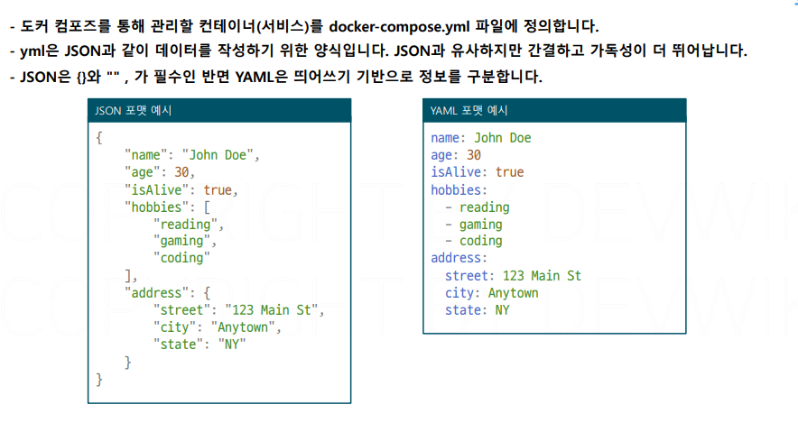

# 도커 컴포즈

## 문서 관리자

조승효(문서 생성자)

## 도커 컴포즈 기본

- 도커 컴포즈에서는 기존에 있는 이미지를 우선하기에 이미지를 바꿀려면 태그를 변경하거나 도커 컴포즈에서 별도의 옵션을 지정해야 함
- 컴포즈는 디폴트로 네트워크를 만든다. 그리고 컨테이너를 이 네트워크 안에 포함시킨다.
- depends_on 은 특정 컨테이너가 실행될 때 까지 실행 보류하는 것.
