# 가상화기술

## 문서 관리자

조승효(문서 생성자)

## 애플리케이션 서버

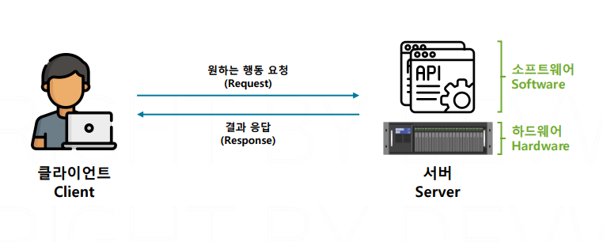

- 서버를 한마디로 정의하면 하드웨어와 그 하드웨어에서 실행 중인 소프트웨어까지 모두 포함하는 단어. 문맥에 따라서 이해하면 된다.
- Serve 는 무언가를 제공해준다는 것
- Server 는 제공하는 주체
- Server 는 어떤 결과를 제공해줌
- Client 는 무언가를 요청하는 주체
  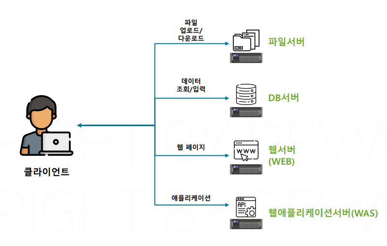
- 어떤 소프트웨어가 실행중인지에 따라 다양하게 분류됨
- 파일 공유 소프트웨어가 설치되어 있으면 파일 서버
- 데이터를 관리하는 DBMS가 설치된 서버를 DBMS 서버
- 소스 코드를 통해 개발된 애플리케이션을 실행하기 위한 서버들은 웹 서버와 웹 애플리케이션 서버
- 웹 서버는 클라이언트가 웹 브라우저를 통해서 HTTP 요청을 보내면 정적인 웹 페이지를 제공해주는 서버
- Java와 같은 프로그래밍 언어로 개발된 백엔드 애플리케이션을 실행하는 서버를 웹 애플리케이션 서버라고 한다.
  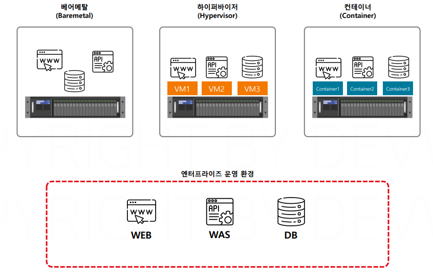
- 베어메탈(Baremetal) 방식은 컴퓨터를 구입하고 프로그램을 실행시키는 방식과 비슷함 서버를 하나 구입한 다음에 그 서버 위에서 OS를 설치하고 여러 개의 소프트웨어를 실행시킴. 기업에서 운영하기 비효율적
- 하이퍼바이저(Hypervisor)
- 컨테이너(Container)
- DevOps는 Development Operations의 약어로, 소프트웨어 개발과 운영을 통합하여 효율성, 협력, 속도, 안정성을 개선하는 개발 및 운영 방법론입니다.
- 코드형 인프라(Infrastructure as Code, IaC)는 수동 프로세스가 아닌 코드를 통해 인프라를 관리하고 프로비저닝하는 것을 말한다.

## 가상화 기술과 하이퍼바이저 가상화

- 가상이라는 단어는 실제로 존재하지는 않지만 마치 존재하는 것처럼 느껴지는 것
  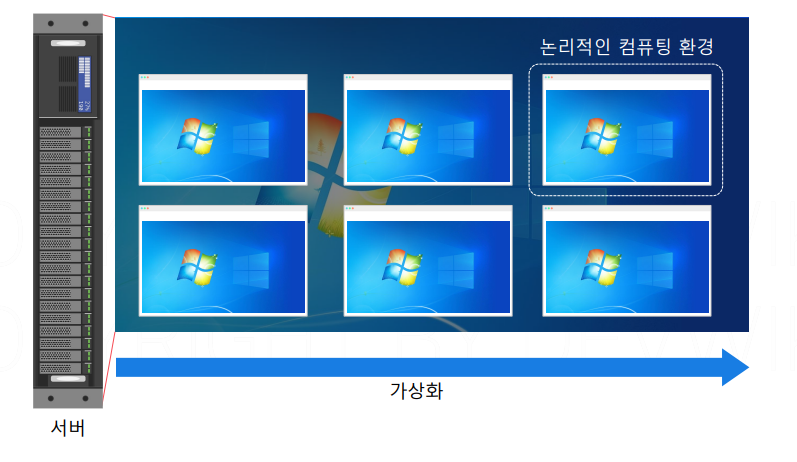
- 가상화 기술: 실제로 존재하는 컴퓨터가 아니지만 마치 존재하는 것처럼 만들어주는 기술. 하나의 컴퓨터에서 여러개의 컴퓨터를 실행하는 것. 컴퓨터 안에 컴퓨터를 또 실행한다.
- 소프트웨어가 오류가 나거나 소프트웨어가 갑자기 많은 리소스를 차지하게 되면 소프트웨어가 간섭을 하게 되므로 소프트웨어를 하나의 OS에서 운영하는 것은 피하는 것이 좋다.
  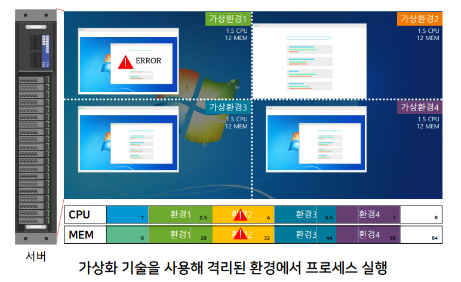
- 가상환경에서는 리소스를 논리적으로 직접 분배할 수 있다. 리소스를 분배한다는 것은 하나의 가상 OS가 사용할 수 있는 리소스의 최대값을 정해놓는 것
- 총 리소스 사용량은 늘어나겠지만 격리된 환경에서 실행되기에 하나의 OS 사용할 때 발생하는 문제가 해결됨
  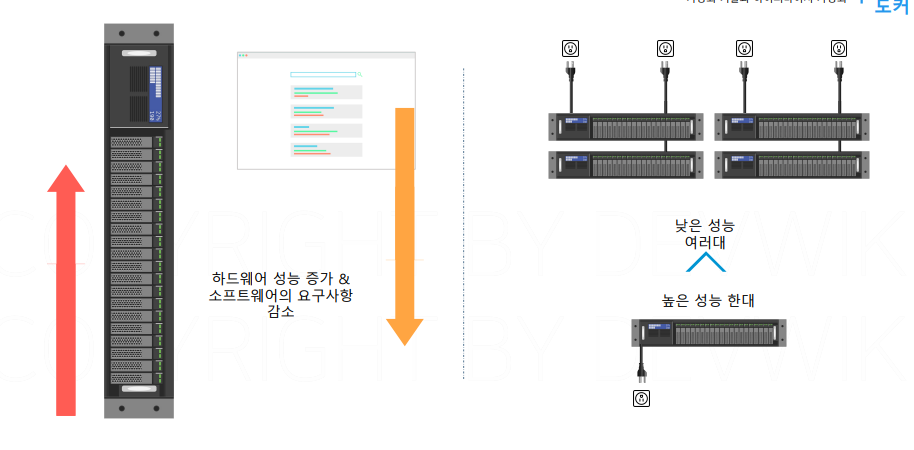
- 기업 입장에서는 낮은 사양의 컴퓨터를 여러 대 사용하는 것보다 높은 사양의 컴퓨터를 한 대 사용하는 것이 가격이나 설치 공간, 설치 인력, 서버 운영, 하드웨어 사이즈나 배선 같이 여러 면에서 훨씬 경제적
  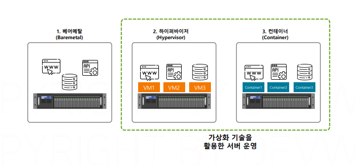
- 가상화 기술은 하이퍼바이저 방식과 컨테이너 방식이 있다.
  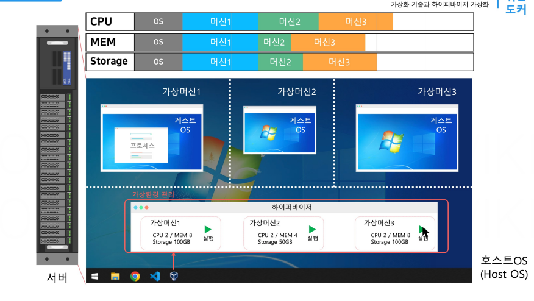
- 하이퍼바이저는 컴퓨터에 설치되는 프로그램. 가상 OS를 만들거나 가상 OS를 실행시키고 종료할 수 있다. 가상 OS를 만들면 사용자가 지정해 놓은 CPU나 메모리만큼 컴퓨터의 격리된 공간을 만들 수 있다. 물리적인 서버에서 설치되는 OS를 호스트 OS. 설치되서 실행되는 OS를 게스트 OS 가상머신이라고도 한다.
  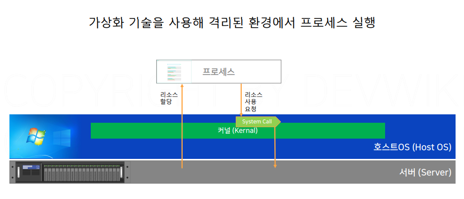
- 프로세스는 정상적으로 실행되기 위해서 CPU나 메모리 같은 리소스를 사용해야 한다. OS를 통해서만 사용가능. OS는 하드웨어를 사용하기 위해 kernal 이 설치되어 있다. OS는 시스템 콜 표준을 정해둠.
  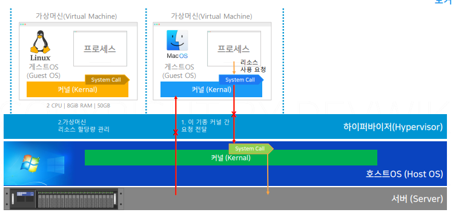
- 각각의 OS(Linux, Mac 등)은 다른 종류의 콜을 사용하기에 시스템 콜도 다르다.
- 가상 머신에 있는 게스트 OS가 서버에 있는 하드웨어를 사용하기 위해서 결국 호스트 OS의 시스템 콜을 호출해야 하는데 하이퍼바이저가 바로 다른 커날 간의 언어를 통역해주는 통역가 역할을 수행한다.
- VMWare, VirtualBox 등이 있다.

## 컨테이너 가상화

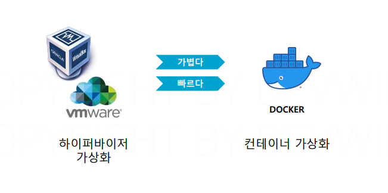

- 컨테이너는 하이퍼바이저보다 가볍고 빠르다.
  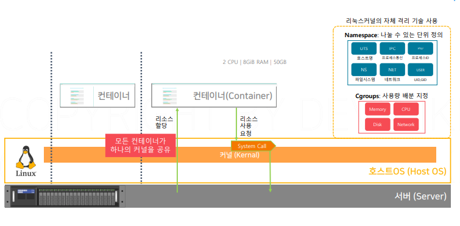
- 컨테이너 가상화는 리눅스 커널이 제공하는 LXC라는 자체 격리 기술에서 출발 커널의 자체 기능만 사용해서 격리된 공간을 만들 수 있다.
- LXC 기술은 커널의 네임스페이스와 Cgroups라는 기능을 활용함. 네임스페이스는 프로세스와 하드드라이브, 네트워크, 사용자, 호스트 네임처럼 리소스를 나누는 기준의 역할을 함. Cgroups는 프로세스가 사용하는 메모리와 CPU, 하드디스크, 네트워크 밴드위스처럼 리소스의 사용량을 배분. LXC를 이용해서 만들어진 격리된 공간을 컨테이너라고 한다.
  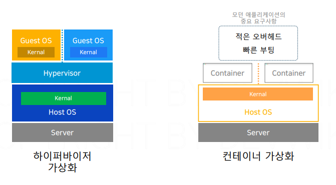
- 하이퍼바이저는 오버헤드가 크다. 반면에 컨테이너는 호스트 OS의 커널을 그대로 사용하기 때문에 중간 단계가 따로 없어서 오버헤드가 작다. 다시 말해 리소스 사용 요청이 더 효율적으로 이루어진다. 컨테이너는 호스트 OS를 공유해서 사용하기에 커널을 실행하는 시간 자체가 없어진다. 그래서 부팅 속도가 빠르다. 하이퍼바이저가 보안 면에서는 더 뛰어나다. 컨테이너는 다른 OS를 실행할 수 없다.
