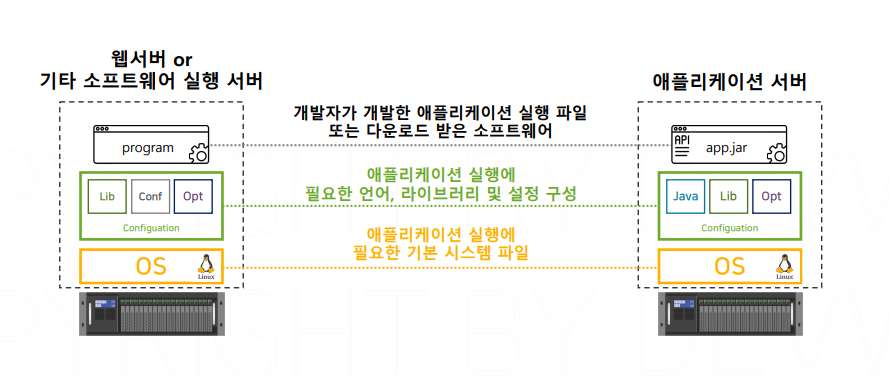
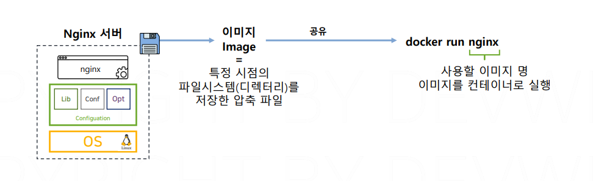
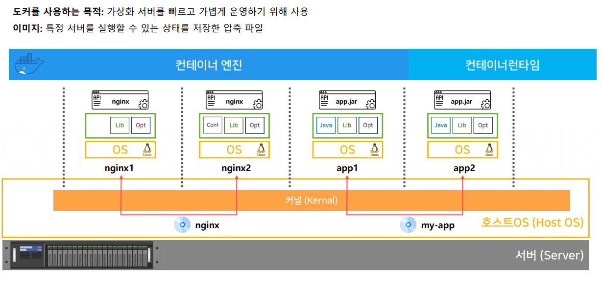
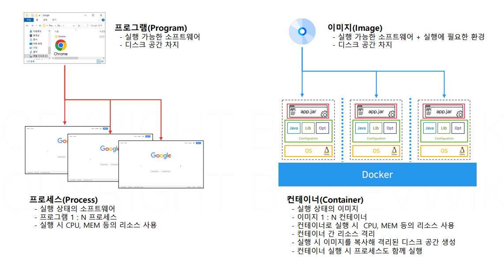

# 이미지와 컨테이너

## 문서 관리자

조승효(문서 생성자)

## 이미지

- 서버에서 프로그램을 실행하기 위해서는 기본 OS, 프로그램을 실행하기 위해서 필요한 구성 요소, 실행시킬 프로그램이 필요하다.
- 어떻게 서버를 구성하는 과정 없이 한 번에 Nginx 프로그램을 실행할 수 있었을까? nginx 이미지를 통해서 컨테이너를 실행했기 때문
  
- 이미지 안에는 OS와 구성요소, 프로그램이 포함되어 있다.
- 이미지는 윈도우에서 사용하는 백업 기능과 비슷하다. 컴퓨터에 윈도우 OS와 프로그램을 설치하고 그 상태를 백업으로 저장해 놓으면 언제든지 해당 프로그램을 실행할 수 있는 시점을 만들 수 있고 공유할 수도 있다.
- 가상 머신에서는 스냅샷이라는 기능이 있다.
- 이미지는 인터넷을 통해 저장하고 공유하기 쉽다.
- 이미지는 다른 사람이 만든 것을 다운할 수 있다.
  

## 이미지와 컨테이너 실행

- 이미지와 컨테이너는 프로그램과 프로세스의 관계
- 이미지를 컨테이너로 실행시키는 것은 이미지에 저장되어 있는 모든 요소들을 격리된 공간으로 만든 다음에 격리된 공간안에서 프로그램을 프로세스로 만드는 것을 한다.
