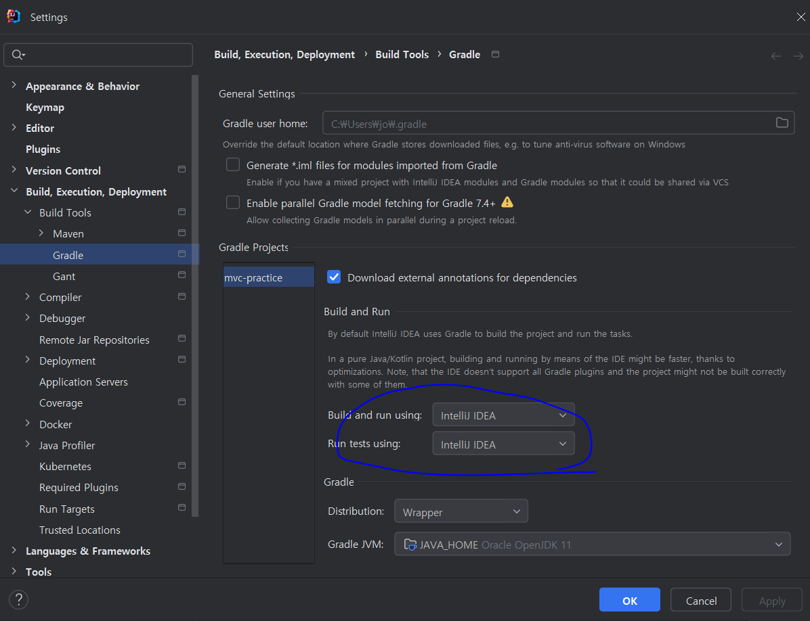
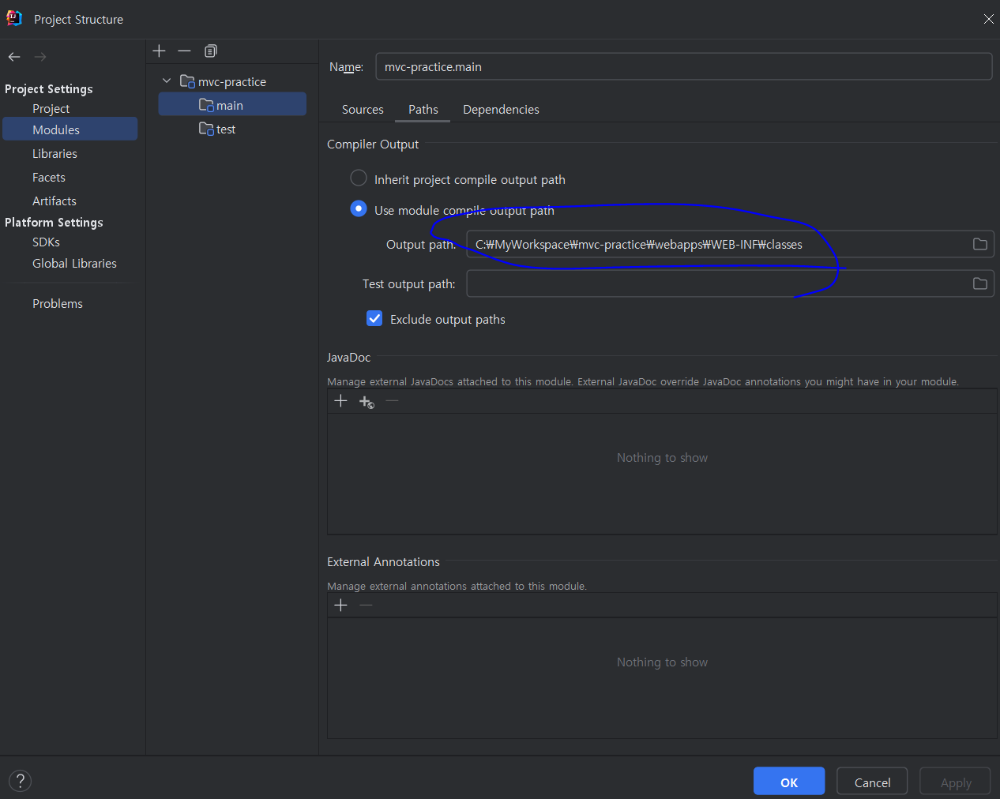
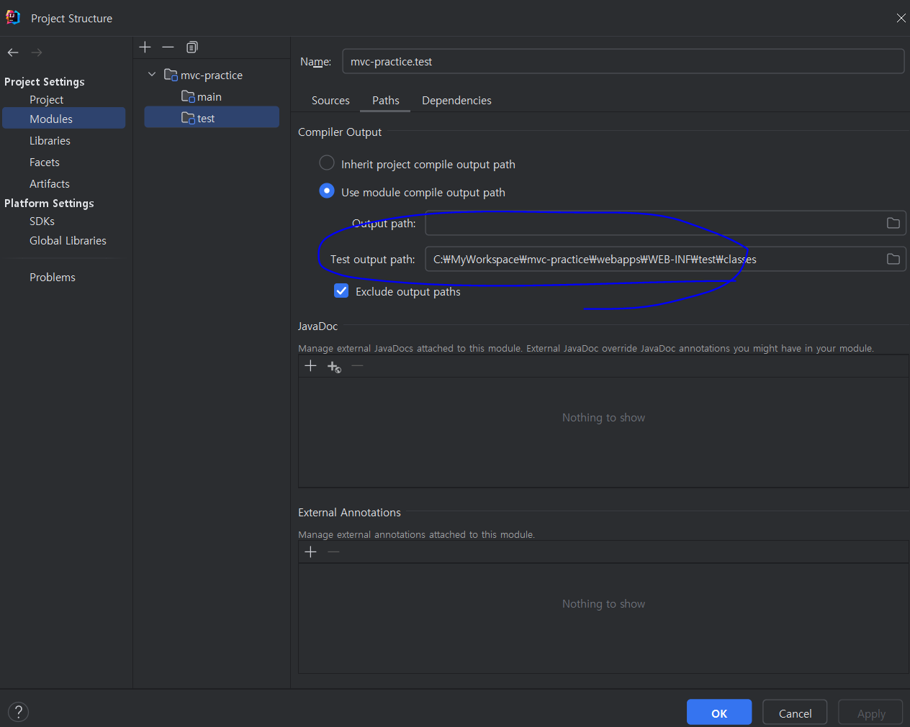

# Part 1. 나만의 MVC 프레임워크 만들기

## 문서 관리자

조승효(문서 생성자)

## Ch02. 개발 환경 구성하기

### 웹 프로젝트 환경 구성

Intellij Ultimate 로 개발하였다.

Setting 을 열어서 동그라미 친 부분과 같이 변경한다.

동그라미 친 부분과 같이 webapps/WEB-INF 에 build 된 클래스들이 들어가도록 한다.
