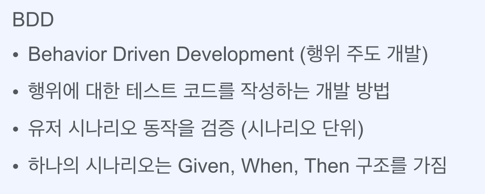

# Part 1. 나만의 MVC 프레임워크 만들기

## 문서 관리자

조승효(문서 생성자)

## Ch03. 객체지향 패러다임

### 테스트 코드 실습

- 프로덕션 코드와 테스트 코드의 패키지는 맞춰주는 것이 좋다.
- ParameterizedTest 를 이용해보도록 하자

### 객체지향

- 추상화란 불필요한 부분을 제거함으로써 필요한 핵심만 나타낸것. 일반화 단순화, 복잡성을 낮추기 위함
- 다형성은 다양한 형태를 가지는 것. 하나의 타입으로 여러 객체를 참조하는 것
- 캡슐화란 객체 내부의 세부사항을 외부로부터 감추는 것. 인터페이스만 공개해서 변경하기 쉬운 코드를 만들어 내기 위함
- 상속은 부모로 부터 물려 받음

- LSP: 상위 타입의 객체를 하위 타입의 객체로 치환해도 동작에 전혀 문제가 없어야 한다.
- DIP: 의존관계를 맺을 때 자주 변경되는 쪽이 아니라 변경이 거의 일어나지 않는 쪽에 의존하라. 자기보다 변하기 쉬운 것에 의존하게 되면 변화의 영향을 많이 받기 때문에 추상화된 인터페이스나 상위 클래스를 둬서 변화의 영향을 받지 않게 하기 위한 원칙
- 객체지향이란 적절한 객체에게 적절한 책임을 할당하여 서로 메시지를 주고 받으며 협력하도록 하는 것. 클래스가 아닌 객체에 초점을 맞추는 것. 객체들에게 얼마나 적절한 역할과 책임을 할당하는지. 높은 응집도, 낮은 결합도 서랍 정리

- 일급 컬렉션이란 리스트 형태, SET 형태로 된것만을 인스턴스 변수로 가지는 클래스. 변수가 2개 이상 있으면 안된다.
