# Part 1. 나만의 MVC 프레임워크 만들기

## 문서 관리자

조승효(문서 생성자)

## Ch04. 웹 애플리케이션 이해

### 시작

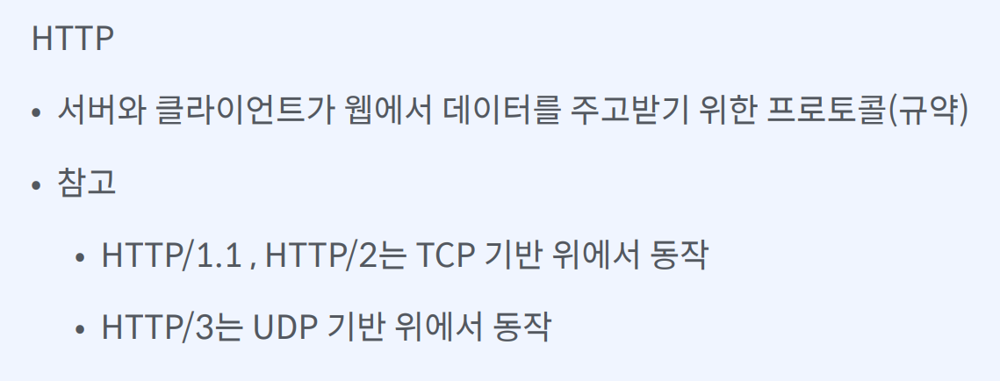

- TCP 기반 위에서 동작한다는 의미는 3-way 핸드쉐이크를 통해서 연결을 맺는다는 의미

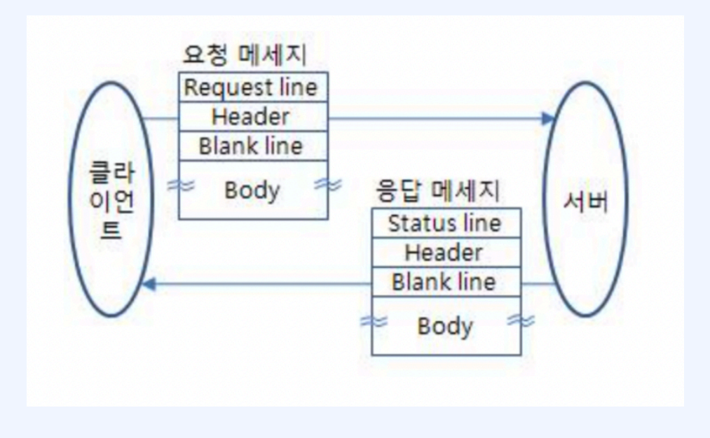

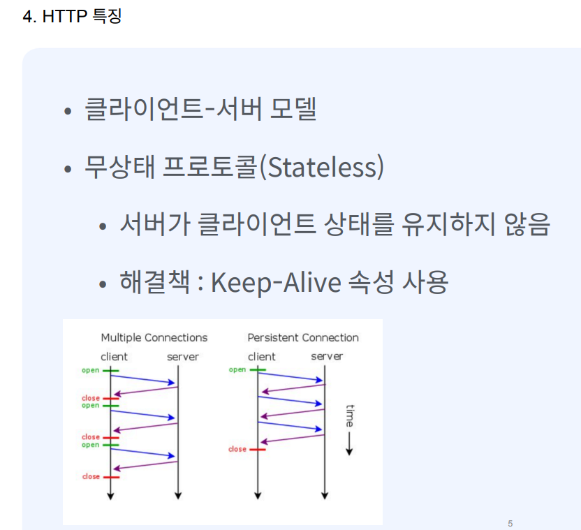

- 클라이언트가 서버로 요청을 다시 보내려면 다시 한번 연결을 맺고 응답을 받아야 되는 구조. TCP 기반으로 동작하는 구조라면 클라이언트가 서버에 요청을 보낼 때마다 3way 핸드쉐이크를 통해서 연결을 맺은 뒤에 데이터를 주고받는 과정을 거쳐야 함. 이 과정을 매 요청마다 수행하는 게 비 효율적이라고 생각을 했기 때문에 일정 기간 동안에는 해당 연결을 끊지 않고 데이터를 클라이언트 서버 사이의 데이터를 주고 받을 수 있도록 한 것이 keep alive
- keep alive 를 잘못 사용하면 성능 하락의 주범이 되기도 한다. 왜냐하면 keep alive 기능이 켜져 있는 상태에서 클라이언트의 요청이 많아지게 되면 유지되는 커넥션도 자연스럽게 많아지게 되고 이로 인해 신규 사용자를 못 받아줄 수도 있기 때문입니다. 즉 웹 서버 스레드가 부족해지는 현상 발생함

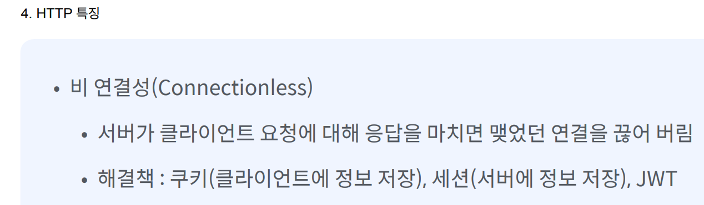

- 왜 HTTP 는 stateless랑 connectionless 라는 특징을 가지게 설계되었을까? 이렇게 뭔가 상태를 유지하지 않고 연결을 클라이언트로부터 응답을 보내면 연결을 바로 끊어버리면서 어떠한 이점을 취할려고 할까? HTTP는 기본적으로 웹상에서 불특정 다수와 통신이 가능하도록 설계된 프로토콜. 이런 상황에서 만약 서버가 다수의 클라이언트들의 상태 또는 연결을 계속 유지해야 한다면 리소스 낭비가 굉장히 심해질것. 따라서 상태 또는 연결을 유지하지 않는 대신에 더 많은 연결을 할 수 있도록 설계가 된 것이 HTTP 프로토콜

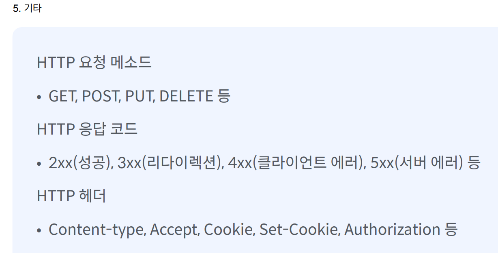

### 실습

- 스프링을 이용해서 웹 개발을 할 때, 어떠한 누군가는 내부적으로 이러한 프로토콜이 들어왔을 때 passing을 해서 어떠한 요청이구나 라는 것을 판단을 할 거며, 그러한 판단에 맞게끔 스프링의 요청을 보내는 작업을 누군가는 수행할 것. 수행하는 것을 톰캣
- 톰캣을 WAS 웹 애플리케이션 서버라고 한다.
- 톰캣을 만들어보는 이유는 HTTP 프로토콜이 어떻게 생겼는지, HTTP 프로토콜을 어떻게 처리하는지 확인하기 위함이다.
- 사용자의 요청이 있을 때마다 thread 를 만들면 blocking 으로 인한 성능 저하를 어느정도 방지할 수 있지만 스레드 할당이라는 것은 비싼 작업인지라 별로 좋은 방법은 아니다. 또한 동시 접속자 수가 많아질 경우에 많은 스레드가 생성될 텐데 스레드가 많아지게 되면 CPU 컨텍스트 스위칭 회수도 증가되고 CPU 메모리 사용량이 굉장히 증가하게 되어서 서버가 다운될 수도 있다. 그래서 스레드 풀 개념을 적용해야 한다.

## CGI, 서블릿

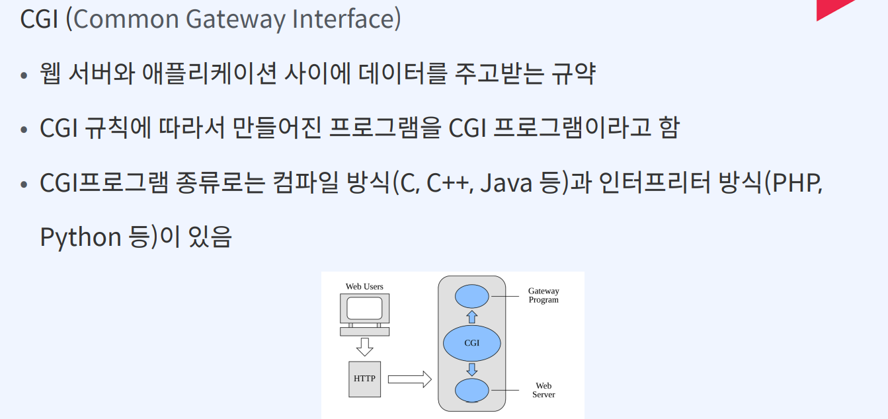
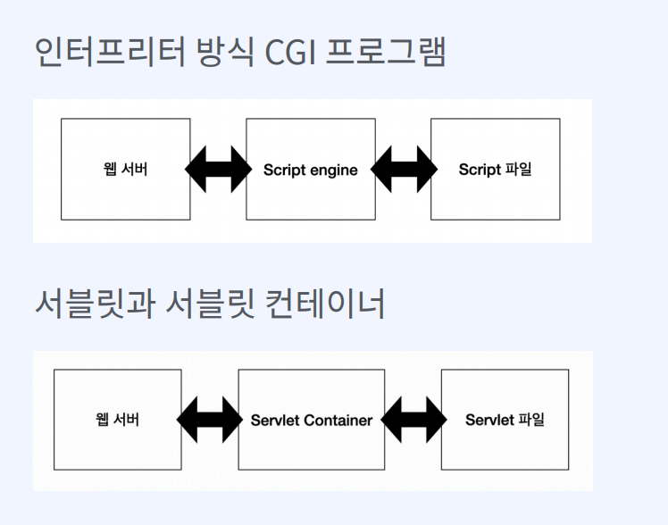

- 인터프리터 방식에는 웹 서버와 Script engine 사이에 CGI 규칙을 통해서 통신한다. 즉 웹 서버와 Script engine 에서는 CGI 규칙이 적용된다.
- 서블릿과 서블릿 컨테이너에 대해서도 마찬가지 이다.

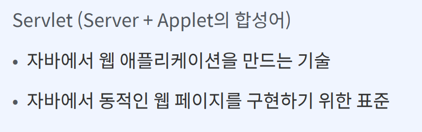

- 라이프 사이클을 관리한다고 하면 컨테이너라는 표현을 사용한다. 서블릿 컨테이너는 서블릿의 라이프 사이클을 관리하기 때문에 서블릿 컨테이너라는 표현을 사용한 것.

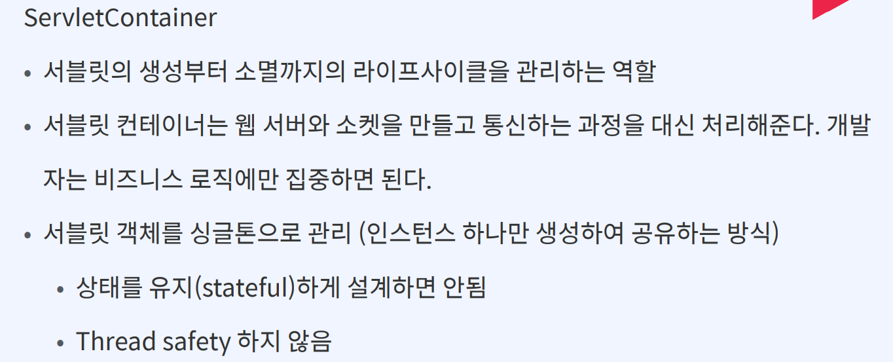

- 서블릿 컨테이너는 웹서버와 소켓을 만들고 통신하는 과정을 대신 처리해준다. 그래서 비즈니스 로직에만 집중하면 된다.

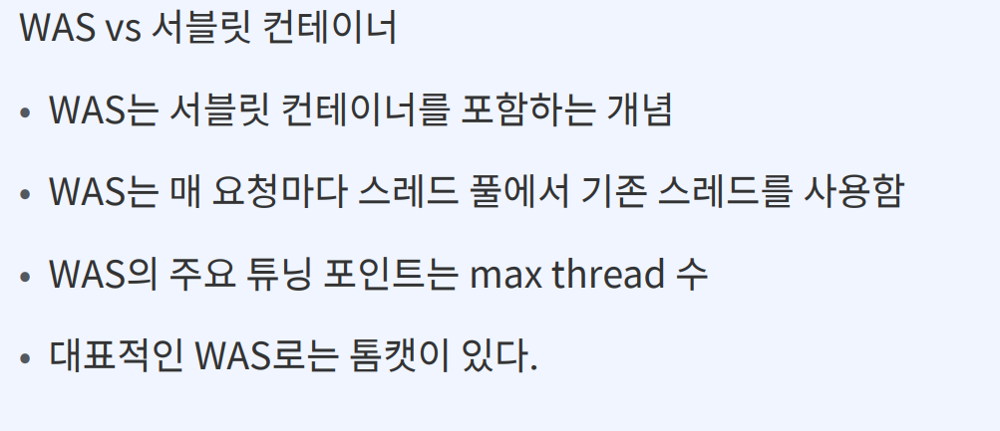
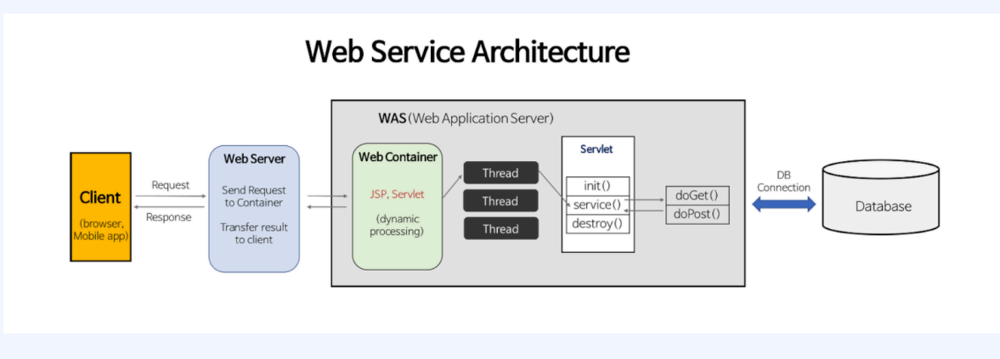

- 레이스 컨디션이란 여러 프로세스 혹은 스레드가 동시에 하나의 자원에 접근하기 위해 경쟁하는 상태

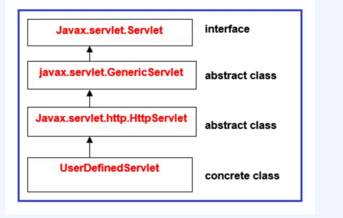
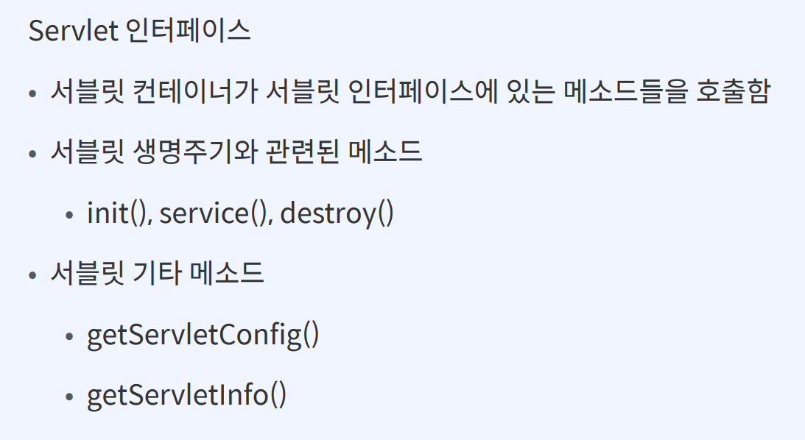
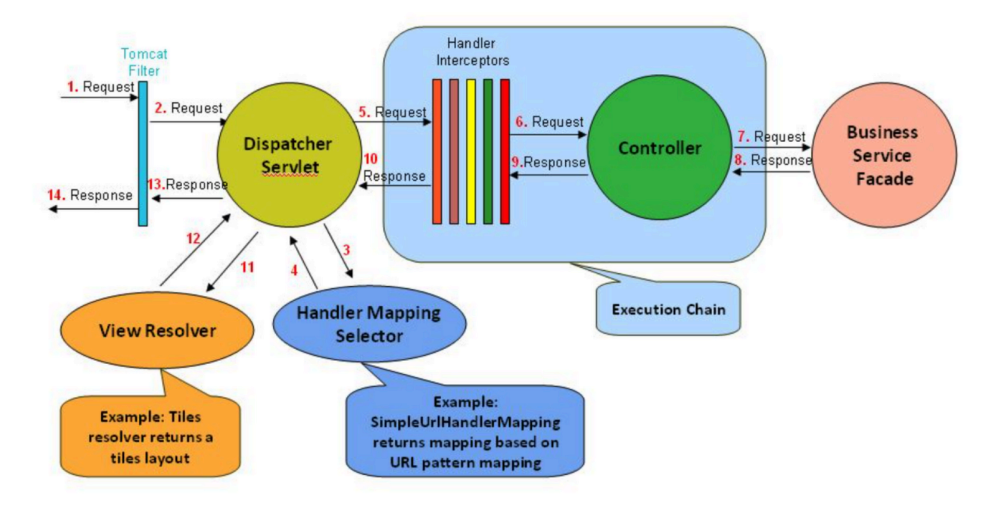
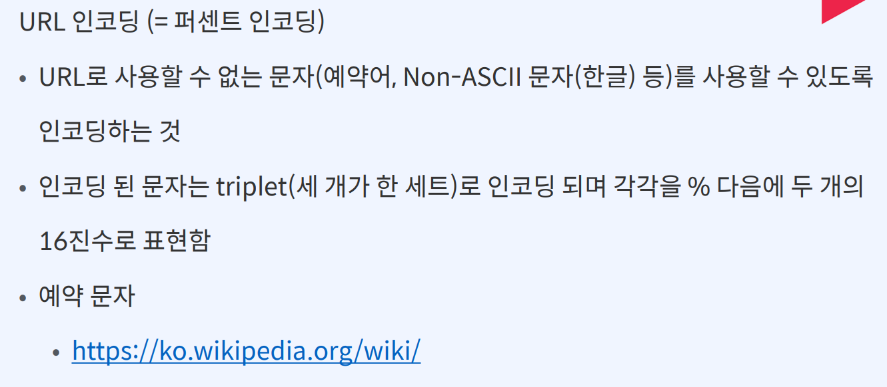
