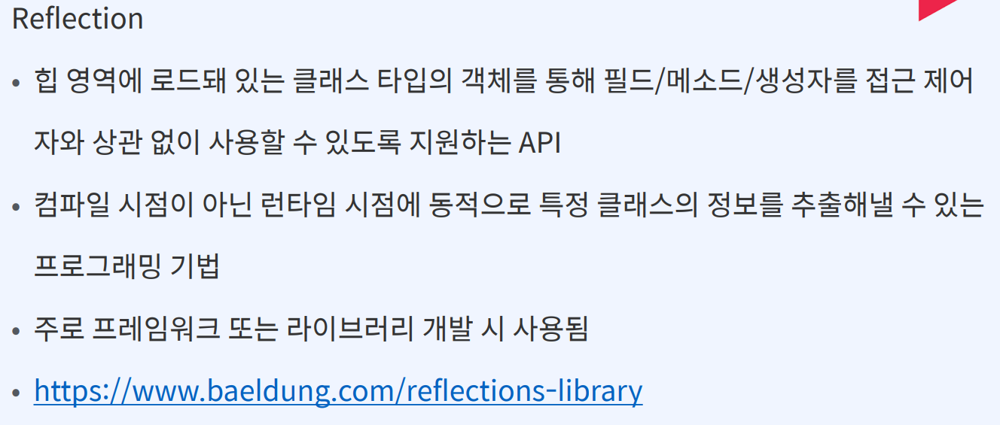
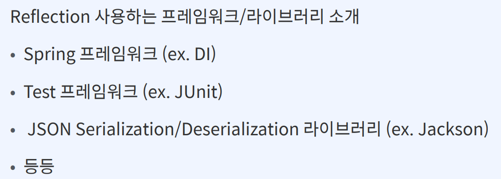
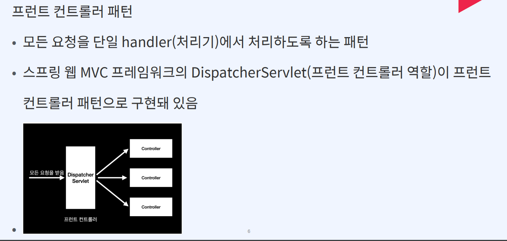
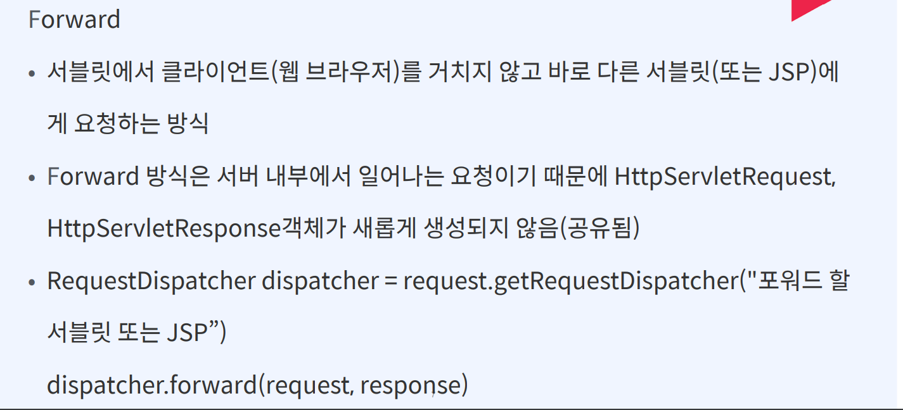
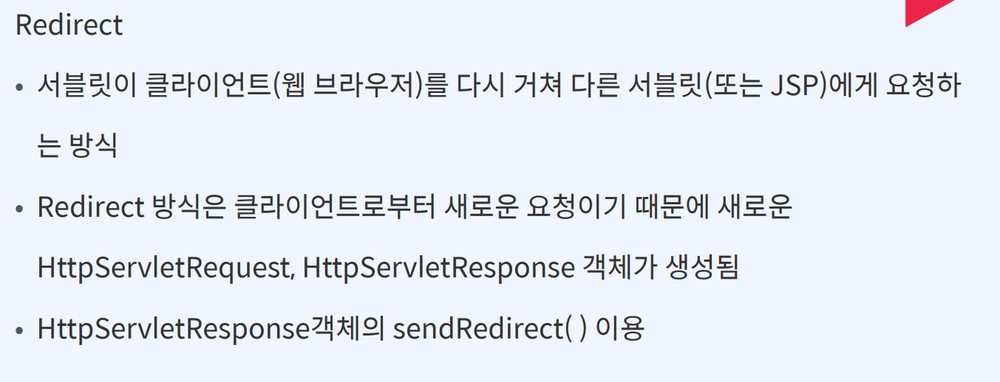
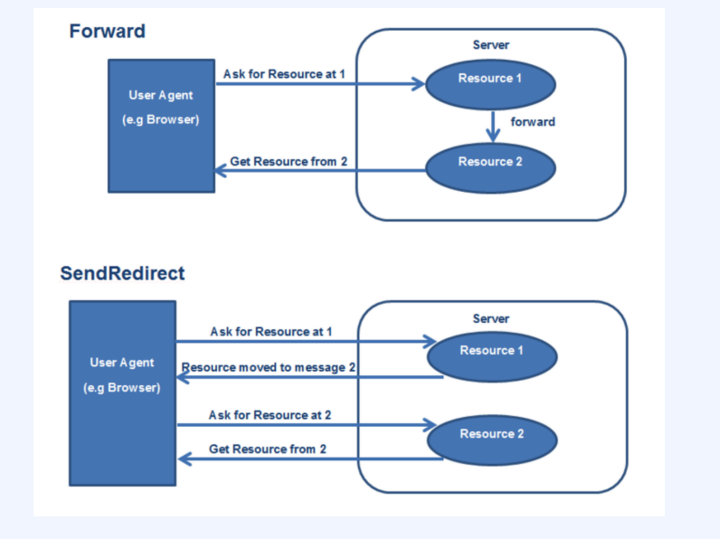
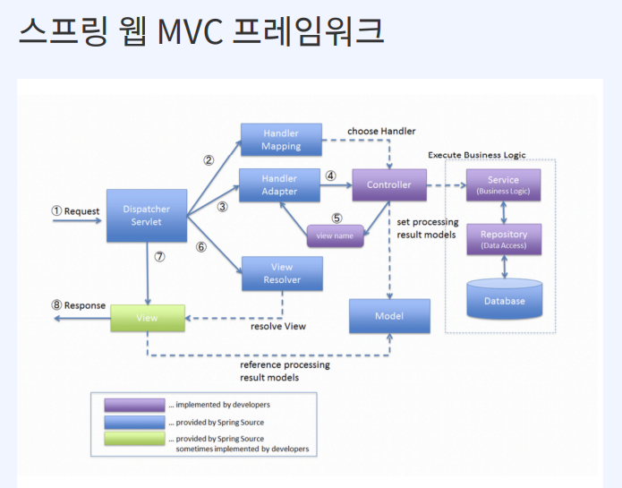

# # Part 1. 나만의 MVC 프레임워크 만들기

## 문서 관리자

조승효(문서 생성자)

## Ch06. MVC 프레임워크 만들기

### 리플렉션

- 힙 영역에 로드되어 있는 클래스 타입 객체를 가져오는 방법: Class.class, instance.getClass, class.fullname
- JVM의 클래스 로더는 클래스 파일에 대한 로딩이 끝나면 클래스 타입의 객체를 생성해서 메모리 힙 영역에 저장함

### 프런트 컨트롤러 패턴

- 포워드 방식은 서버 내부에서 일어나는 요청이다. 기존의 요청을 통해서 생성된 HTTP 서블릿 리퀘스트와 리스폰스 객체를 서버 내부에서 일어는 요청에게 전달할 때 새롭게 생성해서 전달하는 것이 아니라 기존에 만들어진 객체를 전달해서 공유하는 방식
- 리다이렉트 방식은 해당 요청이 들어왔을 때 응답을 웹 브라우저에게 주고 다시 웹 브라우저에서 다른 서블릿 또는 JSP에게 요청하는 방식

### MVC 프레임워크

1. 디스패처 서블릿이 핸들러 매핑을 통해 적절한 핸들러(컨트롤러)를 찾게 된다.
2. 핸들러 어댑터를 통해서 적절한 어댑터에서 컨트롤러를 실행한다.
3. 컨트롤러는 비즈니스 로직을 수행하고 뷰 네임을 리턴한다.
4. 뷰네임을 이용해서 view resolver 를 통해 뷰 객체를 받는다.
5. 뷰 렌더를 통해 응답값을 리턴한다.
